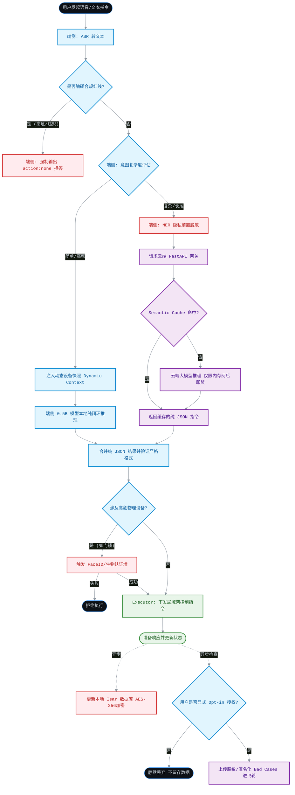
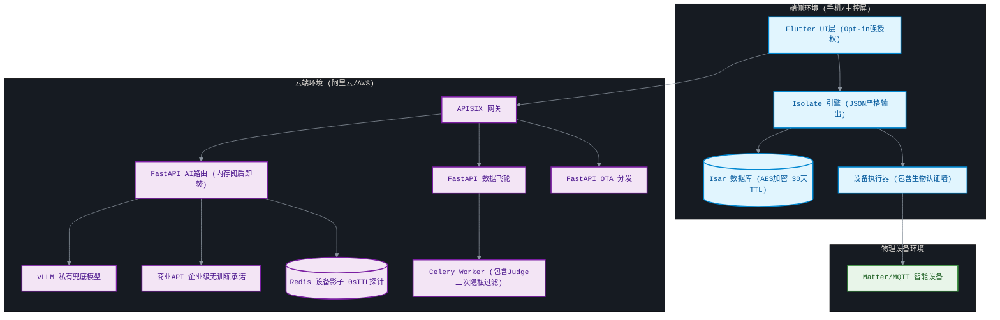
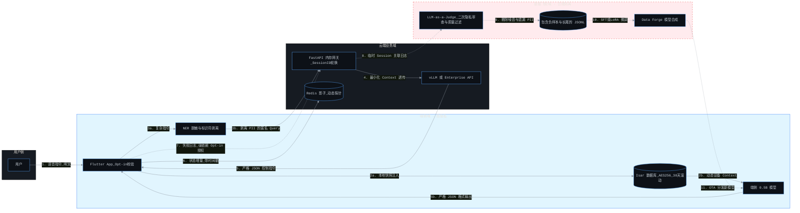
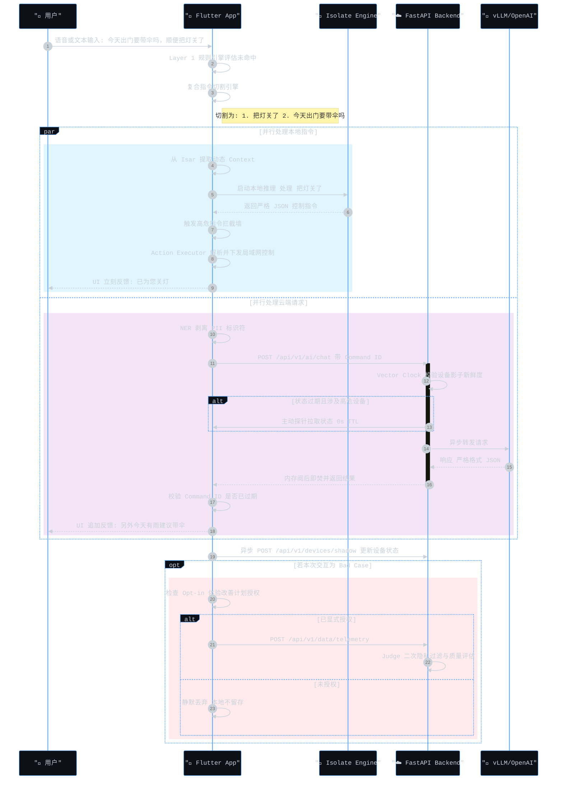

# 🏠 Smart Home On-Device AI Agent (端侧大模型智能管家)

[English](README_en.md) | [中文](README.md)


<p align="left">
  <a href="https://flutter.dev"></a>
  <a href="https://github.com/ggerganov/llama.cpp"></a>
  <a href="https://isar.dev"></a>
  <a href="https://fastapi.tiangolo.com/"></a>
  <a href="https://redis.io/"></a>
  <a href="https://csa-iot.org/"></a>
  <a href="https://developer.apple.com/siri/"></a>
</p>

A next-generation Smart Home application demonstrating the **production-ready implementation of On-Device AI + Agent architecture**. Powered by `llama.cpp` through Dart FFI and a lightweight local RAG (Retrieval-Augmented Generation) system.

这是一个致力于探索和展示 **“端侧大模型 + Agent” 真实落地能力** 的智能家居开源项目。它彻底抛弃了纯云端 API 的重度依赖，在移动设备本地完成了从自然语言理解、意图规划到 IoT 硬件控制的完整 Agent 闭环，并辅以轻量级云端兜底，构建了完整的端云协同体系。

---

## 🌍 商业洞察与战略规划 (Business & Strategic Overview)

作为 AI+硬件产品负责人，我们洞察到当前市场的核心商业痛点：**纯云端 AI 正在拖垮硬件厂商的利润率，且用户对“隐私裸奔”的抗拒正在成为高端市场的致命阻碍**。本项目不盲目追求参数量的技术炫技，而是立足于“降本增效”与“差异化壁垒”，旨在重新定义未来十年的家庭数字生命：

1. **破局隐私信任危机，切入高净值市场 (Privacy as a Moat)**：
   家是最私密的空间。我们将最敏感的上下文（家庭成员对话、安防探头、生活作息）锁定在**本地端侧闭环处理**。物理隔离的“隐私即服务”不仅是技术底座，更是打消高端用户顾虑、打破外资品牌垄断的核心商业卖点。
2. **算力路由重构成本模型 (ROI-Driven Edge-Cloud Routing)**：
   智能家居中 80% 的高频指令是“开灯”、“关窗帘”等低智商控制。如果全部上云，企业将承担海量的 API Token 账单。我们通过“端侧 2B 小模型拦截高频指令 + 云端大模型兜底长尾需求”，**在实现 0 延迟体验的同时，将云端算力成本硬切掉了 80% 以上**，构建了极其健康的商业模型。
3. **数据飞轮铸就行业壁垒 (Data Flywheel for B2B/B2C)**：
   超越“一问一答”的被动硬件。通过端侧脱敏上传的 Bad Cases，利用云端 `LLM-as-a-Judge` 自动提炼高质量微调数据，并通过 OTA 动态反哺端侧。这套闭环让我们能以极低的边际成本，沉淀出行业最懂用户的“专属行为模型”，将用户从“买硬件”转化为“依赖数字管家”，实现**硬件销售向长尾服务订阅 (SaaS) 的商业模式跨越**。

---

## 📑 目录 (Table of Contents)
- [快速指引 (Role-based Entry Points)](#-快速指引-role-based-entry-points)
- [商业洞察与产品愿景 (Business & Product Vision)](#-商业洞察与产品愿景-business--product-vision)
- [核心落地能力 (Why On-Device Agent?)](#-核心落地能力-why-on-device-agent)
- [端云协同架构全景 (Edge-Cloud Architecture)](#-端云协同架构全景-edge-cloud-architecture)
- [项目核心亮点 (Core Project Highlights)](#-项目核心亮点-core-project-highlights)
- [快速开始 (Getting Started)](#-快速开始-getting-started)
- [项目文档 (Documentation)](#-项目文档-documentation)
- [数据与模型 (Data & Model Ops)](#-数据与模型评估复现与迭代-data--model-ops)
- [致谢与社区 (Acknowledgements & Community)](#-致谢与社区-acknowledgements--community)

---

## 🧭 快速指引 (Role-based Entry Points)

欢迎来到 Smart Home On-Device AI Agent 仓库！为了让你快速找到所需内容，请根据你的角色选择入口：

* 👉 **我是移动端/Flutter 开发者**：你想了解如何在设备端本地运行大模型，请直接阅读 [端侧 AI Agent 架构复盘与落地能力指南](docs/architecture/honest_architecture_reflection.md) 和 [Llama.cpp 引擎入口代码](model_forge/inference/on_device_agent/lib/src/engine/llama_cpp/llama_engine.dart)。
* 👉 **我是模型/算法工程师**：你想了解我们如何进行高质量数据合成与端侧模型微调，请前往 [Model Forge 目录说明](model_forge/training/README.md) 并阅读 [数据合成黄金规则](model_forge/training/data_evaluation_and_synthesis_rules.md)。
* 👉 **我是后端/云服务架构师**：你想了解高隐私要求的端云架构与防并发竞态设计，请深入阅读 [端云协同架构落地方案 (基于 FastAPI)](docs/architecture/fastapi_edge_cloud_architecture.md)。
* 👉 **我是产品经理/业务操盘手**：你想了解这个项目的商业价值与终极愿景，请阅读 [产品迭代愿景：从“被动控制”到“无感智能”](docs/product/product_vision_ice.md)。

---

## 📚 项目文档 (Documentation)

### 1. 核心产品与战略 (Business & Strategy)
* [🌌 产品迭代愿景：从“被动控制”到“无感智能” (Zero-UI Platform)](docs/product/product_vision_ice.md)
* [开源协同与敏捷项目管理指南](docs/product/agile_project_management.md)
* [🔗 **[New]** 用户操作与配网手册 (End-User Manual)](docs/user_manual/end_user_manual.md)

### 2. 架构设计与技术落地 (Architecture & Engineering)
* [智能家居端侧 AI Agent 架构复盘与落地能力指南](docs/architecture/honest_architecture_reflection.md)
* [智能家居端侧 AI Agent 架构复盘与落地能力指南（版本二）](docs/architecture/on_device_ai_architecture_review.md)
* [智能家居端云协同架构落地方案 (基于 FastAPI) - 研发工程评审版](docs/architecture/fastapi_edge_cloud_architecture.md)
* [智能家居端云协同 AI 架构设计方案](docs/architecture/edge_cloud_collaborative_architecture.md)
* [端云协同大模型 AI Agent：全链路数据与部署架构解决方案](docs/architecture/full_lifecycle_ai_architecture_solution.md)
* [🔗 **[New]** 智能家居全链路架构深度拆解：端云协同、IoT 通信与生态集成](docs/architecture/full_stack_architecture_decomposition.md)
* [智能家居端云协同架构：商用化演进与盲区攻坚方案 (Architecture Evolution)](docs/architecture/architecture_evolution_and_blind_spots.md)
* [智能家居 Matter 协议生态接入架构方案 (Matter Integration)](backed_project/docs/matter_integration_architecture.md)
* [智能家居 Matter 对接项目排期与研发任务清单 (Matter Delivery Plan)](docs/architecture/matter_integration_project_schedule_and_task_breakdown.md)
* [🔗 **[New]** 全球三大智能生态（Apple, Google, Alexa）接入产品战略与架构方案 (Ecosystem Integration)](docs/architecture/ecosystem_integration_strategy_apple_google_alexa.md)
* [后端核心架构设计与演进路线 (Backend Architecture & Roadmap)](backed_project/docs/architecture.md)
* [后端基建规划与 DDD 落地指南 (Infrastructure Design)](backed_project/docs/infrastructure_design.md)
* [架构演进路线与遗留任务清单 (Architecture Roadmap)](backed_project/docs/architecture_roadmap.md)

### 3. 规范、运维与审计 (Standards, DevOps & Audit)
* [🔗 **[New]** 全局 API 接口字典 (Full API Reference)](docs/api/api_reference.md)
* [🔗 **[New]** 自动化测试与质量保障指南 (Testing & QA Docs)](docs/testing/testing_and_qa_guide.md)
* [🔗 **[New]** 故障排查矩阵与 FAQ (Troubleshooting & FAQ)](docs/troubleshooting/faq_and_troubleshooting.md)
* [🔗 **[New]** 后端 API 规范与全局异常处理标准 (API Standards)](backed_project/docs/api_standards.md)
* [🔗 **[New]** Docker 容器化与开发环境配置指南 (Docker Guide)](backed_project/docs/docker_development_guide.md)
* [🔗 **[New]** 后端并发防御架构与代码质量审计报告 (Architecture Audit)](backed_project/docs/code_review_and_architecture_audit.md)
* [智能家居 AI 系统端到端隐私合规与数据安全方案](docs/architecture/ai_privacy_compliance_guidelines.md)
* [端云协同 AI 系统数据地图与验证指导体系](docs/architecture/data_map_and_qa_lineage.md)

### 4. 数据与模型工程 (Data & Model Ops)
* [端侧模型深度定制与全链路微调方案 (架构师视角)](model_forge/training/on_device_model_customization_pipeline.md)
* [数据评估体系与合成规则逆向推导](model_forge/training/data_evaluation_and_synthesis_rules.md)
* [智能家居端侧模型业务扩展与迭代 SOP](model_forge/training/business_expansion_model_iteration_sop.md)
* [Mac M4 端侧模型微调与量化复现 SOP](model_forge/training/mac_m4_reproduction_sop.md)
* [智能家居端侧模型：数据评估与验收体系指南](model_forge/training/data_evaluation_and_acceptance_framework.md)
* [Model Forge 目录说明](model_forge/training/README.md)

---

## 🎯 核心产品战略：从「被动控制」到「主动智能」 (Core Product Strategy)

> **“我们不是在制造一个搭载大模型的万能语音遥控器。我们在打造一个‘预判你所想，自然如呼吸’的家庭专属数字生命。”**

当前行业的智能家居大多陷入了“技术炫技”的怪圈：用庞大的云端参数模型，去执行“开灯”、“关窗帘”这种简单的**被动指令**。这本质上依然是“人服务于机器”（需要人去下发指令才能运作）。

本项目的核心产品战略是实现范式转移：**彻底跨越「被动控制」，迈向「主动智能 (Proactive Intelligence)」**。所有的底层技术架构（端侧推理、本地 RAG、防并发网关）均服务于这一产品愿景，绝非无意义的技术堆砌。

### 1. 认知重塑：什么是真正的主动智能？
*   **从“一问一答”到“全域感知 (Context-Awareness)”**：不再是被唤醒词叫醒才工作，而是通过本地传感器、时间节律、甚至是用户的生物节律（如睡眠状态），在后台持续构建动态家庭上下文 (Dynamic Context)。
*   **从“执行指令”到“预判意图 (Predictive Action)”**：系统能学习到“周五晚上 7 点你需要柔和灯光与加冰威士忌”，在你踏入家门前，一切已悄然就绪，实现真正的 **Zero-UI（无感交互）**。干掉繁琐的汉堡菜单和 Toggle 开关，交互应该变成基于物理引擎的本能动作与多模态感官闭环。
*   **从“公域模型”到“私域数字生命 (Personalized AI)”**：通过端侧的全局习惯学习模型 (Federated Habit Engine)，AI 会随着用户的起居习惯不断进化，成为世界上唯一且最懂你的数字管家。

### 2. 为什么「主动智能」必须依赖「端侧大模型」？
这正是本项目技术选型背后的**第一性原理**。
要实现主动智能，AI 必须 24 小时不断地监听、分析家庭中的温湿度、安防探头、生活作息等**极度隐私的数据**。
*   **隐私底座不可妥协**：如果完全依赖云端大模型，意味着要将全家人的生活隐私 24 小时向云端直播，这在商业合规和用户心理上是**绝对不可接受的**。
*   **延迟与成本的灾难**：主动感知带来的海量微小状态变化，如果全部上云，会产生极其恐怖的 API 调用成本和网络延迟。

**因此，端侧大模型 (On-Device AI) 不是为了省网费的技术炫技，而是实现「主动智能」的绝对前提（Privacy as a prerequisite for Proactive AI）。** 我们将 >80% 的高频和隐私数据拦截在设备本地进行闭环计算，才使得“全天候主动感知”成为可能。

### 3. 商业变现与护城河 (Business Value)
*   **破局隐私信任危机**：以“本地优先 (Local-First)”打消用户顾虑，精准切入对隐私极度敏感的高端市场。
*   **构建合规数据飞轮**：依靠“显式授权 (Opt-in) + 端侧脱敏”，合法合规地沉淀高质量垂域日志，持续迭代企业自身的专属行业大模型。

[👉 深入阅读《产品迭代愿景：从“被动控制”到“无感智能”》详细报告](docs/product/product_vision_ice.md)

---

## 🚀 管理后台演进路线：AI 调度中心与进化工厂 (AI Ops Center)

在“端侧优先、云端兜底”的架构下，传统的“设备增删改查”管理后台必须向 **AI 云原生架构 (AI Cloud-Native)** 转型。管理后台的定位将演进为整个系统的**“AI 调度中心与进化工厂”**。

### 📍 Phase 1: 基础设施增强与 AI 观测底座 (0-3 Months)
**目标**：打破端云黑盒，建立对 AI 成本、延迟和并发冲突的可视化。
*   **AI 流量与成本看板 (AI Telemetry)**
    *   监控大模型请求的端侧拦截率（目标 >80%），统计云端 vLLM 兜底带来的 Token 成本消耗。
    *   监控 Semantic Cache（语义缓存）的命中率及 TTFT（首字延迟）大盘数据。
*   **端侧设备健康度预警**
    *   监控不同型号手机/中控屏运行大模型时的 RAM 峰值（防 OOM 崩溃）及 NPU 负载。
*   **设备影子状态对账 (Shadow & Vector Clock)**
    *   针对高并发弱网环境，提供设备云端状态与本地时钟（Vector Clock）的可视化校验工具，排查“幽灵跳动”等并发冲突。

### 📍 Phase 2: 数据飞轮与模型生命周期 (3-9 Months)
**目标**：构建业务自增长闭环，让大模型“越用越聪明”。
*   **自动化评测与坏案例清洗 (LLM-as-a-Judge)**
    *   接收端侧脱敏上报的失败日志（Bad Cases）。
    *   在后台引入大模型作为“裁判”，自动剔除噪音，提取高质量的 JSONL 负样本。
*   **微调工厂与 LoRA 管理 (Model Forge Ops)**
    *   一键将清洗后的数据推送至微调管线。
    *   管理针对特定场景（如制冰机专属、复杂语境）训练出的 LoRA 适配器权重。
*   **“千机千面”的 OTA 下发策略**
    *   基于设备的算力画像（内存大小、芯片代际），动态下发不同量级（0.5B/1.5B/2B）的 GGUF 模型。

### 📍 Phase 3: 生态破壁与协议中台 (9-18 Months)
**目标**：成为家庭物理世界的统一中枢，支撑跨品牌协同。
*   **南向物模型适配器 (Southbound Integration)**
    *   提供拖拽式映射界面，将第三方生态（如 Tuya、AWS IoT）的专有属性平滑映射至内部标准物模型（TSL）。
*   **Matter 生态管理中心**
    *   管理 Matter 设备的证书（DAC/NOC）分发。
    *   提供局域网边缘网关（Home Hub）的拓扑结构监控与远程热重启能力。
*   **动态安全护栏配置 (Dynamic Guardrails)**
    *   动态更新 GBNF 语法树模板，严防大模型产生幻觉去控制未授权的高危设备（如门锁）。

### 📍 Phase 4: 无感智能与商业化变现 (18+ Months)
**目标**：支撑终极愿景，管理多模态交互资产与 SaaS 订阅服务。
*   **全域感知与预判引擎管理 (Proactive Intelligence)**
    *   管理基于用户起居习惯生成的“预测模型”。
    *   配置仲裁规则：当 AI 的主动预判操作与用户的物理按键发生冲突时，如何优雅降级。
*   **多模态感官资产库 (Sensory Asset Ops)**
    *   统一管理 Flutter Impeller 所需的 3D 物理映射素材、Shader 动画脚本。
    *   管理设备专属的 ASMR 交互音效及 CoreHaptics 线性马达震动配置文件。
*   **SaaS 订阅与权限网关**
    *   支撑商业化转型：基础语音控制免费，基于历史习惯的“全自动预判 AI 管家”作为高级订阅增值服务进行权限鉴权。

> **💡 产品战略重心**：目前的后端架构已打好极佳的底子（FastAPI + Redis Lua 防并发 + DDD 设计），接下来的重心应该放在 **Phase 2（数据飞轮）**。只要后台能把“收集端侧报错 -> 自动清洗 -> 微调出新模型 -> OTA 静默下发”这个飞轮转起来，产品就建立起了真正的护城河，从而彻底脱离单纯卖硬件的红海价格战。

---

## 🌟 技术底座：支撑主动智能的核心落地能力 (Tech Enablers)

大模型直接控制物理世界的硬件，面临着**延迟**、**隐私**、**幻觉**以及**并发竞态**等重重阻碍。本项目通过构建强大的“端云协同 (Edge-Cloud Synergy)”底座，通过以下六大架构创新，完美解决了这些工业级落地痛点：

### 1. 🎯 零幻觉的硬件控制 (Zero-Hallucination Determinism)
*   **痛点**：云端大模型容易产生幻觉，输出不存在的设备 ID 或错误的 JSON 格式，导致硬件控制崩溃。
*   **落地实现 (端侧)**：首创性地引入了 **动态 GBNF (GGML BNF) 语法树**。在每次推理前，Agent 会获取当前真实的家庭设备列表，动态生成底层 C++ 采样约束（如 `device_id ::= "\"light_1\"" | "\"ac_1\""`）。从概率分布的最底层掐断了 AI 输出非法字符的可能，实现了 **100% 的 JSON 解析成功率和实体准确率**。

### 2. 📚 纯本地的隐私级 RAG (Edge RAG for Privacy)
*   **痛点**：用户询问“今天谁开了大门”、“卧室监控有没有异常”等涉及极高隐私的数据，绝不能上传云端。
*   **落地实现 (端侧)**：利用 **Isar 本地对象数据库** 替代沉重的向量库。Agent 内部实现了轻量级的意图路由，拦截查询类指令后，在几毫秒内检索本地 `BehaviorLog`，并作为 Context 动态注入 Prompt。整个过程**完全断网可用**，实现了真正的“隐私级数据增强”。

### 3. ⚡ 异步隔离与毫秒级响应 (Isolate-Driven Edge Inference)
*   **痛点**：在移动端跑 2B 级别的模型，极易导致主线程阻塞，造成 App 卡顿甚至 ANR。
*   **落地实现 (端侧)**：基于 Dart 的 FFI 深度绑定 `llama.cpp` 源码，并将模型加载（Mmap）、Prompt 预处理和 Token 采样全部压入 **Dart Isolate (独立内存堆的后台线程)** 中。确保在进行繁重的张量计算时，Flutter UI 依然能保持丝滑的 60fps 帧率。

### 4. 🛡️ 工业级防竞态与一致性 (Concurrency & Shadow Consistency)
*   **痛点**：弱网环境下指令重发、多端同时操作会导致设备状态覆写 (TOCTOU) 和“幽灵播报”。
*   **落地实现 (云端)**：FastAPI 后端引入 **Command ID + Redis SETNX 分布式锁**，实现 API 请求绝对幂等防重放。同时，基于 **Vector Clock (逻辑时钟) 与 Redis Lua 原子脚本** 更新设备影子，确保高并发下的状态一致性。

### 5. 🧠 端云协同语义缓存与安全 (Semantic Cache & Fast Routing)
*   **痛点**：高频相似的长尾询问（如“今天天气如何”）重复调用云端大模型，既浪费 Token 成本又增加响应延迟；传统的字符串缓存易受 Prompt 注入攻击。
*   **落地实现 (云端)**：设计了一套基于 **Hashlib SHA-256 + 状态签名** 的 Semantic Cache 路由层。将用户的意图结构化特征进行防投毒哈希，对于命中缓存的复杂指令，直接在网关层返回 0 延迟的纯 JSON 指令，极大降低了推理成本。

### 6. 🔄 闭环数据飞轮 (Automated Data Flywheel)
*   **痛点**：用户在端侧交互失败的 Bad Case 无法有效回收，导致 AI 体验停滞不前，难以形成产品壁垒。
*   **落地实现 (云端)**：基于 **Celery + RabbitMQ** 搭建了异步的数据清洗队列。端侧在获得用户 Opt-in 授权后脱敏上传失败日志，云端利用 **LLM-as-a-Judge** 对交互质量进行打分、分类，并自动提取提炼为可用于 SFT (监督微调) 的高质量 JSONL 数据，最终通过 OTA 下发新模型，完成数据到体验的闭环进化。

## ☁️ 端云协同架构全景 (Edge-Cloud Architecture)

本项目不仅包含强大的端侧引擎，更通过 **FastAPI 云端微服务** 打造了高隐私、低延迟的端云协同底座，兼顾物理控制的安全与长尾意图的智能。

### 核心设计原则 (First Principles)
1. **极致隐私 (Privacy by Design)**: 默认本地闭环。复杂指令上云前强制 NER 脱敏剥离个人标识符，云端内存阅后即焚；飞轮数据收集严格遵循显式 Opt-in 强授权。
2. **极速响应与防竞态 (Low Latency)**: 端侧拦截 >80% 日常请求；引入指令解耦 (Intent Splitting) 实现端云并行，结合 Command ID 防“幽灵播报”。
3. **工业级并发防御 (Concurrency Safety)**: 云端基于 Redis Lua 脚本实现 Check-and-Set 原子操作，彻底解决设备影子在弱网断连重发时的 TOCTOU (Time-of-Check to Time-of-Use) 并发覆写漏洞。
4. **协同进化 (Data Flywheel)**: 建立基于 Celery + RabbitMQ 的异步清洗队列，利用 LLM-as-a-Judge 提取高质量 SFT 负样本数据，并通过 OTA 动态反哺端侧模型。

### 1. 业务流程与合规卡点 (Business Process Flow)
展示从语音发起到设备响应的全生命周期，突出脱敏、认证与数据飞轮卡点。


### 2. 产品与微服务架构 (Product Architecture)
展示端侧重组件、云端微服务与物理终端的三层结构。


### 3. 核心数据流转 (Core Data Flow)
明确展示控制流、状态流以及带有强隐私隔离要求的数据飞轮流转路径。


### 4. 关键交互时序 (Sequence Flow)
展示复杂复合指令的端云并行处理与竞态防护机制。


详细的 API 契约、管理层决策与 DevOps 部署方案，请参阅 [端云协同架构落地方案](docs/architecture/fastapi_edge_cloud_architecture.md)。

---

## ✨ 交互体验亮点 (UX Highlights)

*   **🧠 透明的“思维链”展示**：告别 AI 的黑盒。UI 实时渲染 Agent 的规划过程（意图识别 -> 本地 RAG 检索 -> 动态语法树生成 -> 指令执行）。
*   **🔄 操作前后状态对比**：精准捕捉 AI 控制前后的 IoT 设备状态（例如：空调 `[关闭] ➔ [开启 (22°C)]`），在聊天气泡中提供极具安全感的状态反馈。
*   **📊 极客性能看板**：在 Debug 模式下，每条指令下方会自动挂载性能追踪面板，展示 **端侧推理耗时** 和 **Tokens/s (生成吞吐量)**，为架构调优提供直观依据。

---

## 🏆 项目核心亮点 (Core Project Highlights)

本项目不仅仅是一个智能家居 Demo，它在架构设计、工程落地与数据闭环上均体现了工业级的高标准：

1. **破局硬件限制：端侧 AI 零幻觉控制**
   打破了大模型容易产生“幻觉”从而无法安全控制硬件的痛点。创新性地采用 `动态 GBNF (GGML BNF) 语法树` 技术，将设备的物理上下文（Context）直接注入底层 C++ 采样约束中，实现了 **100% 格式严谨的 JSON 指令输出**，彻底杜绝越权操作和无效解析。

2. **三层意图算力路由 (3-Tier Compute Routing)**
   彻底解耦端云算力。Layer 1 (本地规则引擎) 实现 <10ms 极速响应；Layer 2 (端侧大模型) 拦截 80% 复杂家庭指令并保证完全断网可用；Layer 3 (云端大模型) 作为长尾兜底。在保障体验的同时将云端推理成本硬切掉 80% 以上。

3. **双轨制 IoT 通信与防乱序底座 (Double-Track IoT & Concurrency Defense)**
   局域网主通道采用 Matter 实现 0 延迟控制，云端副通道通过 MQTT 覆盖长尾设备。在 FastAPI 后端引入高级并发防御：基于 `Redis SETNX` 的防重放锁与 `Lua 脚本原子操作` 驱动的 Vector Clock (向量时钟) 设备影子，彻底解决多端控制下的状态脏读和“幽灵跳动”。

4. **全球生态兼容与无感配网 (Global Ecosystem & Zero-Touch Setup)**
   深度集成 Apple Home, Google Home 和 Amazon Alexa 三大智能生态。不仅支持亚马逊 FFS 零接触配网与 Google AppFlip 无缝授权，更通过 Siri App Intents 构建了防守反击的 AI 护城河，将“御三家”的流量洗入我们原生的主动智能体系。

5. **全栈隐私护城河：Privacy by Design**
   无论是端侧的 **Isar AES-256 全盘加密**，还是云端交互的 **前置 NER 脱敏**、**内存阅后即焚**，以及进入数据飞轮前的 **强制 Opt-in 显式授权**，项目在数据流转的每一个毛细血管都贯彻了最严苛的合规标准。

6. **高性能工程落地：Isolate 异步与指令解耦**
   利用 Flutter 的 `Isolate` 和 FFI 深度绑定 `llama.cpp`，确保端侧 2B 模型推理不阻塞主线程。在端云协同中，实现了 **意图复合切割 (Intent Splitting)**，支持本地控制指令与云端长尾推理并行处理，极大降低了用户体感延迟。

7. **数据飞轮闭环：从模型评估到自动化微调**
   包含完整的 `Model Forge` 数据工厂。基于业务指标逆向推导 **数据合成的 5 条黄金规则**。配合云端 `RabbitMQ + Celery` 构建的 `LLM-as-a-Judge` 异步清洗管道，实现脱敏日志的自动化打分与 SFT 微调反馈，构建了可持续进化的智能底座。

---

## 🏗 架构全景 (Architecture Overview)

项目被严格解耦为 **UI 表现层** 和 **端侧 Agent 内核包**，便于在任何 Flutter 项目中复用：

```text
lib/ (Flutter UI 层)
 ├── main.dart (App Entry, Chat UI & Metrics Panel)
 └── services/ (IoT 设备状态管理模拟)

packages/on_device_agent/ (端侧 Agent 内核)
 ├── lib/src/
 │    ├── engine/        # 基于 FFI 的 LlamaCppEngine & Isolate 调度
 │    ├── context/       # 环境感知、RAG 日志组装 & 动态 GBNF 生成器
 │    └── executor/      # 动作执行器 (含安全护栏 Guardrails & 行为落库)
 └── ios/Classes/llama_cpp_src/ # llama.cpp 底层 C++ 源码 (子模块)
```

## 🚀 快速开始 (Getting Started)

### Prerequisites
*   Flutter SDK `3.x`
*   Dart SDK `3.x`
*   (For iOS/macOS) Xcode and CocoaPods
*   (For Android) Android Studio & NDK

### Installation

1. **Clone the repository:**
   ```bash
   git clone https://github.com/yourusername/smart_home_app_on_device_ai.git
   cd smart_home_app_on_device_ai
   ```

2. **Install dependencies:**
   ```bash
   flutter pub get
   ```

3. **Generate Isar database schemas:**
   ```bash
   cd packages/on_device_agent
   flutter pub run build_runner build
   cd ../..
   ```

4. **Run the App:**
   ```bash
   # Run in debug mode (Includes Performance Metrics UI)
   flutter run
   ```
   > **Note:** By default, running on Web or Simulator will use the `LlamaCppEngineMock` (fallback engine) since compiling C++ LLM inference requires real device hardware acceleration (Metal/Vulkan).

## 🛠 Advanced: Running Real LLMs on Device

To use real on-device inference instead of the mock engine:
1. Download a highly quantized `.gguf` model (e.g., `gemma-2b-it-q4_k_m.gguf`).
2. Place it in the `assets/models/` directory.
3. Update the initialization path in `main.dart`:
   ```dart
   await _agent.initialize(modelPath: "assets/models/your_model.gguf");
   ```
4. Ensure hardware acceleration is enabled in native builds (e.g., `GGML_METAL=1` for iOS).

---

## 🧩 Monorepo 结构与关键入口 (Project Layout & Key Entry Points)

本项目基于 Monorepo 架构进行统一管理，核心业务模块拆分如下：

```mermaid
%%{init: {'theme': 'base', 'themeVariables': { 'primaryColor': '#0d1117', 'primaryTextColor': '#c9d1d9', 'primaryBorderColor': '#58a6ff', 'lineColor': '#8b949e', 'tertiaryColor': '#161b22', 'fontFamily': 'monospace', 'fontSize': '14px'}}}%% 
graph TD 
    classDef core fill:#161b22,stroke:#3fb950,stroke-width:2px,color:#c9d1d9; 
    classDef infra fill:#161b22,stroke:#d29922,stroke-width:2px,color:#c9d1d9; 
    classDef ghost fill:#0d1117,stroke:#8b949e,stroke-width:1px,stroke-dasharray: 5 5,color:#8b949e; 

    SHP["smart_home_projects/ (智能管家主干仓库)"]:::core
    
    subgraph CoreRepo ["核心业务模块 (Core Modules)"] 
        direction TB 
        Frontend["fronted_project/ (Flutter 端侧 AI 引擎)"]:::core 
        Backend["backed_project/ (FastAPI 云端微服务)"]:::core 
        ModelForge["model_forge/ (大模型合成与微调车间)"]:::core 
        Docs["docs/ (全局架构与商业文档)"]:::core 
    end 
    
    subgraph InfraEnv ["部署与基础设施 (Infrastructure)"] 
        direction TB 
        Deploy["deploy/ (Nginx, MQTT, Prometheus 挂载与配置)"]:::infra 
    end 
    
    subgraph Legacy ["归档区 (Archived)"] 
        direction TB 
        Archived["archived/ (历史版本与脚手架)"]:::ghost 
    end 

    SHP --> CoreRepo 
    SHP --> InfraEnv 
    SHP --> Legacy
```

- UI 入口与演示
  - [main.dart](fronted_project/lib/main.dart)
  - 设备模型：[device.dart](fronted_project/lib/models/device.dart)
  - 设备服务：[device_service.dart](fronted_project/lib/services/device_service.dart)
- 端侧 Agent 内核 (可复用包)
  - Llama.cpp 引擎入口：[llama_engine.dart](model_forge/inference/on_device_agent/lib/src/engine/llama_cpp/llama_engine.dart)
  - FFI 绑定声明：[llama_bindings.dart](model_forge/inference/on_device_agent/lib/src/engine/llama_cpp/llama_bindings.dart)
  - 意图结构体 (JSON Schema 对应)：[agent_intent.dart](model_forge/inference/on_device_agent/lib/src/models/agent_intent.dart)
- Model Forge (造模型车间)
  - 数据合成脚本：[data_synthesis.py](model_forge/training/notebooks/data_synthesis.py)
  - 训练脚本 (MLX LoRA)：[train.py](model_forge/training/scripts/train.py)
  - 转换与量化流水线：[quantize.sh](model_forge/training/scripts/quantize.sh)
  - 一键环境与训练：`make setup`、`make train` 或运行 [run_train.sh](model_forge/training/run_train.sh)
  - 目录说明与 SOP 索引：[Model Forge README](model_forge/training/README.md)

---

## 🧪 数据与模型：评估、复现与迭代 (Data & Model Ops)

本项目建立了一套覆盖**“数据准备 -> 模型微调 -> 工程推理 -> 商业变现”**的完整四级核心指标体系，它是整个端侧 AI 架构演进的“北极星”。

### 端侧 AI 全生命周期核心指标体系

#### 阶段一：数据质量与训练指标 (Data & Training)
本阶段决定了模型“吃进去的粮”和“消化能力”，是整个数据飞轮的起点。
- **Data Purity (数据纯净度)**：100%（进入训练集前，必须通过 Judge 清洗，彻底剥离所有个人身份信息 PII）。
- **Data Synthesis Yield (数据合成有效率)**：≥ 90%（合成数据能通过云端 LLM-as-a-Judge 验证并入库的比例）。
- **Benchmark Coverage (测试集维度覆盖率)**：直接指令 40%、模糊推理 30%、越界负样本 20%、上下文陷阱 10%。
- **Loss Convergence (收敛稳定性)**：要求 QLoRA 训练过程中的 Loss 曲线平滑下降，且验证集 Loss 无回弹，防止过拟合。

#### 阶段二：模型能力验收指标 (Model Acceptance KPIs)
这是模型能否从 Model Forge 车间毕业的硬性标准。
- **FSR (Format Strictness Rate / 刚性解析率)**：≥ 99.5%（模型输出必须能被无错解析，绝不包含解释性废话）。
- **IEM (Intent Exact Match / 意图精确匹配率)**：≥ 95.0%（解析后的 device_id 和 action 与 Ground Truth 完全一致）。
- **OOD-R (Out-of-Domain Rejection / 越界拦截率)**：≥ 98.0%（面对非智能家居指令，必须稳定输出拒绝控制的意图）。
- **DCR (Dynamic Context Resilience / 抗干扰率)**：≥ 99.0%（出现不存在的同名设备时，模型不产生幻觉调用）。

#### 阶段三：工程与推理性能指标 (Engineering & Inference)
决定了用户在使用时的“体感流畅度”和手机的“健康度”，是端侧部署的红线。
- **TTFT (Time To First Token / 首字延迟)**：≤ 300ms（从点击发送到 UI 渲染出首个状态变化的时间）。
- **End-to-End Latency (端到端控制延迟)**：≤ 800ms（涵盖语音转写、网关分发、模型推理、局域网设备执行全链路）。
- **Throughput (生成吞吐量)**：≥ 15 Tokens/s（在主流移动端芯片上的生成速度）。
- **RAM Peak (推理峰值内存)**：≤ 1.5GB（确保 3GB/4GB 内存机型上 0 OOM 崩溃率）。
- **Model Size (模型分发体积)**：≤ 500MB（极致压缩体积以降低用户下载成本）。
- **GBNF Format Hit (端侧语法树命中)**：100%（结合动态 GBNF 语法树注入，实际推理中强行阻断非法 JSON）。

#### 阶段四：商业与业务价值指标 (Business & ROI)
验证端出 AI 架构重构是否真正为企业带来了降本增效的护城河。
- **Edge Routing Ratio (端侧拦截率)**：≥ 80%（在本地闭环处理，未向云端发起大模型请求的指令占比）。
- **Cloud Token Cost Reduction (云端 Token 降本率)**：相比纯云端方案，通过本地拦截和缓存节省的 API 账单费用估算。
- **User Opt-in Rate (隐私授权转化率)**：用户开启“体验改善计划”以提供脱敏 Bad Case 的比例。
- **First AI Interaction Conversion (首次 AI 交互转化率)**：接入首个设备后，24 小时内完成首次 AI 控制的比例。

---

**文档更新情况 (Code References)**：
- [全链路数据与部署架构解决方案](docs/architecture/full_lifecycle_ai_architecture_solution.md) 重构了第 6 节，将其升级为全局“北极星”文档。
- [数据评估与验收体系指南](model_forge/training/data_evaluation_and_acceptance_framework.md) 补充了架构说明，明确定位为全生命周期中阶段二的执行标准。
- [业务扩展与迭代 SOP](model_forge/training/business_expansion_model_iteration_sop.md) 更新了工程交接 SOP，严格对齐了新梳理的 RAM Peak、Throughput 及 TTFT 等红线参数。

- 数据合成黄金规则
  - 仅输出纯 JSON、动态设备快照、模糊意图覆盖、负样本边界测试、长尾语言分布
  - 详见：[数据评估体系与合成规则逆向推导](model_forge/training/data_evaluation_and_synthesis_rules.md)
- 端到端复现 (Apple M4)
  - 环境与命令全流程：从 venv、数据合成、QLoRA、GGUF 转换到 Q4_K_M 量化
  - 详见：[Mac M4 复现 SOP](model_forge/training/mac_m4_reproduction_sop.md)
- 端侧模型定制方案
  - 架构师视角的全链路方案与团队收益
  - 详见：[深度定制与全链路微调方案](model_forge/training/on_device_model_customization_pipeline.md)

---

## 📦 提交规范与忽略策略 (Commit Policy)

- 仅提交必要源码与配置，忽略大型模型文件、临时产物与平台构建输出
- 当前忽略规则参考：[.gitignore](.gitignore)
- Model Forge 关键忽略事项
  - 不提交 `exports/**/*.gguf`、`data/**/*.jsonl`、`venv/` 与 `scripts/llama.cpp/`
  - 大文件统一由外链或发布包下发

## 📝 Debugging & Performance Tracking

The application includes a built-in profiler available only in `kDebugMode`. When you send a command to the AI, it will output a dedicated metrics panel showing:
*   **Inference Time (ms)**: Pure C++ execution time.
*   **Total Latency (ms)**: From tapping "Send" to UI rendering.
*   **Throughput (Tokens/s)**: The generation speed of the LLM on your hardware.

## 🤝 Contributing

We welcome contributions! Please see our [CONTRIBUTING.md](CONTRIBUTING.md) for details on our code of conduct and the process for submitting pull requests.

---

## 🙏 致谢与社区 (Acknowledgements & Community)

本项目的架构能够成功落地，离不开以下优秀开源社区的基石：
*   **[llama.cpp](https://github.com/ggerganov/llama.cpp)**：为移动端提供了极其高效的张量推理能力与 GBNF 语法树支持。
*   **[Flutter](https://flutter.dev/) & [Isar](https://isar.dev/)**：提供了完美的跨平台 UI 体验和极速的本地 NoSQL 对象存储。
*   **[vLLM](https://github.com/vllm-project/vllm)**：支撑了本项目云端长尾推理与 LLM-as-a-Judge 的高并发吞吐。

### 💬 加入社区交流
*   如果您对端侧 AI (Edge AI)、智能家居或模型量化微调感兴趣，欢迎在仓库的 **[Discussions](https://github.com/yourusername/smart_home_app_on_device_ai/discussions)** 区发帖交流。
*   对于代码 Bug 或 Feature Request，请通过 **[Issues](https://github.com/yourusername/smart_home_app_on_device_ai/issues)** 提交。

---

## 📋 核心演进路线 (Roadmap & Projects)

本项目的开发节奏与任务分配已全面迁移至 **GitHub Projects** 进行敏捷管理。你可以通过以下链接实时查看我们的开发进度、认领任务或参与架构讨论：

👉 **[查看完整的研发看板 (GitHub Project Board) ↗](https://github.com/aidencck/smart_home_app_on_device_ai/projects)**

当前的研发重心（Epics）分为以下三个阶段：

### Phase 1: FastAPI 端云协同底座搭建 (✅ 已完成)
*   **Epic**: 构建高可用、防并发竞态的云端微服务，作为端侧 Agent 的坚实后盾。
*   **Key Issues**:
    *   `#1` [✅] 初始化 FastAPI 后端脚手架 (Pydantic v2 & JWT)
    *   `#2` [✅] 基于 Redis Lua 原子脚本重构设备影子 (Vector Clock 机制)
    *   `#3` [✅] 云端引入基于 SETNX 的 Command ID 分布式防重放锁
    *   `#4` [✅] 后端微服务 Docker 容器化编排 (PostgreSQL + Redis + API)

### Phase 2: 隐私合规与大模型路由 (🎯 正在进行)
*   **Epic**: 建立严格的数据脱敏管道与意图分发网络。
*   **Key Issues**:
    *   `#5` [✅] FastAPI 路由层 Semantic Cache (引入上下文哈希签名防投毒)
    *   `#6` [✅] vLLM/OpenAI 的 Structured Outputs 强制 JSON Schema 对齐
    *   `#7` [🚧] 端侧轻量级 NER 前置脱敏引擎
    *   `#8` [🚧] App 端合规授权墙 (Opt-in UI) 开发

### Phase 3: 数据飞轮与模型演进 (🚀 长期愿景)
*   **Epic**: 打造可持续进化的“主动智能”模型底座。
*   **Key Issues**:
    *   `#9` [✅] LLM-as-a-Judge 脱敏日志二次清洗流水线 (Celery + RabbitMQ)
    *   `#10` [✅] 基于硬件算力与 Version Code 的 OTA 模型动态下发策略
    *   `#11` [🚧] 端侧意图解耦 (Intent Splitting) 与并行调度器
    *   `#12` [🚧] (预研) 端侧微调与联邦学习架构探索

### Phase 4: 商用化演进与盲区攻坚 (🛡️ 规模化基石)
*   **Epic**: 解决百万级设备在线的安全性、容错性与极端弱网可用性。
*   **Key Issues**:
    *   `#13` [🚧] OTA 增量更新与双槽位 (Dual-Slot) 灾难回滚机制
    *   `#14` [🚧] 基于数字签名 (Ed25519) 的 GGUF 模型防篡改验签
    *   `#15` [🚧] 引入边缘常驻网关 (Home Hub) 解决离家断网反向控制盲区
    *   `#16` [🚧] 离线状态冷启动重同步与物理按键冲突仲裁机制

### Phase 5: Matter 生态接入与商业化 MVP (🌐 跨品牌智能中枢)
*   **Epic**: 将端侧 AI Agent 从“可理解”升级为“可控制跨品牌 Matter 设备”的家庭智能中枢。
*   **Key Issues**:
    *   `#17` [🚧] 原生 Matter SDK 桥接与 Flutter 统一领域模型封装
    *   `#18` [🚧] 配网 Commissioning 闭环 (扫码 / 配对码 / 设备入库)
    *   `#19` [🚧] Matter Controller 控制闭环与 Agent JSON 指令映射
    *   `#20` [🚧] Subscribe 状态同步、本地缓存与云端影子一致性打通
    *   `#21` [🚧] Matter 商业化 MVP 测试矩阵、试点发布与质量看板

### Phase 6: 全球三大生态集成与无感配网 (🌍 御三家接入)
*   **Epic**: 接入 Apple, Google, Alexa，实现“借力打力”的流量护城河策略。
*   **Key Issues**:
    *   `#22` [🚧] Google AppFlip 一键授权与 C2C API Gateway 适配
    *   `#23` [🚧] Amazon FFS 零接触配网 MES 产线改造与 Lambda 对接
    *   `#24` [🚧] iOS App Intents 深度集成与 Siri 本地推理唤醒链路
    *   `#25` [🚧] 跨生态数据同步的隐私过滤拦截器 (NER 增强版)

> 💡 **参与贡献**：如果你对以上任何 Issue 感兴趣，欢迎在对应的 Issue 下留言认领。我们会为你分配任务并提供技术支持！

---

## 📄 License

This project is licensed under the MIT License - see the [LICENSE](LICENSE) file for details.
