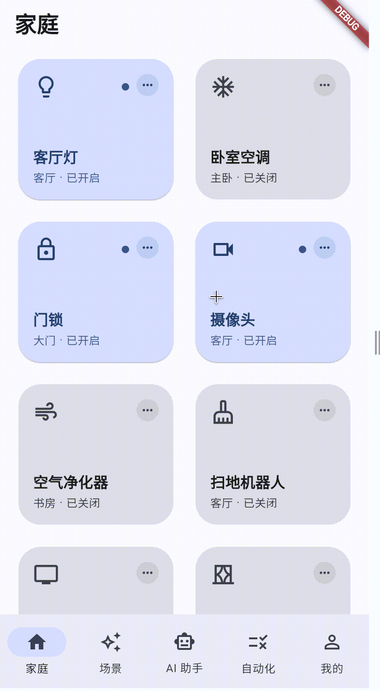
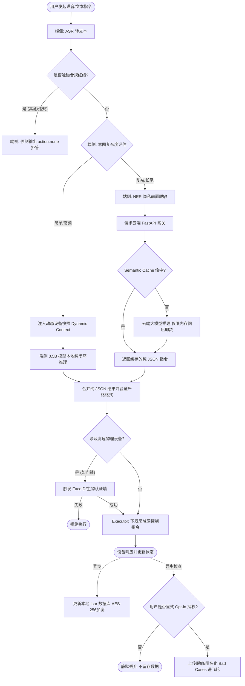
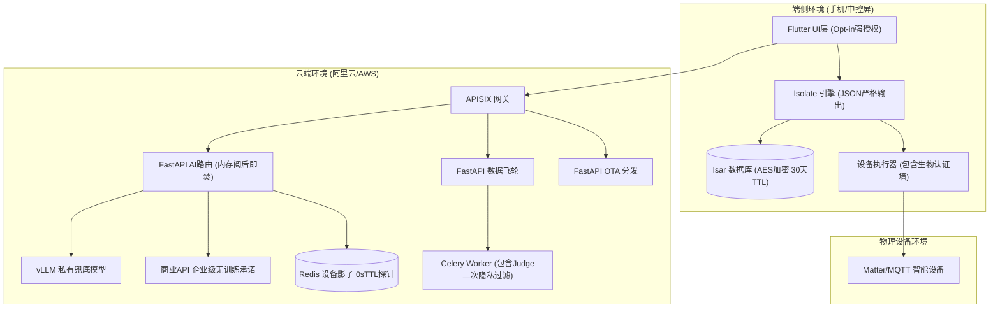
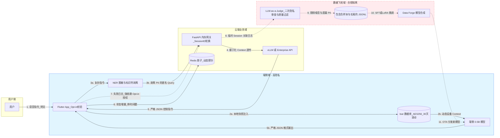
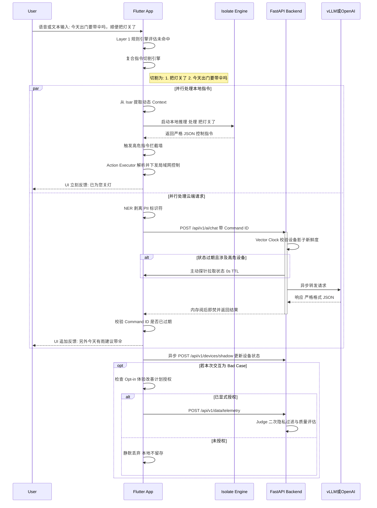

# 🏠 Smart Home On-Device AI Agent (端侧大模型智能管家)

[English](README_en.md) | [中文](README.md)



[](https://flutter.dev)
[](https://dart.dev)
[](https://github.com/ggerganov/llama.cpp)
[](https://isar.dev)
[](LICENSE)
[](http://makeapullrequest.com)

A next-generation Smart Home application demonstrating the **production-ready implementation of On-Device AI + Agent architecture**. Powered by `llama.cpp` through Dart FFI and a lightweight local RAG (Retrieval-Augmented Generation) system.

这是一个致力于探索和展示 **“端侧大模型 + Agent” 真实落地能力** 的智能家居开源项目。它彻底抛弃了纯云端 API 的重度依赖，在移动设备本地完成了从自然语言理解、意图规划到 IoT 硬件控制的完整 Agent 闭环，并辅以轻量级云端兜底，构建了完整的端云协同体系。

## 📑 目录 (Table of Contents)
- [快速指引 (Role-based Entry Points)](#-快速指引-role-based-entry-points)
- [商业洞察与产品愿景 (Business & Product Vision)](#-商业洞察与产品愿景-business--product-vision)
- [核心落地能力 (Why On-Device Agent?)](#-核心落地能力-why-on-device-agent)
- [端云协同架构全景 (Edge-Cloud Architecture)](#-端云协同架构全景-edge-cloud-architecture)
- [项目核心亮点 (Core Project Highlights)](#-项目核心亮点-core-project-highlights)
- [快速开始 (Getting Started)](#-快速开始-getting-started)
- [项目文档 (Documentation)](#-项目文档-documentation)
- [数据与模型 (Data & Model Ops)](#-数据与模型评估复现与迭代-data--model-ops)
- [致谢与社区 (Acknowledgements & Community)](#-致谢与社区-acknowledgements--community)

---

## 🧭 快速指引 (Role-based Entry Points)

欢迎来到 Smart Home On-Device AI Agent 仓库！为了让你快速找到所需内容，请根据你的角色选择入口：

* 👉 **我是移动端/Flutter 开发者**：你想了解如何在设备端本地运行大模型，请直接阅读 [端侧 AI Agent 架构复盘与落地能力指南](docs/honest_architecture_reflection.md) 和 [Llama.cpp 引擎入口代码](packages/on_device_agent/lib/src/engine/llama_cpp/llama_engine.dart)。
* 👉 **我是模型/算法工程师**：你想了解我们如何进行高质量数据合成与端侧模型微调，请前往 [Model Forge 目录说明](model_forge/README.md) 并阅读 [数据合成黄金规则](model_forge/data_evaluation_and_synthesis_rules.md)。
* 👉 **我是后端/云服务架构师**：你想了解高隐私要求的端云架构与防并发竞态设计，请深入阅读 [端云协同架构落地方案 (基于 FastAPI)](docs/fastapi_edge_cloud_architecture.md)。
* 👉 **我是产品经理/业务操盘手**：你想了解这个项目的商业价值与终极愿景，请阅读 [产品迭代愿景：从“被动控制”到“无感智能”](docs/product_vision_ice.md)。

---

## 📚 项目文档 (Documentation)

* [🌌 产品迭代愿景：从“被动控制”到“无感智能” (Zero-UI Platform)](docs/product_vision_ice.md)
* [智能家居端侧 AI Agent 架构复盘与落地能力指南](docs/honest_architecture_reflection.md)
* [智能家居端云协同架构落地方案 (基于 FastAPI) - 研发工程评审版](docs/fastapi_edge_cloud_architecture.md)
* [智能家居 AI 系统端到端隐私合规与数据安全方案](docs/ai_privacy_compliance_guidelines.md)
* [端云协同 AI 系统数据地图与验证指导体系](docs/data_map_and_qa_lineage.md)
* [智能家居端云协同 AI 架构设计方案](docs/edge_cloud_collaborative_architecture.md)
* [智能家居端侧 AI Agent 架构复盘与落地能力指南（版本二）](docs/on_device_ai_architecture_review.md)
* [端侧模型深度定制与全链路微调方案 (架构师视角)](model_forge/on_device_model_customization_pipeline.md)
* [Mac M4 端侧模型微调与量化复现 SOP](model_forge/mac_m4_reproduction_sop.md)
* [数据评估体系与合成规则逆向推导](model_forge/data_evaluation_and_synthesis_rules.md)
* [智能家居端侧模型：数据评估与验收体系指南](model_forge/data_evaluation_and_acceptance_framework.md)
* [智能家居端侧模型业务扩展与迭代 SOP](model_forge/business_expansion_model_iteration_sop.md)
* [Model Forge 目录说明](model_forge/README.md)

---

## 🎯 核心产品战略：从「被动控制」到「主动智能」 (Core Product Strategy)

> **“我们不是在制造一个搭载大模型的万能语音遥控器。我们在打造一个‘预判你所想，自然如呼吸’的家庭专属数字生命。”**

当前行业的智能家居大多陷入了“技术炫技”的怪圈：用庞大的云端参数模型，去执行“开灯”、“关窗帘”这种简单的**被动指令**。这本质上依然是“人服务于机器”（需要人去下发指令才能运作）。

本项目的核心产品战略是实现范式转移：**彻底跨越「被动控制」，迈向「主动智能 (Proactive Intelligence)」**。所有的底层技术架构（端侧推理、本地 RAG、防并发网关）均服务于这一产品愿景，绝非无意义的技术堆砌。

### 1. 认知重塑：什么是真正的主动智能？
*   **从“一问一答”到“全域感知 (Context-Awareness)”**：不再是被唤醒词叫醒才工作，而是通过本地传感器、时间节律、甚至是用户的生物节律（如睡眠状态），在后台持续构建动态家庭上下文 (Dynamic Context)。
*   **从“执行指令”到“预判意图 (Predictive Action)”**：系统能学习到“周五晚上 7 点你需要柔和灯光与加冰威士忌”，在你踏入家门前，一切已悄然就绪，实现真正的 **Zero-UI（无感交互）**。干掉繁琐的汉堡菜单和 Toggle 开关，交互应该变成基于物理引擎的本能动作与多模态感官闭环。
*   **从“公域模型”到“私域数字生命 (Personalized AI)”**：通过端侧的全局习惯学习模型 (Federated Habit Engine)，AI 会随着用户的起居习惯不断进化，成为世界上唯一且最懂你的数字管家。

### 2. 为什么「主动智能」必须依赖「端侧大模型」？
这正是本项目技术选型背后的**第一性原理**。
要实现主动智能，AI 必须 24 小时不断地监听、分析家庭中的温湿度、安防探头、生活作息等**极度隐私的数据**。
*   **隐私底座不可妥协**：如果完全依赖云端大模型，意味着要将全家人的生活隐私 24 小时向云端直播，这在商业合规和用户心理上是**绝对不可接受的**。
*   **延迟与成本的灾难**：主动感知带来的海量微小状态变化，如果全部上云，会产生极其恐怖的 API 调用成本和网络延迟。

**因此，端侧大模型 (On-Device AI) 不是为了省网费的技术炫技，而是实现「主动智能」的绝对前提（Privacy as a prerequisite for Proactive AI）。** 我们将 >80% 的高频和隐私数据拦截在设备本地进行闭环计算，才使得“全天候主动感知”成为可能。

### 3. 商业变现与护城河 (Business Value)
*   **破局隐私信任危机**：以“本地优先 (Local-First)”打消用户顾虑，精准切入对隐私极度敏感的高端市场。
*   **构建合规数据飞轮**：依靠“显式授权 (Opt-in) + 端侧脱敏”，合法合规地沉淀高质量垂域日志，持续迭代企业自身的专属行业大模型。

[👉 深入阅读《产品迭代愿景：从“被动控制”到“无感智能”》详细报告](docs/product_vision_ice.md)

---

## 🌟 技术底座：支撑主动智能的核心落地能力 (Tech Enablers)

大模型直接控制物理世界的硬件，最大的阻碍是**延迟**、**隐私**和**幻觉**。本项目通过以下三大架构创新，完美解决了这些落地痛点：

### 1. 🎯 零幻觉的硬件控制 (Zero-Hallucination Determinism)
*   **痛点**：云端大模型容易产生幻觉，输出不存在的设备 ID 或错误的 JSON 格式，导致硬件控制崩溃。
*   **落地实现**：首创性地引入了 **动态 GBNF (GGML BNF) 语法树**。在每次推理前，Agent 会获取当前真实的家庭设备列表，动态生成底层 C++ 采样约束（如 `device_id ::= "\"light_1\"" | "\"ac_1\""`）。从概率分布的最底层掐断了 AI 输出非法字符的可能，实现了 **100% 的 JSON 解析成功率和实体准确率**。

### 2. 📚 纯本地的隐私级 RAG (Edge RAG for Privacy)
*   **痛点**：用户询问“今天谁开了大门”、“卧室监控有没有异常”等涉及极高隐私的数据，绝不能上传云端。
*   **落地实现**：利用 **Isar 本地对象数据库** 替代沉重的向量库。Agent 内部实现了轻量级的意图路由，拦截查询类指令后，在几毫秒内检索本地 `BehaviorLog`，并作为 Context 动态注入 Prompt。整个过程**完全断网可用**，实现了真正的“隐私级数据增强”。

### 3. ⚡ 异步隔离与毫秒级响应 (Isolate-Driven Edge Inference)
*   **痛点**：在手机上跑 2B 级别的模型，极易导致主线程阻塞，造成 App 卡顿甚至 ANR。
*   **落地实现**：基于 Dart 的 FFI 深度绑定 `llama.cpp` 源码，并将模型加载（Mmap）、Prompt 预处理和 Token 采样全部压入 **Dart Isolate (独立内存堆的后台线程)** 中。确保在进行繁重的张量计算时，Flutter UI 依然能保持丝滑的 60fps 帧率。

## ☁️ 端云协同架构全景 (Edge-Cloud Architecture)

本项目不仅包含强大的端侧引擎，更通过 **FastAPI 云端微服务** 打造了高隐私、低延迟的端云协同底座，兼顾物理控制的安全与长尾意图的智能。

### 核心设计原则 (First Principles)
1. **极致隐私 (Privacy by Design)**: 默认本地闭环。复杂指令上云前强制 NER 脱敏剥离个人标识符，云端内存阅后即焚；飞轮数据收集严格遵循显式 Opt-in 强授权。
2. **极速响应与防竞态 (Low Latency)**: 端侧拦截 >80% 日常请求；引入指令解耦 (Intent Splitting) 实现端云并行，结合 Command ID 防“幽灵播报”。
3. **高危物理阻断 (Physical Safety)**: 门锁等高危设备采用 0s TTL 零缓存，涉及此类操作强制触发主动探针与本地生物认证墙。
4. **协同进化 (Data Flywheel)**: 建立基于 LLM-as-a-Judge 的二次隐私清洗队列，提取高质量 SFT 负样本数据，并通过 OTA 动态反哺端侧模型。

### 1. 业务流程与合规卡点 (Business Process Flow)
展示从语音发起到设备响应的全生命周期，突出脱敏、认证与数据飞轮卡点。


### 2. 产品与微服务架构 (Product Architecture)
展示端侧重组件、云端微服务与物理终端的三层结构。


### 3. 核心数据流转 (Core Data Flow)
明确展示控制流、状态流以及带有强隐私隔离要求的数据飞轮流转路径。


### 4. 关键交互时序 (Sequence Flow)
展示复杂复合指令的端云并行处理与竞态防护机制。


详细的 API 契约、管理层决策与 DevOps 部署方案，请参阅 [端云协同架构落地方案](./docs/fastapi_edge_cloud_architecture.md)。

---

## ✨ 交互体验亮点 (UX Highlights)

*   **🧠 透明的“思维链”展示**：告别 AI 的黑盒。UI 实时渲染 Agent 的规划过程（意图识别 -> 本地 RAG 检索 -> 动态语法树生成 -> 指令执行）。
*   **🔄 操作前后状态对比**：精准捕捉 AI 控制前后的 IoT 设备状态（例如：空调 `[关闭] ➔ [开启 (22°C)]`），在聊天气泡中提供极具安全感的状态反馈。
*   **📊 极客性能看板**：在 Debug 模式下，每条指令下方会自动挂载性能追踪面板，展示 **端侧推理耗时** 和 **Tokens/s (生成吞吐量)**，为架构调优提供直观依据。

---

## 🏆 项目核心亮点 (Core Project Highlights)

本项目不仅仅是一个智能家居 Demo，它在架构设计、工程落地与数据闭环上均体现了工业级的高标准：

1. **破局硬件限制：端侧 AI 零幻觉控制**
   打破了大模型容易产生“幻觉”从而无法安全控制硬件的痛点。创新性地采用 `动态 GBNF (GGML BNF) 语法树` 技术，将设备的物理上下文（Context）直接注入底层 C++ 采样约束中，实现了 **100% 格式严谨的 JSON 指令输出**，彻底杜绝越权操作和无效解析。

2. **全栈隐私护城河：Privacy by Design**
   无论是端侧的 **Isar AES-256 全盘加密** 与 **30天滚动清理**，还是云端交互的 **前置 NER 脱敏**、**内存阅后即焚**，以及进入数据飞轮前的 **强制 Opt-in 显式授权**，项目在数据流转的每一个毛细血管都贯彻了最严苛的合规标准。

3. **高性能工程落地：Isolate 异步与指令解耦**
   利用 Flutter 的 `Isolate` 和 FFI 深度绑定 `llama.cpp`，确保端侧 2B 模型推理不阻塞主线程。在端云协同中，实现了 **意图复合切割 (Intent Splitting)**，支持本地控制指令与云端长尾推理并行处理，极大降低了用户体感延迟。

4. **数据飞轮闭环：从模型评估到自动化微调**
   包含完整的 `Model Forge` 数据工厂。不是简单的拼凑数据，而是基于业务指标逆向推导 **数据合成的 5 条黄金规则**。并配合云端 `LLM-as-a-Judge` 机制实现脱敏日志的自动化清洗、打分与 SFT 微调反馈，构建了可持续进化的智能底座。

---

## 🏗 架构全景 (Architecture Overview)

项目被严格解耦为 **UI 表现层** 和 **端侧 Agent 内核包**，便于在任何 Flutter 项目中复用：

```text
lib/ (Flutter UI 层)
 ├── main.dart (App Entry, Chat UI & Metrics Panel)
 └── services/ (IoT 设备状态管理模拟)

packages/on_device_agent/ (端侧 Agent 内核)
 ├── lib/src/
 │    ├── engine/        # 基于 FFI 的 LlamaCppEngine & Isolate 调度
 │    ├── context/       # 环境感知、RAG 日志组装 & 动态 GBNF 生成器
 │    └── executor/      # 动作执行器 (含安全护栏 Guardrails & 行为落库)
 └── ios/Classes/llama_cpp_src/ # llama.cpp 底层 C++ 源码 (子模块)
```

## 🚀 快速开始 (Getting Started)

### Prerequisites
*   Flutter SDK `3.x`
*   Dart SDK `3.x`
*   (For iOS/macOS) Xcode and CocoaPods
*   (For Android) Android Studio & NDK

### Installation

1. **Clone the repository:**
   ```bash
   git clone https://github.com/yourusername/smart_home_app_on_device_ai.git
   cd smart_home_app_on_device_ai
   ```

2. **Install dependencies:**
   ```bash
   flutter pub get
   ```

3. **Generate Isar database schemas:**
   ```bash
   cd packages/on_device_agent
   flutter pub run build_runner build
   cd ../..
   ```

4. **Run the App:**
   ```bash
   # Run in debug mode (Includes Performance Metrics UI)
   flutter run
   ```
   > **Note:** By default, running on Web or Simulator will use the `LlamaCppEngineMock` (fallback engine) since compiling C++ LLM inference requires real device hardware acceleration (Metal/Vulkan).

## 🛠 Advanced: Running Real LLMs on Device

To use real on-device inference instead of the mock engine:
1. Download a highly quantized `.gguf` model (e.g., `gemma-2b-it-q4_k_m.gguf`).
2. Place it in the `assets/models/` directory.
3. Update the initialization path in `main.dart`:
   ```dart
   await _agent.initialize(modelPath: "assets/models/your_model.gguf");
   ```
4. Ensure hardware acceleration is enabled in native builds (e.g., `GGML_METAL=1` for iOS).

---

## 🧩 Monorepo 结构与关键入口 (Project Layout & Key Entry Points)

- UI 入口与演示
  - [main.dart](file:///Users/aiden/Documents/macinit/smarthome%20APP/smart_home_app/lib/main.dart)
  - 设备模型：[device.dart](file:///Users/aiden/Documents/macinit/smarthome%20APP/smart_home_app/lib/models/device.dart)
  - 设备服务：[device_service.dart](file:///Users/aiden/Documents/macinit/smarthome%20APP/smart_home_app/lib/services/device_service.dart)
- 端侧 Agent 内核 (可复用包)
  - Llama.cpp 引擎入口：[llama_engine.dart](file:///Users/aiden/Documents/macinit/smarthome%20APP/smart_home_app/packages/on_device_agent/lib/src/engine/llama_cpp/llama_engine.dart)
  - FFI 绑定声明：[llama_bindings.dart](file:///Users/aiden/Documents/macinit/smarthome%20APP/smart_home_app/packages/on_device_agent/lib/src/engine/llama_cpp/llama_bindings.dart)
  - 意图结构体 (JSON Schema 对应)：[agent_intent.dart](file:///Users/aiden/Documents/macinit/smarthome%20APP/smart_home_app/packages/on_device_agent/lib/src/models/agent_intent.dart)
- Model Forge (造模型车间)
  - 数据合成脚本：[data_synthesis.py](file:///Users/aiden/Documents/macinit/smarthome%20APP/smart_home_app/model_forge/notebooks/data_synthesis.py)
  - 训练脚本 (MLX LoRA)：[train.py](file:///Users/aiden/Documents/macinit/smarthome%20APP/smart_home_app/model_forge/scripts/train.py)
  - 转换与量化流水线：[quantize.sh](file:///Users/aiden/Documents/macinit/smarthome%20APP/smart_home_app/model_forge/scripts/quantize.sh)
  - 一键环境与训练：`make setup`、`make train` 或运行 [run_train.sh](file:///Users/aiden/Documents/macinit/smarthome%20APP/smart_home_app/model_forge/run_train.sh)
  - 目录说明与 SOP 索引：[Model Forge README](file:///Users/aiden/Documents/macinit/smarthome%20APP/smart_home_app/model_forge/README.md)

---

## 🧪 数据与模型：评估、复现与迭代 (Data & Model Ops)

- 评估指标与验收标准
  - 指标体系：FSR ≥ 99.5%，IEM ≥ 95%，OOD-R ≥ 98%，DCR ≥ 99%
  - 详见：[数据评估与验收体系指南](file:///Users/aiden/Documents/macinit/smarthome%20APP/smart_home_app/model_forge/data_evaluation_and_acceptance_framework.md)
- 数据合成黄金规则
  - 仅输出纯 JSON、动态设备快照、模糊意图覆盖、负样本边界测试、长尾语言分布
  - 详见：[数据评估体系与合成规则逆向推导](file:///Users/aiden/Documents/macinit/smarthome%20APP/smart_home_app/model_forge/data_evaluation_and_synthesis_rules.md)
- 端到端复现 (Apple M4)
  - 环境与命令全流程：从 venv、数据合成、QLoRA、GGUF 转换到 Q4_K_M 量化
  - 详见：[Mac M4 复现 SOP](file:///Users/aiden/Documents/macinit/smarthome%20APP/smart_home_app/model_forge/mac_m4_reproduction_sop.md)
- 端侧模型定制方案
  - 架构师视角的全链路方案与团队收益
  - 详见：[深度定制与全链路微调方案](file:///Users/aiden/Documents/macinit/smarthome%20APP/smart_home_app/model_forge/on_device_model_customization_pipeline.md)

---

## 📦 提交规范与忽略策略 (Commit Policy)

- 仅提交必要源码与配置，忽略大型模型文件、临时产物与平台构建输出
- 当前忽略规则参考：[.gitignore](file:///Users/aiden/Documents/macinit/smarthome%20APP/smart_home_app/.gitignore)
- Model Forge 关键忽略事项
  - 不提交 `exports/**/*.gguf`、`data/**/*.jsonl`、`venv/` 与 `scripts/llama.cpp/`
  - 大文件统一由外链或发布包下发

## 📝 Debugging & Performance Tracking

The application includes a built-in profiler available only in `kDebugMode`. When you send a command to the AI, it will output a dedicated metrics panel showing:
*   **Inference Time (ms)**: Pure C++ execution time.
*   **Total Latency (ms)**: From tapping "Send" to UI rendering.
*   **Throughput (Tokens/s)**: The generation speed of the LLM on your hardware.

## 🤝 Contributing

We welcome contributions! Please see our [CONTRIBUTING.md](CONTRIBUTING.md) for details on our code of conduct and the process for submitting pull requests.

---

## 🙏 致谢与社区 (Acknowledgements & Community)

本项目的架构能够成功落地，离不开以下优秀开源社区的基石：
*   **[llama.cpp](https://github.com/ggerganov/llama.cpp)**：为移动端提供了极其高效的张量推理能力与 GBNF 语法树支持。
*   **[Flutter](https://flutter.dev/) & [Isar](https://isar.dev/)**：提供了完美的跨平台 UI 体验和极速的本地 NoSQL 对象存储。
*   **[vLLM](https://github.com/vllm-project/vllm)**：支撑了本项目云端长尾推理与 LLM-as-a-Judge 的高并发吞吐。

### 💬 加入社区交流
*   如果您对端侧 AI (Edge AI)、智能家居或模型量化微调感兴趣，欢迎在仓库的 **[Discussions](https://github.com/yourusername/smart_home_app_on_device_ai/discussions)** 区发帖交流。
*   对于代码 Bug 或 Feature Request，请通过 **[Issues](https://github.com/yourusername/smart_home_app_on_device_ai/issues)** 提交。

---

## 📋 核心 Todo 清单 (Roadmap)

基于目前的架构蓝图，项目接下来的核心演进与落地任务如下：

### Phase 1: FastAPI 端云协同底座搭建
- [ ] **初始化 FastAPI 后端脚手架**：包含 Pydantic v2 全局校验与 JWT 鉴权中间件。
- [ ] **重构设备影子 (Device Shadow)**：基于 Redis Cluster 实现状态增量更新，引入 Vector Clock 时间戳校验机制。
- [ ] **端云防竞态处理**：在 Flutter 端实现 Command ID 拦截器，解决云端异步返回较慢导致的“幽灵播报”。
- [ ] **高危设备 0s TTL 探针**：针对安防设备开发主动拉取状态的 MQTT 极速通道。

### Phase 2: 隐私合规与大模型路由
- [ ] **端侧前置脱敏管道**：在 Flutter 端接入轻量级 NER 引擎，上云前剥离姓名、地址等个人标识符 (PII)。
- [ ] **合规授权墙 (Opt-in UI)**：App 端开发极显眼的“体验改善计划”授权弹窗（非默认勾选），控制日志上传阀门。
- [ ] **Semantic Cache 语义缓存**：在 FastAPI 路由层接入 Redis/Milvus，拦截高频通用指令以降低大模型冷启动延迟。
- [ ] **大模型 Schema 对齐**：确保 vLLM 开启 `--guided-decoding-backend`，商业 API 启用 Structured Outputs。

### Phase 3: 数据飞轮与模型演进
- [ ] **LLM-as-a-Judge 清洗流水线**：开发 Celery Worker 消费脱敏日志，通过大模型进行二次隐私审查与质量打分。
- [ ] **端侧意图解耦 (Intent Splitting)**：开发轻量级分类器，实现本地控制与云端长尾对话的 `par` 并行调度。
- [ ] **OTA 动态分发策略**：开发基于 App `Version Code` 的模型强校验下发服务，杜绝跨版本模型导致推理 Crash。
- [ ] **(预研) 联邦学习闭环**：探索将微调任务下发至端侧计算梯度的技术路径。

---

## 📄 License

This project is licensed under the MIT License - see the [LICENSE](LICENSE) file for details.
