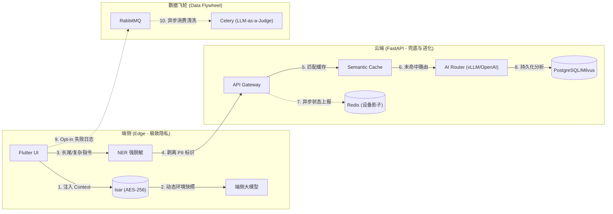

# 智能家居端云协同架构系统设计深度剖析

## 0. 架构设计第一性原理 (First Principles)
基于第一性原理思维，我们在设计端云协同系统时明确以下四大根基，防止过度设计与偏离业务核心：
- **前提 (Premise)**: 智能家居的核心在于实现从被动控制走向**“主动智能(Proactive Intelligence)”**和无感交互(**Zero-UI**)。移动端硬件无法独立运行全能大模型，网络的不确定性及对家庭绝对隐私的要求，决定了端云协同是必由之路。
- **约束 (Constraints)**: 必须严格控制 Token 成本（本地拦截 >80% 日常请求），同时端到端延迟控制在 800ms 内，并兼容不同算力设备的平滑降级。
- **边界 (Boundaries)**: 云端 AI 不直连物理设备下发控制指令，仅输出意图推断（交由局域网 Executor 执行）；云端坚决不触碰未经本地强脱敏及用户 Opt-in 授权的隐私数据。
- **终局 (Endgame)**: 迈向全面**主动智能 (Proactive Intelligence)**与**联邦学习闭环**，将全天候的感知与隐私数据留在本地闭环处理，云端仅承担跨域联邦聚合、长尾路由和基座支撑。

## 1. 核心产品战略与技术支撑
我们的核心战略是：**主动智能与端侧大模型定位**。
端侧大模型并非纯技术炫技，而是实现“主动智能”的绝对前提——只有将全天候感知数据留在本地闭环，才能在不侵犯隐私的前提下实现意图预判与 Zero-UI。云端（FastAPI 架构）则作为强有力的补充和“大脑”，处理端侧无法消化的长尾与复杂意图。

## 2. 端云协同架构核心设计 (Edge-Cloud Collaboration)
在云端，我们采用 **FastAPI** 作为核心框架，无缝集成 vLLM（私有化部署主打兜底）和 OpenAI（处理极复杂长尾逻辑）。

核心解决的痛点及技术方案：
1. **设备影子一致性 (Device Shadow Consistency)**: 引入 **Vector Clock (向量时钟)** 与主动 **MQTT** 探针，彻底解决端云状态同步的异步乱序和旧数据覆盖问题，尤其在涉及高危设备（安防、发热）时做到 0s TTL 探针强校验。
2. **端云异步竞态解决 (Race Condition)**: 引入强绑定的 **Command ID** 机制，确保端侧界面在接收到云端耗时响应时，能够精准匹配，避免“幽灵播报”。
3. **低延迟响应 (Latency Optimization)**: 在 API 网关层引入 **Semantic Cache (语义缓存)**，对高频指令进行意图拦截并极速返回，进一步降低大模型冷启动与推理延迟。
4. **数据飞轮与二次清洗 (Data Flywheel)**: 建立 `LLM-as-a-Judge` 机制对上传的异常日志 (Bad Cases) 进行打分过滤与隐私二次脱敏，确保微调数据的质量与绝对安全。

## 3. 全链路数据地图与验证体系 (Data Map & Lineage)
端云架构的高效运转依赖清晰的数据血缘（Data Lineage）和流转体系：
- **端侧基座**: 高性能本地对象数据库 **Isar**（保留 AES-256 加密的原始感知与行为数据）。
- **云端存储**: 
  - **PostgreSQL**: 持久化关系数据（用户、拓扑、OTA策略）。
  - **Redis Cluster**: 高频短生命周期缓存（设备影子状态）。
  - **Milvus**: 向量记忆检索引擎（支撑云端复杂 RAG）。
- **数据飞轮管道**: 通过 **RabbitMQ** 缓冲并发请求，由 **Celery Worker** 异步执行大模型数据清洗 (`LLM-as-a-Judge`) 及微调合成。

### 核心业务数据流图 (Data Flow Diagram)

## 4. 后端工程项目结构设计
为了支撑上述架构，我们在当前项目下新建了 `backend` 文件夹，基于 FastAPI 最佳实践规划了以下结构：
- `app/api/v1/routers/ai.py`: 负责大模型路由、Semantic Cache 接入及 Command ID 校验。
- `app/api/v1/routers/devices.py`: 负责设备影子的状态上报与 Vector Clock 处理。
- `app/api/v1/routers/ota.py`: 处理端侧模型的动态下发与软硬件环境验证。
- `app/api/v1/routers/data.py`: 处理端侧脱敏数据上报，对接 RabbitMQ 与 Celery 飞轮。
- `app/core/`: 核心配置与鉴权中间件。
- `app/services/`: 业务逻辑封装，如 `MQTTService`, `VectorClockService`。
