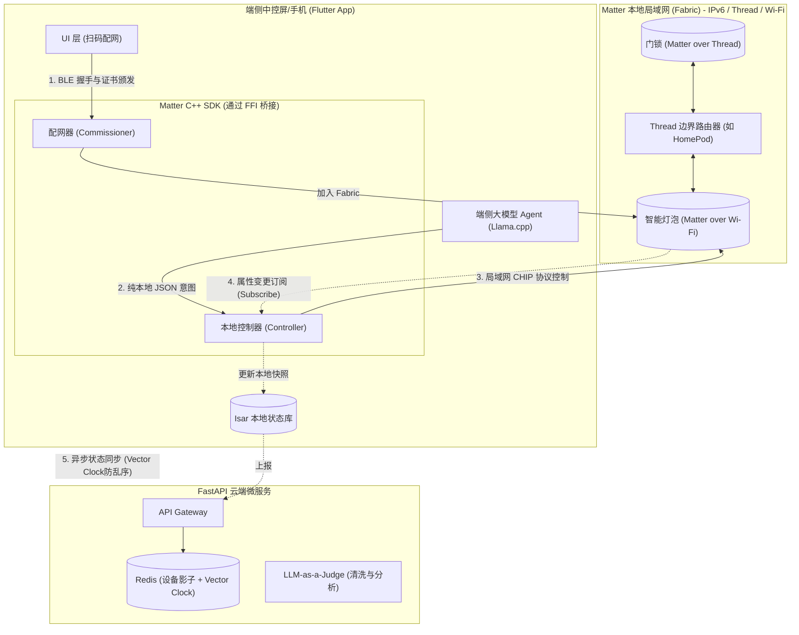

# 智能家居 Matter 协议生态接入架构方案与品审决策纪要

> **Document Status**: Review Draft | **Role**: System Architect / Product Lead / Product Lead | **Date**: 2026-03-31

## 1. 架构愿景 (Architectural Vision)
Matter 作为智能家居的“大一统”标准，其核心理念（**本地优先、安全局域网、多生态互联**）与我们项目“端侧大模型 + 极致隐私”的战略不谋而合。
接入 Matter 协议不仅能打破硬件生态壁垒（无缝接入苹果/谷歌/绿米等设备），更能让我们的 **端侧 Agent 成为整个 Matter Fabric (本地网络结构) 的智能大脑**，彻底摆脱对各厂商专有云端 API 的依赖。

### 1.1 品审结论摘要 (Executive Review Summary)

从架构师、产品负责人、产品负责人 三个视角综合评估，本方案的结论如下：

- **方向正确，应当立项推进**：Matter 不是锦上添花，而是本项目从“AI 控制能力”升级为“跨品牌家庭智能平台”的关键基础设施。
- **必须按商业化 MVP 推进**：本期不应追求全品类、全 Cluster、全生态一次性覆盖，而应聚焦“配网、控制、状态同步”三个闭环。
- **优先级高于部分体验增强项**：在产品演进顺序上，Matter 的战略优先级高于单纯 UI 打磨，因为它决定了设备池规模、品牌兼容性和平台化上限。
- **当前最大风险不在模型，而在协议落地**：真正的挑战是原生 SDK、配网链路、局域网状态同步、设备兼容性与 QA 体系，而不是大模型本身。

### 1.2 本期立项目标 (MVP Scope)

本期建议按 **Matter 商业化 MVP** 范围推进：

- **纳入范围**
  - 扫码配网 / 配对码配网
  - 灯、插座、开关三类高频设备
  - 本地局域网控制闭环
  - Subscribe 状态同步闭环
  - 本地缓存与云端影子同步
- **暂不纳入**
  - 门锁、摄像头等高危设备的首发开放
  - 全量 Cluster 覆盖
  - 多 Fabric 管理后台
  - 大规模 Home Hub 平台化能力

### 1.3 商业指标与业务指标体系 (Business & Operating Metrics)

作为业务负责人评估 Matter 方案，不能只看“协议是否接通”，而必须看它是否真的带来**增长、激活、留存、降本和可运营性**。基于当前项目的商业主张、增长计划、全链路指标体系和 Matter MVP 范围，建议在立项阶段就把指标拆成以下四层。

#### A. 商业增长指标 (Growth Metrics)

这类指标回答的是：Matter 接入后，是否真的让产品更容易被用户接受、激活并形成平台扩张。

- **设备接入激活率 (Add Device Activation Rate)**：用户下载并进入设备接入流程后，成功添加首个 Matter 设备的比例。该指标决定 Matter 是否真正降低了新用户进入门槛。
- **首次 AI 交互转化率 (First AI Interaction Conversion)**：完成首个设备接入后，用户是否在 24 小时内完成首次 AI 控制。该指标决定 Matter 是否把“设备连接”转化成了“AI 控制价值”。
- **跨品牌设备池扩张能力 (Device Pool Expansion Readiness)**：首期虽然采用白名单设备池，但要跟踪新增品牌/新增品类接入成本与验证周期，以衡量平台扩展效率。
- **试点家庭激活率 (Pilot Household Activation)**：试点家庭中，同时完成“首台设备接入 + 首次 AI 控制”的家庭占比。这是最接近真实商业化转化的北极星漏斗。

#### B. 商业效率与 ROI 指标 (Commercial Efficiency & ROI)

这类指标回答的是：Matter 对接后，是否让整套智能家居方案更值得卖、更值得持续运营。

- **Edge Routing Ratio (端侧拦截率)**：高频控制请求中，在本地完成理解与控制、无需上云的比例。项目现有战略目标是端侧承接 80% 以上高频请求，这直接决定云端成本结构。
- **Cloud Token Cost Reduction (云端 Token 降本率)**：相较纯云端控制方案，通过端侧理解、本地执行与状态复用节省的云端推理成本比例。
- **本地控制价值转化率 (Local Control Value Realization)**：用户实际使用 Matter 本地直控的频次，占全部设备控制次数的比例。该指标越高，说明“本地优先”不是 PPT 价值，而是真实行为。
- **售卖叙事完成度 (Commercial Story Completeness)**：用于管理层评估的组合指标，至少覆盖“跨品牌兼容、本地优先、隐私可信、低延迟”四个卖点是否都能被真实演示与验证。

#### C. 业务体验与激活指标 (Product Experience Metrics)

这类指标回答的是：用户第一次接触 Matter 能不能快速成功，后续能不能稳定使用。

- **首次 Matter 配网成功率 ≥ 85%**：决定用户是否进入后续体验，是最关键的入口指标。
- **首台设备接入时长 ≤ 3 分钟**：决定用户对“复杂度”的主观感知，直接影响放弃率。
- **设备接入后 24 小时内 AI 控制转化率 ≥ 40%**：决定 Matter 是否真正放大了 AI 能力，而不是停留在设备层。
- **Install → Add Device → Use AI 漏斗转化**：建议持续监控“安装 -> 添加首个设备 -> 完成首次 AI 控制”三段漏斗，验证 Matter 是否提升整体产品激活效率。

#### D. 运营与服务质量指标 (Operational Metrics)

这类指标回答的是：系统是否可持续运营，是否能够在全球市场下支撑试点、售后与口碑传播。

- **局域网控制 P95 时延 ≤ 200ms**：这是用户感知“真智能”与“假智能”的分界线。
- **设备状态同步一致性 ≥ 99%**：如果物理开关、App、AI 三方状态不一致，用户对整个系统的信任会迅速崩塌。
- **Matter 问题 Top N 归因覆盖率**：需要通过遥测和看板持续追踪配网失败码、掉线原因、状态冲突、控制超时的前几位问题来源。
- **试点问题闭环时效**：试点阶段需跟踪从问题出现到定位、修复、回滚的时效，确保方案具备可运营能力，而不是只能演示。

#### E. 业务负责人视角的最终判断

从业务负责人视角，Matter 接入的成功不等于“支持了多少设备”，而等于以下三件事是否同时成立：

1. **用户更容易接入和使用**：配网成功率高、激活漏斗顺、首次体验不挫败。
2. **商业价值更容易讲清楚**：跨品牌兼容、本地优先、隐私可信、低延迟这四个卖点可量化、可演示、可转化。
3. **运营成本结构更健康**：高频请求尽量在端侧完成，减少云端依赖和长期推理成本。

一句话总结：**Matter 的业务指标核心不是“协议覆盖数”，而是“激活率、转化率、降本率和可运营性”四条线是否同时成立。**

### 1.4 北极星指标 (North Star Metrics)

- 首次 Matter 配网成功率 ≥ 85%
- 首台设备接入时长 ≤ 3 分钟
- 局域网控制 P95 时延 ≤ 200ms
- 设备状态同步一致性 ≥ 99%
- 设备接入后 24 小时内 AI 控制转化率 ≥ 40%

### 1.5 全球用户 VOC 深度洞察 (Global Voice of Customer)

结合全球智能家居用户的公开反馈、DIY 社区讨论、Matter 新品接入舆情以及本项目现有的产品战略文档，可以归纳出以下几类高频 VOC。这些声音不是外围参考，而是决定我们 Matter 方案是否成立的根本依据。

#### A. 全球共性的六大用户心声

1. **“我不想管理一堆 App，我想管理的是家。”**
   用户最强烈的不满并不是单个设备不好用，而是跨品牌设备需要在多个 App、多个语音平台之间来回切换。对用户而言，Matter 的第一价值不是协议名词，而是**减少系统割裂感**。

2. **“我能接受智能家居不够聪明，但不能接受它不稳定。”**
   全球用户对智能家居最核心的负面反馈集中在：设备随机掉线、配网困难、状态不同步、重启后失控。说明 Matter 方案的成败，首先取决于**可靠性与恢复能力**，而不是功能列表的长度。

3. **“家里的灯和门锁，不应该因为外网故障就失效。”**
   用户对云依赖的容忍度很低，尤其是照明、插座、门锁、暖通等高频设施。对这类场景，用户天然偏好**本地优先、断网可用、低延迟**的控制路径。

4. **“我愿意给智能家居更多权限，但前提是我知道数据去了哪里。”**
   对摄像头、门锁、语音交互、行为习惯数据，用户的隐私敏感度显著高于普通消费软件。隐私问题不会直接提升转化，但会直接阻断购买和长期留存。

5. **“配网失败一次，我还能重试；失败三次，我就放弃这个品牌。”**
   首次上手体验决定用户是否进入后续场景编排和 AI 控制阶段。对 Matter 而言，**配网成功率、配网时长、失败后的可恢复性**是最重要的激活指标。

6. **“我不需要一个会说很多话的 AI，我需要一个真的能把灯打开的系统。”**
   用户对 AI 家居的真实期待是“可执行”和“有结果”，而不是抽象的智能对话。Matter 恰恰是把 AI 从“会理解”拉到“会控制”的关键桥梁。

#### B. 区域化 VOC 差异

不同地区用户的购买动机和风险阈值不同，Matter 方案在产品表达上不能只讲一种话术。

- **北美用户**
  - 更关注便利性、跨品牌自由组合、DIY 可扩展性
  - 对“单一 App 管全屋”“兼容 Apple / Google / Alexa”感知强
  - 但也更容易因配网失败、设备不稳定而迅速流失

- **欧洲用户**
  - 对隐私、本地控制、能效、可持续更敏感
  - 更能接受“本地优先”“少上云”“合规友好”的价值主张
  - 对高危设备和长期稳定性要求更高

- **亚太用户**
  - 更重视安装复杂度、价格带、交付效率和售后体验
  - 对“开箱即用”“少配置”“出问题有人处理”敏感
  - 更容易把智能家居视为家庭装修和设备升级的一部分，而不是纯技术玩具

- **高净值 / 第二居所用户**
  - 更关注远程可观测性、异常预警、弱网恢复与长期托管
  - 对“设备兼容性”之外，更关心“十年内是否稳定可维护”
  - 这类人群会直接推动 Home Hub、远程诊断与质量看板成为后续高优先级能力

#### C. 从 VOC 反推的产品判断

基于以上用户声音，Matter 方案必须遵守以下原则：

- **先解决可靠性，再讲智能化**：用户先要“稳定开灯”，才会相信“主动智能”
- **先解决兼容性，再讲生态想象力**：用户先要“少装 App、少换平台”，才会愿意扩大设备池
- **先解决本地可用，再讲云端协同**：用户不接受关键设备完全依赖外网
- **先解决配网与恢复，再讲高级场景**：激活门槛过高会直接阻断后续留存
- **先解决隐私信任，再讲数据飞轮**：没有用户信任，就没有长期可持续的数据沉淀

#### D. 对当前方案的直接启发

全球 VOC 对本方案提出了四个不能妥协的硬要求：

1. **配网必须短、准、可恢复**：这要求我们把 Commissioning 视为产品体验工程，而不是单纯协议工程。
2. **控制必须本地优先**：局域网直控不是技术炫技，而是用户对智能家居的基础信任门槛。
3. **状态必须一致**：物理开关、App 控制、AI 控制三方不一致，会直接摧毁用户对系统的信任。
4. **兼容性必须有边界承诺**：全球用户讨厌“宣传全兼容、实际踩坑”，所以首期白名单设备池是正确策略。

一句话总结：**从全球 VOC 看，Matter 方案成功的关键不在于“支持多少协议特性”，而在于是否把“少 App、低门槛、可恢复、本地可用、状态一致、隐私可信”做成真实体验。**

## 2. 系统核心角色与职责映射

在引入 Matter 后，我们将现有的“端云架构”与 Matter 的标准角色进行融合：

| 本项目组件 | Matter 标准角色映射 | 职责说明 |
| :--- | :--- | :--- |
| **Flutter App** | **Commissioner (配网器)** | 扫描设备二维码，通过 BLE/Wi-Fi 为新设备颁发本地证书并加入 Fabric。 |
| **Flutter 端侧 Agent** | **Matter Controller (控制器)** | 通过局域网 (IPv6) 直接向 Matter 设备发送 CHIP 协议的控制指令，实现 **0 云端延迟控制**。 |
| **端侧 Isar 数据库** | **Local Device Cache** | 订阅 Matter 设备的属性变更订阅 (Subscribe)，实时维护本地设备状态快照。 |
| **FastAPI 云端** | **Matter OTA Provider & 影子中心** | 为 Matter 设备提供统一的固件升级通道，并通过 Vector Clock 接收端侧上报的全局状态用于长尾分析。 |

---

## 3. Matter 集成系统架构图 (Architecture Diagram)

---

## 4. 核心工作流设计 (Core Workflows)

### 4.1 配网入网流程 (Commissioning Flow)
摒弃传统的账号绑定。用户通过 Flutter App 扫描设备上的 Matter QR Code。
1. App 通过 Bluetooth LE (BLE) 与设备建立初始连接。
2. App (Commissioner) 生成该设备的**节点证书 (NOC)**，并通过 BLE 传递给设备。
3. 设备获取家庭 Wi-Fi 或 Thread 网络凭证，正式加入本地局域网 (Fabric)。
4. 端侧 Isar 数据库记录新设备，并向大模型动态 GBNF 语法树中注册该设备的控制权限。

### 4.2 本地断网控制流 (Offline Control Flow)
完美契合我们的零延迟战略：
1. 用户说：“把客厅的灯调成阅读模式”。
2. 端侧大模型 (Llama.cpp) 解析出 JSON: `{"device_id": "matter_node_01", "action": "set_color", "params": {"color_temp": 4000}}`。
3. Flutter App 调用 Matter SDK 的 Controller 接口，通过局域网 (UDP/IPv6) 直接向 `matter_node_01` 发送 CHIP 报文。
4. **全程无需互联网连接**，从语音到灯光响应耗时 < 200ms。

### 4.3 状态同步与端云影子 (State Synchronization)
Matter 采用了高效的 **Subscribe (订阅)** 机制取代轮询。
1. 端侧 Controller 向局域网内的所有 Matter 设备发起属性订阅。
2. 当灯泡被物理开关改变状态时，立刻通过局域网推送给端侧 App。
3. 端侧更新 Isar 数据库，并立刻附带 `last_update_ts` (Vector Clock) 异步上报给 FastAPI 云端。
4. 云端 Redis 影子通过 Lua 脚本原子更新，供云端长尾大模型兜底时使用。

---

## 5. 方案品审结论 (Solution Review)

### 5.1 产品价值评审 (Product Value Review)

本方案满足产品负责人视角的三个核心判断：

1. **它能解决“兼容性”问题**：用户不再需要为了 AI 能力而绑定单一硬件品牌。
2. **它能解决“体验割裂”问题**：AI 理解、设备控制、状态回写不再分散在多个系统里。
3. **它能解决“平台天花板”问题**：设备生态越开放，后续场景推荐、主动智能、数据飞轮的价值越高。

结论：**Matter 是平台化增长抓手，不是边缘功能。**

### 5.2 用户体验评审 (UX Review)

本方案的体验闭环具备较强说服力，但要通过品审，必须满足以下条件：

- 配网过程必须足够短，不得让用户感知到复杂的证书、Fabric、BLE 细节
- 控制结果必须有实时反馈，不能停留在“AI 说已执行”
- 物理操作、App 操作、AI 操作三者之间必须保证状态一致
- 异常场景必须清楚区分：未配网、设备离线、权限不足、网络切换失败

结论：**体验不只是“能控制”，而是“可理解、可恢复、可预期”。**

### 5.3 商业化评审 (Business Review)

从产品负责人 视角，Matter 对接成立的前提在于它能支撑以下商业叙事：

- **跨品牌兼容**：降低用户换新成本，扩大可售卖设备池
- **本地优先与隐私**：强化高端市场与隐私敏感用户的购买理由
- **订阅扩展潜力**：Matter 打通后，后续才有资格卖场景服务、智能推荐、主动智能订阅
- **渠道价值**：更容易与标准设备厂商、地产、整装、运营商合作

结论：**Matter 是商业中枢能力，不是单点功能增强。**

### 5.4 技术可行性评审 (Feasibility Review)

从架构师视角，方案方向可行，但必须承认以下现实：

- Flutter 侧缺乏成熟纯 Dart Matter SDK，必须采用原生桥接
- iOS 与 Android 的 Matter 能力存在实现差异，必须先建立统一领域模型
- Matter 设备碎片化严重，首期必须控制设备池，不宜开放式宣称“全兼容”
- 状态同步、异常恢复、弱网切换的工程复杂度高于“控制成功”本身

结论：**方案可做，但必须用 MVP 思维和分阶段门禁控制复杂度。**

---

## 6. 关键决策点清单 (Decision Log)

| 决策主题 | 备选方案 | 建议决策 | 决策理由 | Owner |
| :--- | :--- | :--- | :--- | :--- |
| **立项策略** | 全量生态接入 / 商业化 MVP | **先做商业化 MVP** | 控制范围、缩短验证周期、提升试点成功率 | 产品负责人 |
| **首发设备范围** | 全品类 / 高频三件套 | **灯、插座、开关优先** | 需求高频、控制语义简单、风险可控 | 产品负责人 |
| **端侧协议实现** | 全 Dart / 原生桥接 | **原生桥接 + Flutter 抽象层** | 可行性最高，符合当前生态现实 | 架构师 |
| **控制路径** | 云端中转 / 局域网直控 | **局域网直控优先** | 与本地优先、低延迟、隐私战略一致 | 架构师 |
| **状态同步** | 轮询 / Subscribe | **Subscribe 优先** | 时效性更高、资源消耗更低 | 架构师 |
| **高危设备策略** | 同期开放 / 延后开放 | **首期延后或强制二次认证** | 降低误控与安全风险 | 产品负责人 / 安全负责人 |
| **Home Hub 策略** | 首期建设 / 二期预研 | **首期预留，二期推进** | 先做手机端 MVP，再解决常驻中枢问题 | 产品负责人 |
| **兼容性策略** | 全市场开放 / 白名单设备池 | **白名单设备池** | 减少试点阶段的兼容性不确定性 | QA / PM |

### 6.1 必须拍板的 Go/No-Go 决策

- 是否接受 **“先闭环，再扩品类”** 的产品策略
- 是否接受 **“先本地控制，再主动智能”** 的路线
- 是否批准 **双周 Sprint、10~12 周** 的交付节奏
- 是否同意首期将高危设备排除在商用 MVP 外
- 是否同意首期只对选定品牌设备池承诺兼容性

---

## 7. 分阶段门禁与品审要求 (Stage Gates)

### 7.1 Phase 1 门禁：SDK 与配网能力

- 至少完成一个平台的配网 PoC
- Flutter 层可拿到设备入网结果
- 配网失败有明确错误码和 UI 文案

### 7.2 Phase 2 门禁：控制闭环

- AI 结构化 JSON 可成功映射到 Matter 指令
- 开灯、关灯、调亮度三类操作稳定通过
- 局域网控制 P95 ≤ 200ms

### 7.3 Phase 3 门禁：状态闭环

- Subscribe 可稳定工作
- 物理按键变化能够实时回写到本地缓存
- 本地状态与云端影子一致性 ≥ 99%

### 7.4 Phase 4 门禁：商业化 MVP

- 配网成功率达到目标
- 问题定位与回滚机制就绪
- 试点设备池、试点家庭、发布策略明确
- 产品演示链路可完整跑通

---

## 8. 落地所需资源、合规与行业标准规范 (Resources, Compliance & Standards)

要将上述 Matter 架构方案从图纸推向真正的商业化落地，不能仅靠研发团队的单点突破。从业务负责人和架构师的综合视角，本期 MVP 及后续阶段的交付必须具备以下内部资源保障、外部生态支持，并严格遵守相关的行业合规与技术标准。

### 8.1 内部资源需求 (Internal Resources)

1. **专项研发与测试团队 (Dedicated R&D and QA)**
   - **Matter 协议专家/C++ 工程师**：由于缺乏纯 Dart 的成熟 Matter SDK，需要具备 C++/JNI/Objective-C++ 混合编译经验的工程师，解决 Project CHIP 源码在 iOS/Android 双端的编译与桥接问题。
   - **嵌入式/IoT 测试专家**：传统软件 QA 无法胜任，需要具备抓包（Wireshark 结合无线网卡抓取 IPv6/UDP 报文）、局域网拓扑模拟、弱网干扰测试经验的 IoT 测试人员。
   - **全栈架构师**：负责统筹端侧大模型意图输出（JSON）与 Matter Cluster 定义之间的语义映射。

2. **硬件测试实验室与设备池 (Hardware Lab & Device Pool)**
   - **跨品牌设备墙 (Device Wall)**：采购市面主流品牌的 Matter 认证设备（如 Apple HomePod Mini, Google Nest Hub, 绿米 Aqara, 飞利浦 Hue 等）建立自动化回归测试墙。
   - **网络隔离环境**：构建多 VLAN、屏蔽室或射频隔离箱，用于模拟复杂的家庭 Wi-Fi 拥堵、Thread 边界路由切换、断网局域网直控等极端网络边缘场景。

3. **数据与合规审核小组 (Data & Privacy Review Board)**
   - 专人负责跟进端云协同过程中的数据采集边界，确保“仅收集改进模型所需的最小遥测数据”，并对上传到云端的设备影子数据进行脱敏评估。

### 8.2 外部资源与生态合作 (External Resources & Partnerships)

1. **云基础设施与中间件支持 (Cloud Infrastructure)**
   - 稳定低延迟的云端网关与 Redis 集群，用于承载高并发的设备状态异步上报与 Vector Clock 校验。
   - OTA 固件分发 CDN 资源，确保 Matter 设备的固件更新具备全球覆盖的下载速度与稳定性。

2. **生态芯片与模组原厂支持 (Silicon & Module Vendors)**
   - 与主流 IoT 芯片厂商（如乐鑫 Espressif、芯科 Silicon Labs、恩智浦 NXP）建立技术沟通渠道，获取底层的 SDK 补丁、已知 Bug 列表以及量产烧录（DAC 证书）的最佳实践。

3. **第三方认证与测试机构 (Test Houses)**
   - 提前对接具备 CSA (Connectivity Standards Alliance) 授权的独立测试实验室（ATL），为后续自研硬件设备或核心软件组件的 Matter 认证做好流程摸底。

### 8.3 合规与安全要求 (Compliance & Security)

Matter 的核心卖点是安全与隐私，这要求我们在合规层面做到无懈可击：

1. **全球数据隐私法规 (GDPR, CCPA 等)**
   - **数据最小化与本地化**：用户的设备拓扑（Fabric）、配网凭证、日常控制习惯必须默认存储在端侧（Isar 数据库）。云端仅保留脱敏的设备影子和去标识化的指令执行成功率统计。
   - **被遗忘权与注销**：用户在 App 端删除 Fabric 或注销账号时，必须实现云端、端侧以及设备端（通过 `Remove Fabric` 指令）的彻底数据擦除。

2. **零信任安全架构与证书管理 (Zero Trust & PKI)**
   - **设备认证证书 (DAC)**：必须校验接入设备的 DAC 证书合法性，防止伪造的流氓设备接入局域网窃取数据。
   - **节点操作证书 (NOC) 安全分发**：作为 Commissioner，我们的 App 在为设备颁发 NOC 时，必须确保本地根证书（Root CA）的存储安全，防止私钥泄露导致整个家庭网络被接管。

3. **固件与大模型安全 (OTA & Model Security)**
   - 端侧大模型的更新与 Matter 设备的 OTA 升级必须实施严格的**防降级 (Anti-Rollback)** 与**签名校验 (Signature Verification)** 机制，防止供应链攻击或中间人篡改。

### 8.4 行业标准规范遵循 (Industry Standards)

方案的研发不能闭门造车，必须严格对齐以下国际标准与规范：

1. **CSA Matter 核心规范 (Matter Core Specification)**
   - 遵循 Matter 1.2/1.3 最新协议规范，重点实现其定义的基础 Cluster（如 OnOff, LevelControl, ColorControl），确保语义指令与标准数据模型完全一致。
   - 严格按照规范实现 Commissioning 流程（BLE 发现 -> PASE 握手 -> 证书颁发 -> 网络配网 -> CASE 会话）。

2. **Thread 组网标准 (Thread Group Specifications)**
   - 针对 Matter over Thread 设备，必须理解并兼容 Thread 1.3.0 规范，特别是边界路由器（Thread Border Router）的发现与 IPv6 路由机制，确保跨网段设备的互通。

3. **Bluetooth SIG 规范**
   - 遵循蓝牙低功耗 (BLE) 核心规范，保障在不同品牌安卓手机与 iPhone 上，Matter 配网初期的 BLE 广播发现与连接稳定性。

4. **智能家居网络安全相关国家/区域标准**
   - 如欧洲的 **ETSI EN 303 645**（消费类物联网安全基线要求）或美国的 **NIST IR 8425**，在密码学算法选择、默认密码消除、漏洞报告机制上满足目标市场的准入门槛。

---

## 9. 工程落地挑战与研发规划 (Implementation Roadmap)

在 Flutter 中接入 Matter 并非易事，因为目前缺乏官方的纯 Dart Matter SDK。我们需要采用 FFI 混合开发模式。

- **Phase 1 (基础建设)**：编译 [Project CHIP (Matter 官方 C++ SDK)](https://github.com/project-chip/connectedhomeip)。在 iOS 侧封装 `Matter.framework`，在 Android 侧封装 `play-services-home`，并通过 Flutter MethodChannel 暴露基础的配网 (Commissioning) 接口。
- **Phase 2 (控制与订阅)**：封装 Matter 的 Cluster 模型（如 OnOff Cluster, LevelControl Cluster），打通端侧 Agent 输出的 JSON 与 Matter CHIP 协议之间的转换层。
- **Phase 3 (Thread 边界网络)**：集成 Thread 边界路由支持，允许我们的 App 发现并控制低功耗 Matter 传感器（如温湿度计），丰富本地 RAG 的上下文。

### 9.1 研发推进建议

- **先打一条演示链路**：不要一开始就追求完整 SDK 包装，先完成“扫码配网 -> 开灯 -> 状态回写”的最短闭环
- **建立统一领域模型**：尽早抽象 nodeId、endpointId、clusterId、attributePath，避免 iOS/Android 双栈分裂
- **建立设备白名单测试池**：确保试点阶段能稳定复现与回归
- **把影子与指标一起做**：Matter 对接必须与遥测、质量看板一起落，不然无法运营

### 9.2 最终品审建议

综合评估后，本方案建议结论为：

- **建议通过立项评审**
- **建议按商业化 MVP 范围推进**
- **建议首期不承诺全品类全品牌兼容**
- **建议将 Home Hub、Thread 深化、多 Fabric 运营后台列入后续阶段**

一句话结论：**Matter 方案值得做，但必须以“闭环、可售卖、可验收”为第一原则推进，而不是以“协议覆盖度”作为阶段成功标准。**
