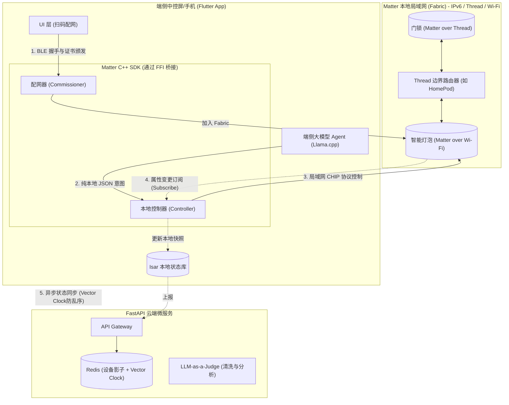

# 智能家居 Matter 协议生态接入架构方案

> **Document Status**: Draft | **Role**: System Architect | **Date**: 2026-03-31

## 1. 架构愿景 (Architectural Vision)
Matter 作为智能家居的“大一统”标准，其核心理念（**本地优先、安全局域网、多生态互联**）与我们项目“端侧大模型 + 极致隐私”的战略不谋而合。
接入 Matter 协议不仅能打破硬件生态壁垒（无缝接入苹果/谷歌/绿米等设备），更能让我们的 **端侧 Agent 成为整个 Matter Fabric (本地网络结构) 的智能大脑**，彻底摆脱对各厂商专有云端 API 的依赖。

## 2. 系统核心角色与职责映射

在引入 Matter 后，我们将现有的“端云架构”与 Matter 的标准角色进行融合：

| 本项目组件 | Matter 标准角色映射 | 职责说明 |
| :--- | :--- | :--- |
| **Flutter App** | **Commissioner (配网器)** | 扫描设备二维码，通过 BLE/Wi-Fi 为新设备颁发本地证书并加入 Fabric。 |
| **Flutter 端侧 Agent** | **Matter Controller (控制器)** | 通过局域网 (IPv6) 直接向 Matter 设备发送 CHIP 协议的控制指令，实现 **0 云端延迟控制**。 |
| **端侧 Isar 数据库** | **Local Device Cache** | 订阅 Matter 设备的属性变更订阅 (Subscribe)，实时维护本地设备状态快照。 |
| **FastAPI 云端** | **Matter OTA Provider & 影子中心** | 为 Matter 设备提供统一的固件升级通道，并通过 Vector Clock 接收端侧上报的全局状态用于长尾分析。 |

---

## 3. Matter 集成系统架构图 (Architecture Diagram)

---

## 4. 核心工作流设计 (Core Workflows)

### 4.1 配网入网流程 (Commissioning Flow)
摒弃传统的账号绑定。用户通过 Flutter App 扫描设备上的 Matter QR Code。
1. App 通过 Bluetooth LE (BLE) 与设备建立初始连接。
2. App (Commissioner) 生成该设备的**节点证书 (NOC)**，并通过 BLE 传递给设备。
3. 设备获取家庭 Wi-Fi 或 Thread 网络凭证，正式加入本地局域网 (Fabric)。
4. 端侧 Isar 数据库记录新设备，并向大模型动态 GBNF 语法树中注册该设备的控制权限。

### 4.2 本地断网控制流 (Offline Control Flow)
完美契合我们的零延迟战略：
1. 用户说：“把客厅的灯调成阅读模式”。
2. 端侧大模型 (Llama.cpp) 解析出 JSON: `{"device_id": "matter_node_01", "action": "set_color", "params": {"color_temp": 4000}}`。
3. Flutter App 调用 Matter SDK 的 Controller 接口，通过局域网 (UDP/IPv6) 直接向 `matter_node_01` 发送 CHIP 报文。
4. **全程无需互联网连接**，从语音到灯光响应耗时 < 200ms。

### 4.3 状态同步与端云影子 (State Synchronization)
Matter 采用了高效的 **Subscribe (订阅)** 机制取代轮询。
1. 端侧 Controller 向局域网内的所有 Matter 设备发起属性订阅。
2. 当灯泡被物理开关改变状态时，立刻通过局域网推送给端侧 App。
3. 端侧更新 Isar 数据库，并立刻附带 `last_update_ts` (Vector Clock) 异步上报给 FastAPI 云端。
4. 云端 Redis 影子通过 Lua 脚本原子更新，供云端长尾大模型兜底时使用。

---

## 5. 工程落地挑战与研发规划 (Implementation Roadmap)

在 Flutter 中接入 Matter 并非易事，因为目前缺乏官方的纯 Dart Matter SDK。我们需要采用 FFI 混合开发模式。

- **Phase 1 (基础建设)**：编译 [Project CHIP (Matter 官方 C++ SDK)](https://github.com/project-chip/connectedhomeip)。在 iOS 侧封装 `Matter.framework`，在 Android 侧封装 `play-services-home`，并通过 Flutter MethodChannel 暴露基础的配网 (Commissioning) 接口。
- **Phase 2 (控制与订阅)**：封装 Matter 的 Cluster 模型（如 OnOff Cluster, LevelControl Cluster），打通端侧 Agent 输出的 JSON 与 Matter CHIP 协议之间的转换层。
- **Phase 3 (Thread 边界网络)**：集成 Thread 边界路由支持，允许我们的 App 发现并控制低功耗 Matter 传感器（如温湿度计），丰富本地 RAG 的上下文。
