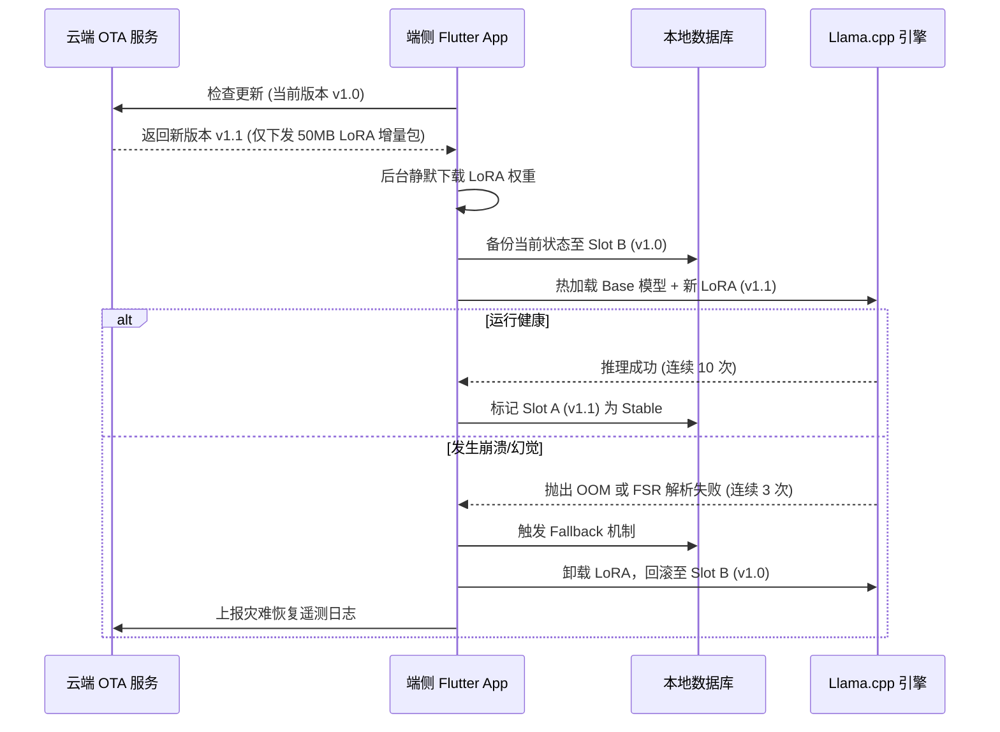
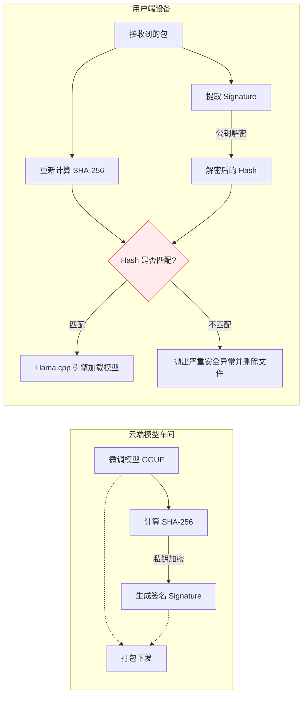
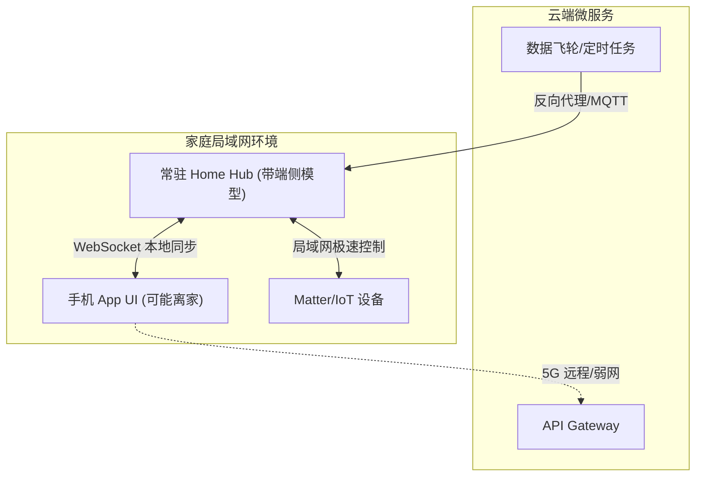
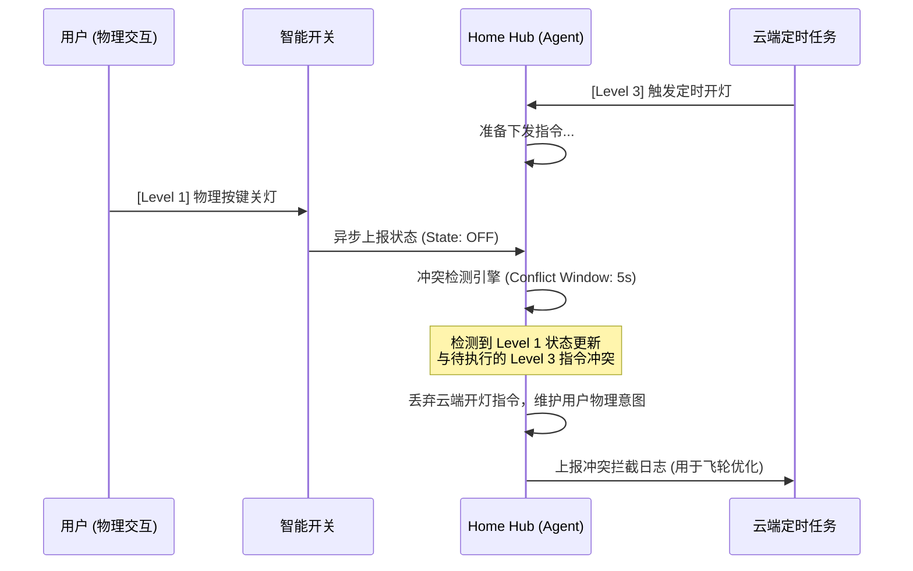

# 智能家居端云协同架构：商用化演进与盲区攻坚方案

> **Document Status**: Draft | **Role**: System Architect | **Date**: 2026-03-31

在完成了端侧推理闭环（GBNF、本地 RAG）和云端高并发底座（Redis 防重放、Semantic Cache、数据飞轮）的建设后，本项目已具备极高的技术壁垒。然而，要从“技术 Demo”跨越到“支持百万级设备在线的商用化平台 (Scale to Millions)”，现有的架构在 **OTA 模型分发、安全防篡改、边缘常驻网关以及离线状态对账** 方面存在明显的盲区。

本文档针对上述四大薄弱点，提供深度推演与架构落地方案，作为项目 Phase 4 的核心演进路线。

---

## 1. OTA 模型分发：增量更新与灾难回滚 (OTA Delta & Rollback)

### 1.1 问题定义
当前 2B 规模的 GGUF 模型体积约为 1.2GB~1.5GB。如果每次微调后都进行全量下发，CDN 成本昂贵且极易因弱网导致下载失败。此外，若新模型导致端侧严重幻觉或内存泄漏 (OOM)，系统缺乏退路。

### 1.2 架构解决方案
*   **双槽位回滚 (Dual-Slot Rollback)**：参考 Android A/B 分区，端侧保留 `Slot A (Current)` 和 `Slot B (Fallback)`。若连续发生 3 次 OOM 或 FSR 严重下降，自动切换回上一稳定版本。
*   **LoRA 适配器增量下发**：不再全量更新基座模型，而是仅下发几十 MB 的 LoRA 权重，在端侧（如利用 MLX 或 llama.cpp 的 LoRA 支持）进行动态加载合并。

### 1.3 数据流与时序图

---

## 2. 安全性闭环：模型权重签名与防篡改 (Model Signature)

### 2.1 问题定义
如果 CDN 被劫持或设备被 Root，恶意伪造的 GGUF 文件替换了本地模型，Agent 可能会绕过原有的安全护栏，生成恶意的 Matter 控制指令（如“开启门锁”）。仅靠 MD5 无法防范这种攻击。

### 2.2 架构解决方案
*   **数字签名验证 (Digital Signature Verification)**：云端发布模型时，使用机构私钥（如 Ed25519）对 GGUF 文件的 Hash 进行签名。
*   **端侧强制验签**：在 Llama.cpp 引擎进行 `Mmap` 加载前，Dart FFI 层必须使用硬编码在 App 内部的公钥进行验签，若失败则拒绝加载。

### 2.3 数据流向图

---

## 3. 边缘常驻网关：The Missing "Home Hub"

### 3.1 问题定义
当前手机 App 是唯一的 AI 推理入口和 Matter 控制器。当用户带手机离家（断开局域网）或 App 被杀后台时，云端的数据飞轮和定时任务链路彻底断裂，无法对家庭设备进行反向控制。

### 3.2 架构解决方案
*   **引入 Home Hub 角色**：将端侧 Agent 的核心内核（Llama.cpp 引擎 + Isar 数据库）剥离为独立包，部署在常驻局域网的硬件上（如带屏音箱、软路由、专用网关）。
*   **局域网 P2P 状态同步**：手机 App 仅作为 UI 前端，进入局域网后通过 mDNS 发现 Hub，并通过 WebSocket/gRPC 实时同步 Isar 中的设备影子状态。

### 3.3 架构重构图

---

## 4. 离线状态重同步与冲突仲裁 (Offline Resync)

### 4.1 问题定义
App 冷启动或从断网恢复时，Isar 数据库记录的状态可能已过期。若此时立刻进行大模型推理，会导致上下文幻觉。同时，如果“用户手动按墙壁开关”与“云端 AI 预设场景”发生冲突，缺乏统一的裁决机制。

### 4.2 架构解决方案
*   **冷启动对账协议 (Cold-Start Reconciliation)**：建立基于 Vector Clock 的状态探针机制，启动时优先强制对齐物理状态，阻塞 AI 推理直至对账完成。
*   **仲裁优先级矩阵**：定义指令处理优先级：`物理设备交互 (Level 1) > 本地 AI 意图 (Level 2) > 云端定时任务 (Level 3)`。在 5 秒冲突窗口期内，低优先级指令将被静默丢弃。

### 4.3 仲裁处理时序

---

## 5. 结语

上述四大维度的补全，标志着系统从“算法有效”迈向“工程可靠”和“商业可用”。它们构成了项目的 **Phase 4 核心演进路线**，确保我们的端侧 AI Agent 能够抵御恶意攻击、适应复杂网络并在极端的设备争抢中保持稳定。