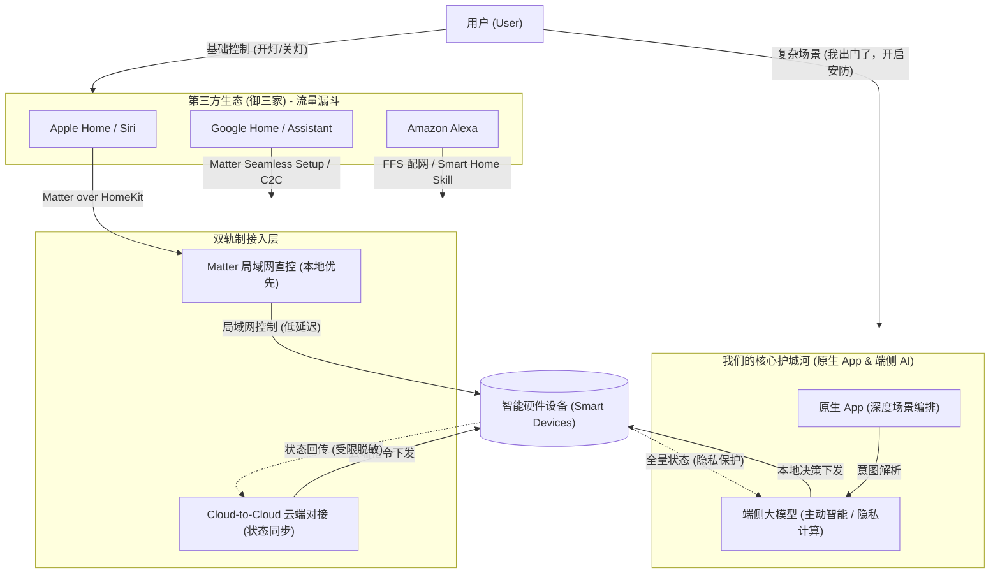
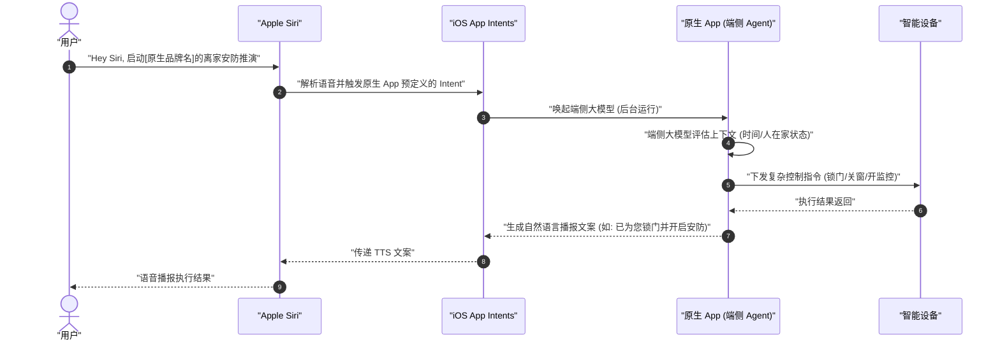
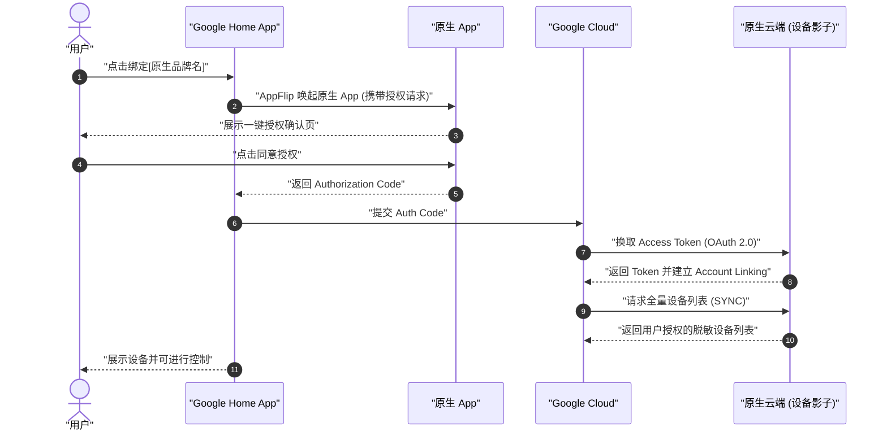
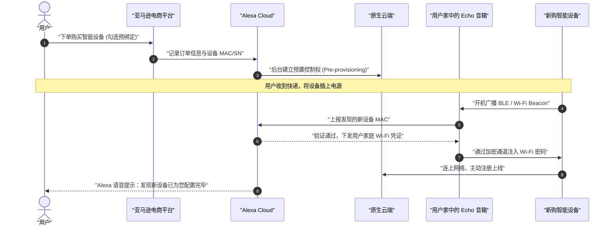

# 全球三大智能生态（Apple, Google, Alexa）接入产品战略与架构方案

> **Document Status**: Review Draft | **Role**: Product VP / Product Director | **Date**: 2026-04-01

## 1. 战略愿景与高管摘要 (Strategic Vision & Executive Summary)

作为主打“端侧大模型”与“主动智能”的智能家居平台，我们需要明确一个核心的商业博弈问题：**接入 Apple、Google 和 Alexa（以下简称“御三家”），究竟是出卖我们的灵魂沦为“哑管道”，还是借力打力扩大我们的流量护城河？**

从 **产品 VP** 的视角，本方案的战略定调如下：
- **流量漏斗而非终点**：将“御三家”定位为**泛化语音入口**和**用户习惯的桥梁**。我们要利用它们庞大的装机量完成新用户的低门槛激活，但必须通过我们 App 内的“高级主动智能”将用户心智拉回我们的核心业务。
- **双轨制接入策略**：采用 `Matter (本地优先)` + `Cloud-to-Cloud (云端互联)` 双轨并行的策略，确保满足不同生态的准入门槛，同时守住本地隐私的底线。
- **防守反击**：在基础的“开灯/关灯”控制上让渡给御三家，但在“场景编排、主动感知、复杂语义理解”上建立体验壁垒。

### 1.1 全局生态接入与防守反击业务架构图

### 1.2 本方案在现有项目架构中的融合定位 (Integration with Current Architecture)

作为架构师，必须明确本方案并非孤立的业务规划，而是深度嵌入到我们现有的 **“端云协同 (Edge-Cloud) + 数据飞轮 (Data Flywheel)”** 全局架构中。具体融合点如下：

- **端侧 AI 与 Isar 本地状态库的协同**：
  在现有的端云架构中，Flutter App 和 Isar 数据库构成了设备的“Local Device Cache”。御三家的局域网控制（如 Apple Matter over HomeKit）发生状态变更时，通过 Matter 的 Subscribe 机制，状态会实时更新至 Isar，触发本地大模型的上下文刷新，确保 Siri/Alexa 唤醒时，我们的本地 AI 拥有最新、最准确的设备状态感知。
- **云端 FastAPI 与 Redis 设备影子的对接**：
  Google C2C 和 Alexa Smart Home Skill 的云端对接，直接复用现有的 FastAPI 网关与 Redis 设备影子。当 Google HomeGraph 发起 `QUERY` 或我们的设备发生状态变更时，直接由 Redis 影子通过 Server Push 或 EventBridge 向御三家异步上报（Report State），这与我们现有的“端云状态 Vector Clock 防乱序同步”机制完美契合。
- **数据飞轮的合规屏障**：
  我们的核心竞争力是利用端侧脱敏日志上报进行 LLM-as-a-Judge 清洗和微调（QLoRA）。在接入御三家后，通过 Siri/Alexa 发起的语音指令日志**严禁进入**我们的核心训练语料库，以遵守生态数据隐私协议。我们的数据飞轮仅采集用户在我们原生 App 内发生的自然语言交互。

---

## 2. 三大生态接入产品方案拆解 (Ecosystem Solutions)

从 **产品总监** 的视角，针对不同生态的用户特征和技术规范，我们需要制定差异化的产品接入与体验方案。

### 2.1 Apple 生态 (Apple Home / Siri)
**核心受众**：高净值用户、隐私极度敏感者、全家桶用户。
**产品定位**：极致的安全感与无缝的 iOS 深度融合。

- **接入路径与体验设计**：
  - **Matter over HomeKit (主路径)**：依托前期的 Matter 架构，实现设备直接扫码进入 Apple Home 应用。对用户而言，体验是“无需下载我们的 App 即可基础使用”。
  - **Siri Shortcuts & App Intents (护城河路径)**：对于我们独有的“主动智能”场景（如“开启离家安防大模型推演”），通过 iOS App Intents 深度集成 Siri。用户可以通过 Siri 呼出我们独有的 AI 能力，而非仅仅控制单品。
- **关键体验指标**：从拆箱到 Apple Home 可见的配置时间 ≤ 2分钟。
- **生态认证**：Works with Apple Home (基于 Matter 认证顺产)。

**【架构师技术细化：Apple 生态接入技术栈与约束】**
- **Matter 证书管理**：需实现 Controller/Commissioner 角色，在 iOS 侧调用 `Matter.framework` 颁发 NOC (Node Operational Certificate)。注意 iOS 16+ 对 Matter 局域网权限 (Local Network Privacy) 的强制弹窗拦截处理。
- **App Intents 架构**：需在 Xcode 中定义 `AppIntents` 结构体，实现 `perform()` 异步方法唤起后台 Flutter Engine 的 Dart 隔离区 (Isolate)，从而触发本地大模型推理，全程不能强依赖云端 API。
- **与当前端侧架构的融合**：
  在现存的 [全生命周期 AI 架构](file:///Users/aiden/Documents/macinit/smarthome%20APP/smart_home_app/docs/full_lifecycle_ai_architecture_solution.md) 中，端侧（如 Llama.cpp 或 MLC LLM）已经具备基于 GGUF 的离线推理能力。App Intents 需要直接桥接到我们现有的意图分类路由，通过 FFI (Foreign Function Interface) 调用 Llama.cpp 引擎，确保 Siri 在无网状态下依然可以驱动我们的“离家安防推演”。

**【业务时序图：Siri App Intents 护城河唤醒链路】**
通过该链路，我们不仅让 Apple 控制设备，更让 Apple 成为原生“主动智能”的语音入口。

### 2.2 Google 生态 (Google Home / Google Assistant)
**核心受众**：安卓基本盘、Android Auto/TV 用户、追求高性价比的智能玩家。
**产品定位**：最广泛的设备兼容与安卓系统的底层控制。

- **接入路径与体验设计**：
  - **Google Smart Home Action (Cloud-to-Cloud)**：实现账号互联（Account Linking）。用户在 Google Home App 中绑定我们的账号后，云端设备影子实时双向同步。支持 App-to-App (AppFlip) 一键授权，消除输入密码的跳出率。
  - **Matter Seamless Setup**：在安卓手机上实现靠近发现（Fast Pair），半屏弹窗直接完成网络配置与 Google Home 绑定，将配网流失率降至最低。
  - **Device Controls API**：深度集成安卓系统的“下拉控制中心”，让高频设备（灯、插座）直接出现在安卓系统的锁屏快捷面板中。
- **关键体验指标**：App-to-App 授权成功率 ≥ 95%，云端控制状态同步延迟 ≤ 500ms。
- **生态认证**：Works with Google Home。

**【架构师技术细化：Google 生态接入技术栈与约束】**
- **Cloud-to-Cloud 鉴权与网关**：实现标准的 OAuth 2.0 (Authorization Code Grant)。我们的 API Gateway 必须支持 Google 的 `SYNC` (设备发现), `QUERY` (状态查询) 和 `EXECUTE` (指令执行) Intents。
- **状态高频同步 (Report State)**：为满足 Google 的 HomeGraph 时效性，我们的 Redis 设备影子需通过 HTTP/2 Server Push 或 gRPC 主动调用 Google 的 HomeGraph API 实时推送状态变更，避免 `QUERY` 接口被 Google 降级限流。
- **AppFlip 原生桥接**：在 Android 端需配置 Deep Link (App Links) 和 Intent Filter，接收 Google Home 传来的 Client ID 和 Scope，在 Flutter 层拦截并弹出授权 UI，完成后通过 `setResult` 返回授权码。
- **与当前云端架构的融合**：
  在现存的 [FastAPI 端云协同架构](file:///Users/aiden/Documents/macinit/smarthome%20APP/smart_home_app/docs/fastapi_edge_cloud_architecture.md) 中，Redis 设备影子已经包含了基于 Vector Clock 防乱序的高速缓存同步机制。Google C2C 的网关必须集成在现有的 FastAPI 体系内，通过现有的 `app.services.device_shadow` 模块查询并更新设备状态，而不能绕过 Vector Clock 机制直接修改数据库，以防止与端侧状态发生读写冲突。

**【业务时序图：Google AppFlip (App-to-App) 无缝授权与 C2C 控制】**
解决传统输入账密带来的高流失率，实现“一键绑定，云端互联”。

### 2.3 Amazon Alexa 生态
**核心受众**：北美与欧洲的主流家庭、重度语音交互用户、习惯“盲操”的老人与儿童。
**产品定位**：无处不在的语音助手与家庭电商入口。

- **接入路径与体验设计**：
  - **Alexa Smart Home Skills V3**：开发标准的智能家居技能，通过 OAuth 2.0 账号绑定，实现 Alexa 对设备的发现、控制和状态查询（Report State & Proactive State Updates）。
  - **Frustration-Free Setup (FFS - 零挫败配网)**：这是北美市场的杀手锏。用户在亚马逊电商下单购买我们的硬件时，设备出厂即与用户的亚马逊账号预绑定。用户收到货通电后，附近的 Echo 音箱会自动为其配网，实现 **Zero-Touch 体验**。
- **关键体验指标**：FFS 零接触配网成功率 ≥ 90%，Alexa 语音指令唤醒准确率 ≥ 95%。
- **生态认证**：Works with Alexa (WWA) 认证（北美线下渠道上架的硬性门槛）。

**【架构师技术细化：Amazon Alexa 接入技术栈与约束】**
- **Smart Home Skill Lambda**：需在 AWS 部署 Lambda 函数作为 Alexa 与我们 OpenAPI 之间的适配层。处理 `Alexa.Discovery` 和 `Alexa.PowerController` 等标准接口。
- **FFS 硬件预置 (Pre-provisioning)**：工厂生产线（MES 系统）必须与 AWS IoT Core 打通，在设备烧录阶段将设备 MAC/SN 上报至亚马逊后台建立数字孪生。
- **异步控制架构**：Alexa 要求云端指令必须在 8 秒内响应。如果我们的设备处于休眠或弱网，必须采用 `DeferredResponse` 机制，先返回 HTTP 202 (Accepted)，等设备真实执行后再通过 Amazon EventBridge 异步回调执行结果。
- **与当前架构通信链路的融合**：
  在现存的架构中，我们使用了 Command ID 和 RabbitMQ/Celery 来解决端云异步竞态。Alexa 传入的指令，将作为一种特殊的外部 Command，在 FastAPI 中生成 `command_id` 后直接投递给 MQTT Broker 或 RabbitMQ 下发到端侧。端侧执行完毕后，将 `command_id` 的结果回传云端，此时云端的 Celery 任务或 Webhook 服务再触发 Amazon EventBridge，完美复用现有的异步处理基建。

**【业务时序图：Amazon FFS (Frustration-Free Setup) 零接触配网流程】**
这是转化亚马逊电商流量的核心漏斗，实现设备“出厂即绑定”。

---

## 3. 商业与业务指标体系 (Business & Operating Metrics)

产品 VP 关注 ROI 与生态价值，我们需要建立独立的“外部生态指标看板”。这里不能只谈概念，必须拆解为可量化、可追踪、且直接与收入/降本挂钩的具体指标：

1. **获客与激活指标 (Acquisition & Activation)**
   - **跨生态激活占比**：新激活设备中，首发通过 Apple/Google/Alexa 绑定的比例。（*目标：占总激活量的 60% 以上，证明生态引流有效*）
   - **FFS 转化漏斗效率**：通过亚马逊 FFS 无感配网的电商用户占比及退货率对比。（*目标：带 FFS 标签的 SKU 较普通 SKU 退货率降低 30%，激活耗时从平均 5 分钟降至 30 秒内*）
   - **配网成本 (Cost Per Provisioning)**：客服团队处理因“配网失败”产生的客诉工单数量与成本。（*目标：接入三大生态后，相关客诉工单量环比下降 40%*）

2. **留存与活跃指标 (Retention & Engagement)**
   - **日均生态语音调用量 (Ecosystem Voice DAU)**：通过御三家语音助手发起的 API 调用次数及云端处理成本。（*目标：监控 API 成本，若超标需优化端云同步策略*）
   - **生态逃逸率 (Ecosystem Churn)**：用户绑定御三家后，30天内不再打开我们原生 App 的比例。（*警戒线：若逃逸率 > 45%，说明我们彻底沦为哑设备提供商，必须拉响产品警报，加强 App 内的主动智能推送*）
   - **原生 App 挽回率 (App Comeback Rate)**：通过御三家生态的设备异常推送 (Push) 或固件升级 (OTA) 提醒，成功引导用户点击 Deep Link 返回原生 App 的转化率。（*目标：维持在 15% 以上*）

3. **防守转化与增值指标 (Defensive Conversion & Upsell ROI)**
   - **高级场景唤醒占比**：通过 Siri App Intents 或 Alexa 触发我们原生“主动智能”复杂场景的比例。（*目标：占总语音指令的 20% 以上，证明我们的 AI 护城河生效*）
   - **生态内增值服务转化率 (Ecosystem-to-Subscription Rate)**：通过御三家渠道进来的用户，最终购买我们原生 App 内高级订阅服务（如高级安防监控包、AI 管家服务）的比例。（*目标：跨生态用户的订阅转化率不低于纯原生用户的 70%*）
   - **设备连带购买率 (Cross-sell Rate)**：已接入某一生态（如 Apple Home）的用户，在 6 个月内复购我们品牌其他品类硬件的概率。（*目标：证明“无缝接入体验”能直接带动连带销售*）

---

## 4. 全球用户 VOC 深度洞察与体验反推 (Voice of Customer & UX Implications)

作为用户洞察专家与产品专家，本方案的成功不能仅停留在“API 能调通”，而必须直击全球智能家居用户在使用“御三家”生态时的核心痛点。以下是我们收集并提炼的关键 VOC，以及它们对本方案架构与产品设计的直接指导意义。

### 4.1 核心痛点与用户原声 (Key Pain Points)

1. **“配网是智能家居的阿喀琉斯之踵” (Commissioning Fatigue)**
   - **VOC 原声**：“为了连一个灯泡，我需要在你们的 App 里注册账号，输入 Wi-Fi 密码，失败了三次，然后还要去 Google Home 里再关联一次账号，我直接退货了。”
   - **洞察**：用户对跨 App 配网的耐心极低。跳出率最高发生在使用邮箱注册和手动输入 Wi-Fi 密码的环节。
   - **产品反推**：这就是为什么本方案必须将 **Apple Matter 扫码、Google Seamless Setup (Fast Pair) 和 Amazon FFS (零接触配网)** 提升到战略最高优先级。目标是“无感配网”或“最多 2 次点击”。

2. **“幽灵跳动与状态割裂” (Ghost Toggling & State Inconsistency)**
   - **VOC 原声**：“我用墙上的物理开关把灯关了，但 Alexa App 里显示灯还亮着。我让 Siri 关灯，Siri 告诉我设备无响应。”
   - **洞察**：多生态同时接入时，设备状态的“真理之源 (Single Source of Truth)”容易混乱，导致用户对整个系统的可靠性产生信任危机。
   - **架构反推**：强制要求云端引入 **Vector Clock (向量钟)** 和 **Redis 异步高速影子 (Report State)**，确保物理操作、原生 App、御三家 App 的状态在 500ms 内强一致，消除“幽灵跳动”。

3. **“隐私焦虑与被监视感” (Privacy Paranoia)**
   - **VOC 原声**：“我不想让亚马逊知道我几点睡觉，也不想让谷歌知道我家里有几个人。但我又想用语音关灯。”
   - **洞察**：特别是欧洲 (GDPR) 和北美高净值用户，对巨头的数据收集极其警惕。
   - **架构反推**：坚守 **“核心意图不外流”** 底线。御三家只能获取“开/关”等执行指令，而诸如“用户习惯、安防规则、人在家状态”等核心推演必须全部隔离在端侧大模型（Isar 数据库）中，不上报给任何云端。

4. **“不够聪明的智能” (Rigid Routines vs. Proactive AI)**
   - **VOC 原声**：“我在 Apple Home 里设置了 10 个自动化条件，但只要我晚回家半小时，整个系统就乱套了。我需要的是一个懂我的管家，不是一个只会执行 If-This-Then-That 的定时器。”
   - **洞察**：御三家的自动化引擎 (Routines) 本质上是规则引擎，极其僵化，无法处理模糊语义和突发变量。
   - **产品反推**：这就是我们的**护城河**。将基础单品控制让渡给御三家，但对于“我今晚有点累，想放松一下”这种模糊意图，必须通过 Siri App Intents 引导用户使用我们原生 App 的端侧大模型来解析和执行。

---

## 5. 生态博弈与数据隐私战略 (Data & Privacy Strategy)

在这个架构中，我们是数据的提供方，必须严守底线：

1. **核心意图不外流**：御三家只能拿到“设备控制语义”（如：开灯、调温），**绝对不向御三家开放家庭用户的行为习惯画像、关系图谱和端侧大模型的推演过程**。
2. **状态同步的节制性**：采用 `Report State` 仅同步用户明确授权的设备状态，屏蔽安防摄像头流、敏感传感器的高频采样数据，确保符合 GDPR/CCPA 并在 Apple 隐私审核中无懈可击。
3. **流量反哺机制**：在设备发生异常、需要固件升级 (OTA) 或触发复杂 AI 推演结果时，通过三大生态的 Push Notification 能力，将通知落地页 Deep Link 强制导流回我们的原生 App。

---

## 6. 演进路线与 Stage Gates (Go-to-Market Roadmap)

为控制研发投入和试错成本，产品总监建议按以下三个阶段（Phase）推进落地：

| 阶段 | 核心目标 | 交付物与产品动作 | 验收门禁 (Stage Gate) |
| :--- | :--- | :--- | :--- |
| **Phase 1: 基础互联 (MVP)** | 满足基本声控需求，不流失习惯用户 | 1. 跑通 Google Cloud-to-Cloud 2. 跑通 Alexa Smart Home Skill 3. 基础 Matter 扫码接入 Apple Home | 账号互联成功率 > 90%；核心设备控制延迟 < 800ms |
| **Phase 2: 体验升维 (UX Boost)** | 降低配网门槛，提升开箱惊艳度 | 1. 落地 App-to-App (AppFlip) 无缝授权 2. 落地 Google Fast Pair 3. 启动 Alexa FFS 认证预研 | App 授权跳出率 < 5%；Fast Pair 弹窗唤起率 > 95% |
| **Phase 3: 深度融合 (Deep AI)** | 建立护城河，对外输出“主动智能” | 1. 落地 Siri App Intents 复杂场景呼出 2. Alexa/Google 深度场景联动触发 3. 跑通 WWA 线下认证 | Siri 场景触发占总语音指令 > 20%；成功上架海外主流零售渠道 |

---

## 7. 核心决策点 (Decision Log)

| 决策维度 | 备选方案 | 产品 VP / 总监建议决策 | 决策依据 |
| :--- | :--- | :--- | :--- |
| **数据共享边界** | 全量共享 / **仅共享基础状态** | **仅共享基础状态** | 保护核心数据资产，端侧大模型数据绝不上云、不共享给第三方生态。 |
| **认证优先级** | 同步推进 / **优先 Matter 与 WWA** | **优先 Matter 与 WWA** | Matter 覆盖 Apple/Google 基本盘；WWA 是亚马逊电商和北美线下渠道的入场券。 |
| **研发资源投入** | 全部自研 / **借助云厂商中间件** | **借助云厂商中间件 (如 AWS/GCP 现成模组)** | 早期追求 Time-to-Market，将核心研发资源保留在端侧大模型和主动智能体验上。 |