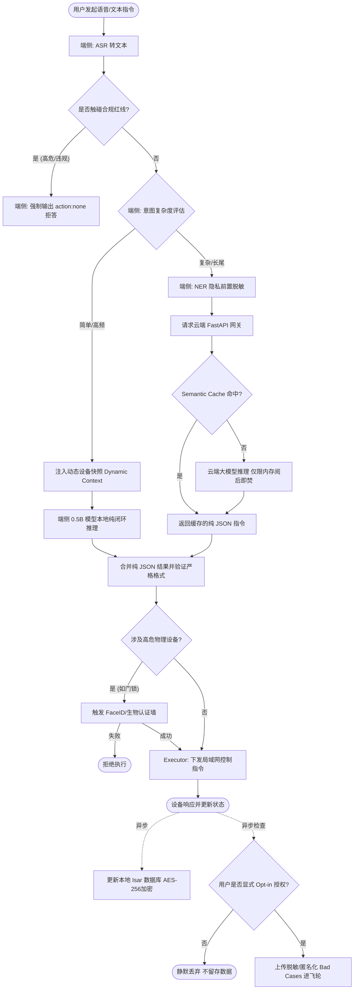
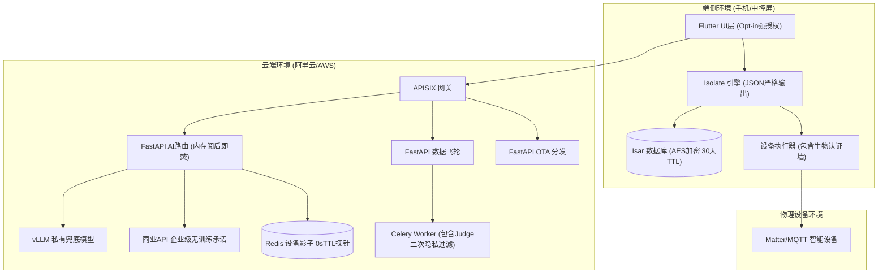
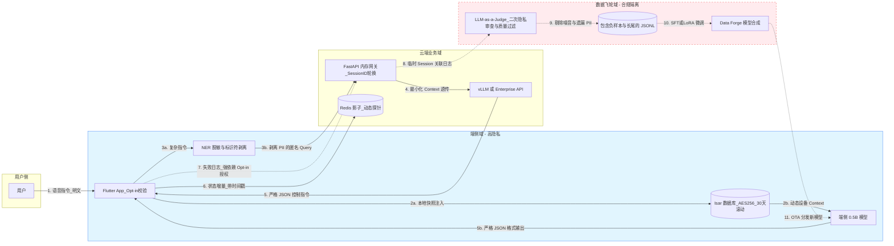
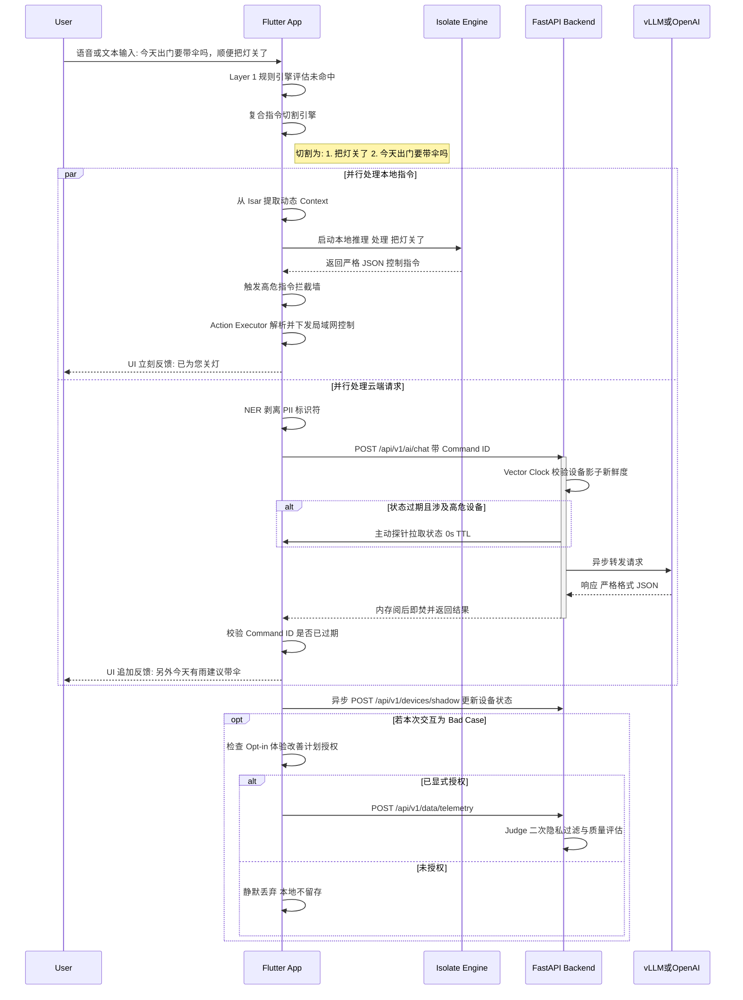

# 智能家居端云协同架构落地方案 (基于 FastAPI) - 研发工程评审版

> **文档状态**: 待研发团队评审 (Draft for Engineering Review)
> **目标读者**: 后端研发工程师、Flutter 端侧工程师、AI 算法工程师、DevOps 工程师
> **阅读指南**: 本文档已包含管理层决策背景，现阶段重点在于拉齐技术实现路径，请各研发同学重点评审第 2、3、4、7 节的技术可行性、接口契约、异常边界处理及具体开发任务。第 8 节记录了历次评审带来的架构核心变更，第 9 节定义了严格的验收标准与指标体系。

---

## 0. 架构的第一性原理分析 (First Principles Analysis)

在深入技术细节之前，我们必须回归智能家居 AI 的本质，明确本架构设计的四大根基。这有助于团队在面临技术分歧时，始终保持方向的正确性。

### 0.1 前提 (Premise): 我们为什么需要端云协同？
*   **物理定律限制**：移动端/边缘端硬件（手机、中控屏）的电池、散热和内存（通常 <8GB RAM）在可见的未来内，无法独立运行足以媲美 GPT-4 智商的全能大模型。
*   **网络不可靠性**：家庭 Wi-Fi 和宽带存在断网、高延迟、弱信号等物理和网络拓扑缺陷，纯云端架构无法保证 100% 的设备控制可用性。
*   **隐私红线**：用户的家庭作息、监控画面、私人对话是绝对敏感数据，必须默认在本地闭环。
*   **结论**：**端云协同不是过渡方案，而是智能家居 AI 的最优解。**

### 0.2 约束 (Constraints): 我们在什么限制下做设计？
*   **成本约束**：千万级设备的每日高频唤醒，如果全量走商业大模型 API（如 GPT-4o），产生的 Token 成本将击穿公司的硬件硬件利润。因此，**本地推理必须拦截 >80% 的日常请求**。
*   **延迟约束**：用户对物理设备（如开灯）的反馈容忍度极低。端到端延迟（从语音输入到灯光亮起）必须控制在 **800ms 以内**，这约束了云端不能在控制链路上做过重的长耗时计算。
*   **兼容性约束**：智能家居设备碎片化严重，端侧 App 运行的系统和算力千差万别，这要求架构必须具备“平滑降级”的能力（Graceful Degradation）。

### 0.3 边界 (Boundaries): 本架构不做的事是什么？
*   **不做云端设备直连控制**：本架构中的云端 AI 不直接向物理设备下发控制报文。云端 AI 仅负责“意图推断”，返回标准 JSON 后，**必须交由端侧局域网的 Executor 执行**。云端是“大脑”，端侧是“小脑+脊髓”。
*   **不触碰未经授权的隐私数据**：数据飞轮模块 (`/api/v1/data`) 收集的失败日志，必须在端侧完成**强脱敏**（去除人名、具体位置等 PII 信息）并获取用户明确授权。云端架构不承担原始隐私数据的存储风险。
*   **不追求单一大模型的“大一统”**：明确界定端侧模型（2B 级，主攻控制与本地 RAG）、云端兜底模型（14B 级，主攻长尾路由）和云端超大模型（千亿级，主攻复杂规划）的职责边界，拒绝用大炮打蚊子。

### 0.4 终局 (Endgame): 我们的架构最终要演进成什么样？
*   **无感知的智能 (Proactive Intelligence)**：从当前的“用户指令驱动 (Reactive)”演进为基于本地 Isar 历史数据与云端大模型周期性分析的“主动预测 (Proactive)”。例如，系统主动感知温度变化并结合用户习惯提前调整空调。
*   **联邦学习闭环 (Federated Learning)**：数据飞轮的最终形态。不再上传脱敏日志，而是将云端微调任务下发至端侧计算梯度，云端仅聚合权重，实现真正的“隐私绝对安全 + 全局模型进化”。
*   **家庭本地算力中心 (Home AI Hub)**：随着架构演进，FastAPI 云端兜底的部分算力将下沉至家庭局域网内的“高算力中控机（如软路由/NAS）”，云端仅保留账号体系、OTA 分发和跨域联邦聚合能力。

---

## 1. 产品与系统全局视角 (Global Perspectives)

为了让产品、研发和测试团队在同一张图纸上对话，本节通过四大核心视图（业务流程、产品架构、数据流向、核心交互）对系统进行全景剖析。

### 1.1 业务流程图 (Business Process Flow)
展示用户从发起语音指令到设备最终响应的全生命周期业务动作，突出“端云路由”与“隐私合规”的业务卡点。


**说明**：业务流程严格遵循了 `Privacy by Design` 的理念。在任何数据上云前，必须经过本地的合规与脱敏判断；在进入本地推理前，必须注入动态设备快照以保证逻辑判断；在任何指令触达物理世界前，必须经过高危设备的生物认证墙；日志上传前必须通过非默认勾选的 Opt-in 强授权检查。

### 1.2 产品架构图 (Product Architecture)
展示系统从端侧硬件到云端服务的分层逻辑结构，明确各模块的职责边界。


*(注：架构图展示了端侧“重组件”、云端“微服务”、物理“执行终端”的三位一体。)*
**说明**：
*   **端侧 (Edge)**：是整个架构的重中之重，包含了 UI、异步推理引擎、本地数据库和执行器，实现了闭环的智能底座。强制包含 Opt-in 授权机制与 AES-256 加密。
*   **云端 (Cloud)**：FastAPI 承担了网关背后的核心业务逻辑编排，包含基于内存阅后即焚的 AI 路由、具备 LLM-as-a-Judge 二次隐私过滤的数据清洗队列，以及对接具备无训练承诺的企业级外部 API。

### 1.3 核心数据流图 (Core Data Flow)
展示项目中三类核心数据（控制流、状态流、飞轮流）的流转路径与合规屏障。


**说明**：数据流图清晰地划分了隐私边界并闭环了数据飞轮。
*   **控制流**：展示了端侧优先通过 Isar 注入动态 Context 到本地模型，仅长尾复杂指令经 NER 剥离个人标识符 (PII) 后上云，且云端仅做最小化 Context 透传。
*   **飞轮数据流 (虚线)**：代表其**非必须**且受限于**显式授权 (Opt-in)** 的强合规管控。在进入 `SFT` 训练前，必须经过 `LLM-as-a-Judge` 的二次隐私审查与格式/意图质量过滤，最终通过 OTA 反哺端侧模型。

---

## 2. 架构目标与技术选型

本方案旨在将“端侧优先、云端兜底、协同进化”的理念，通过 Python FastAPI 框架在云端进行具象化落地。FastAPI 凭借其原生异步支持、高性能（基于 Starlette 和 Pydantic）以及自动生成 OpenAPI 文档的特性，非常适合作为高并发的智能家居云端网关和 AI 调度中心。

### 1.1 云端技术栈选型与理由 (工程师重点关注)
*   **Web 框架**: Python FastAPI
    *   *理由*：原生支持异步 `async/await`，在处理高并发的 LLM API 外部调用时不会阻塞事件循环；Pydantic v2 提供强类型校验，降低数据脏写风险。
    *   *研发规范*：所有 I/O 密集型操作（数据库、外部 API）**必须**使用异步库（如 `asyncpg`, `httpx`），严禁使用同步库阻塞事件循环。
*   **ASGI 服务器**: Uvicorn + Gunicorn (多进程管理)
*   **数据校验**: Pydantic v2 (用于统一的请求/响应模型及 DB Schema 映射)
*   **数据库体系**: 
    *   **PostgreSQL 15+**: 关系型数据（用户账户、家庭设备拓扑树、模型版本策略）。引入 `PostGIS` 插件支持空间地理围栏计算（如“快到家时开空调”）。
    *   **Redis (Cluster) 7.0+**: 高频读写缓存（设备实时在线状态、接口限流令牌桶、短生命周期的 Token 验证）。
    *   **Milvus / Qdrant**: (二期预研) 云端向量数据库，用于长期家庭行为记忆的 RAG 检索。
*   **大模型基座与接口**: 
    *   *主力私有化*: 使用 `vLLM` 框架部署 Qwen 7B/14B 作为主力低成本兜底模型（需保证 OpenAI API 兼容格式）。
    *   *复杂外呼*: 封装 OpenAI/阿里云百炼 API，作为高智商推理任务（Layer 3+）的最终退路。
*   **消息中间件**: RabbitMQ / Celery (用于异步处理数据清洗、LoRA 微调任务队列解耦，防止长任务拖垮 API 网关)

---

## 2. 云端微服务架构设计 (FastAPI 领域模块化)

云端服务采用领域驱动设计 (DDD) 思想，将 FastAPI 应用划分为以下核心领域模块 (Routers)，各模块需保持高内聚低耦合。项目目录结构请参考标准的 FastAPI 最佳实践（如 `app/api`, `app/core`, `app/services`）。

### 2.1 智能路由与云端大模型代理 (`/api/v1/ai`)
**职责**：作为端侧 Layer 3 的兜底层，处理端侧无法消化的复杂 Query。
*   **`POST /api/v1/ai/chat`**: 
    *   **输入**：用户的自然语言 Query、脱敏后的家庭设备上下文快照 (`Context`)、设备状态时间戳 (`Vector Clock`)。
    *   **处理**：FastAPI 异步调用云端大参数模型，利用云端算力进行复杂逻辑推理或闲聊问答。
    *   **输出**：返回符合 GBNF/JSON Schema 的标准 JSON 控制指令，或自然语言回复。
*   **多模型智能路由 (Model Router) [开发重点]**：内部需实现一个 `RoutingService`。为了避免冷启动延迟，**严禁使用重度模型进行路由**。建议引入基于 **Semantic Cache (语义缓存)** 的机制：高频指令先过 Redis 向量匹配，命中则直接返回固定指令链路；未命中则按 Query 长度/复杂度路由给 vLLM (Qwen) 或商业 API。

### 2.2 模型 OTA 与动态下发 (`/api/v1/ota`)
**职责**：管理端侧模型的版本，实现千机千面的动态分发。
*   **`GET /api/v1/ota/check`**:
    *   **输入**：端侧上报的硬件探针数据（`ram_size`, `npu_type`, `os_version`, `current_model_version`, `app_version_code`）。
    *   **处理**：根据硬件画像和 **App 版本号** 进行强校验，查询 PostgreSQL 中的模型策略表，匹配最适合的模型版本。**杜绝跨代兼容引发的端侧推理引擎 Crash**。
    *   **输出**：返回新模型的下载链接（CDN URL）、MD5 校验和、是否强制更新。
*   **`GET /api/v1/ota/download/{model_id}`**:
    *   **开发重点**：必须提供基于 `Range` HTTP 头请求的断点续传能力（通常结合对象存储 OSS 和 CDN，FastAPI 负责鉴权和签发预签名 URL `Presigned URL`，不直接通过 FastAPI 流式传输大文件以节约带宽）。

### 2.3 数据飞轮与微调流水线 (`/api/v1/data`)
**职责**：收集端侧脱敏数据，驱动模型持续进化。
*   **`POST /api/v1/data/telemetry`**:
    *   **输入**：端侧脱敏的失败交互日志（Bad Cases）、用户高频自动化习惯。
    *   **处理**：FastAPI 接收后推入 RabbitMQ 消息队列，快速返回 `202 Accepted` 避免阻塞客户端。
    *   **后续链路 (Celery Worker) [开发重点]**：**绝对不能**将原始 Bad Cases 直接喂给模型微调。必须在 Celery 流程中引入 **LLM-as-a-Judge 数据清洗层**，利用大模型对日志打分过滤，剔除噪音（如乱码、方言杂音），仅提取高质量的“Hard Examples”交由 `model_forge` 生成微调数据集。

### 2.4 设备影子与状态同步 (`/api/v1/devices`)
**职责**：维护云端设备拓扑，为端云切换提供强一致性的状态基础。
*   **`POST /api/v1/devices/shadow`**:
    *   **机制**：端侧状态发生变化时，通过 MQTT 或 HTTP 异步上报状态增量。云端 Redis 维护实时的“设备影子（Device Shadow）”。
    *   **数据一致性保障**：必须携带客户端生成的时间戳，服务端解决乱序到达导致的状态覆盖问题。若调用 AI 接口时发现状态过期，**不能仅依赖被动缓存**，必须有机制主动下发探针拉取最新状态（设置严格超时时间，如 500ms）。

---

## 3. 端云协同关键交互时序图 (Sequence Flow)

以下展示当用户发起一条复杂指令时，结合**指令解耦 (Intent Splitting)** 策略的端云协同典型处理链路。请**端侧研发、后端研发与 AI 数据组**重点对齐此处的并行处理逻辑、并发竞态处理，以及 **Opt-in 强合规授权与数据评估清洗** 链路：



**核心合规与评估节点说明**：
*   **端侧本地推理闭环**：通过前置注入 `Dynamic Context` (动态设备快照)，保证本地小模型即使在弱网下也能严格遵循 JSON 格式输出正确的设备操作，且完全物理隔离保障隐私。
*   **云端流转合规**：上云的长尾指令强制剥离个人标识符 (PII)，且在云端推理过程中做到“内存阅后即焚”，不落盘记录用户的明文操作。
*   **高危动作物理阻断**：任何涉及安防、高温等高危设备的控制，无论是端侧生成还是云端返回，均被挂起并触发本地生物认证 (FaceID)，确保物理安全。
*   **数据飞轮强授权**：所有进入飞轮的 Bad Cases 日志，都必须通过 `Opt-in` 强校验，并仅以临时 `SessionID` 标识；上传后通过 `LLM-as-a-Judge` 进一步清洗噪音和二次拦截隐私数据，确保用于 SFT 的高质量语料绝对合规。

---

## 4. FastAPI 核心代码结构与接口契约示例 (API Contracts)

请后端研发基于以下骨架进行开发，注意 Pydantic 的校验约束：

```python
# app/main.py
from fastapi import FastAPI
from app.api.v1.routers import ai, ota, data, devices

app = FastAPI(title="SmartHome Edge-Cloud API", version="1.0.0")

# 注册各个模块的路由
app.include_router(ai.router, prefix="/api/v1/ai", tags=["AI Routing"])
app.include_router(ota.router, prefix="/api/v1/ota", tags=["Model OTA"])
app.include_router(data.router, prefix="/api/v1/data", tags=["Data Flywheel"])
app.include_router(devices.router, prefix="/api/v1/devices", tags=["Device Shadow"])

@app.get("/health")
async def health_check():
    # 实际开发中需增加对 DB 和 Redis 的探活
    return {"status": "healthy", "version": "1.0.0"}
```

```python
# app/api/v1/routers/ai.py
from fastapi import APIRouter, Depends, HTTPException
from pydantic import BaseModel, Field
from typing import List, Optional, Dict, Any
import time
import logging

logger = logging.getLogger(__name__)
router = APIRouter()

class DeviceState(BaseModel):
    device_id: str = Field(..., description="设备唯一标识")
    state: str = Field(..., description="当前状态, 如 'on', 'off'")
    # 【决策点落地】Vector Clock 时间戳，用于校验脏数据
    last_update_ts: int = Field(..., description="端侧生成的状态时间戳(秒级)")

class ChatRequest(BaseModel):
    command_id: str = Field(..., description="端侧请求的唯一ID，用于防时序竞态")
    query: str = Field(..., min_length=1, max_length=500, description="用户自然语言指令")
    context: List[DeviceState] = Field(default_factory=list, description="家庭设备状态快照")
    hardware_level: Optional[str] = Field("unknown", description="端侧硬件等级评级")

class ChatResponse(BaseModel):
    command_id: str
    status: str
    reply_text: str
    commands: List[Dict[str, Any]] = Field(default_factory=list)

@router.post("/chat", response_model=ChatResponse)
async def cloud_ai_fallback(request: ChatRequest):
    """
    云端大模型兜底接口 (Layer 3)
    """
    try:
        # 1. Vector Clock 强一致性校验
        current_ts = int(time.time())
        is_context_stale = False
        for device in request.context:
            if current_ts - device.last_update_ts > 60: # 严格缩短过期时间为 60s
                logger.warning(f"Device {device.device_id} state is stale.")
                is_context_stale = True
                break
                
        # 研发TODO: 若高危设备过期，在此处触发 MQTT 极速探针查询状态

        # 2. 组装 Prompt (需开发专门的 PromptBuilder Service)
        prompt = build_system_prompt(request.context, is_context_stale)
        
        # 3. 动态模型路由 (优先走便宜的 vLLM)
        # 研发TODO: 接入 Semantic Cache，命中则跳过大模型调用
        if is_complex_query(request.query):
            # 研发TODO: OpenAI API 必须开启 response_format={ "type": "json_object" }
            response_data = await async_call_openai(prompt, request.query)
        else:
            # 研发TODO: vLLM 必须配置 --guided-decoding-backend 对齐端侧 GBNF Schema
            response_data = await async_call_local_vllm(prompt, request.query)
        
        # 4. 返回结构化数据供端侧执行
        return ChatResponse(
            command_id=request.command_id,
            status="success", 
            reply_text=response_data.get("reply_text", ""),
            commands=response_data.get("commands", [])
        )
    except Exception as e:
        logger.error(f"AI Chat failed: {str(e)}", exc_info=True)
        raise HTTPException(status_code=500, detail="Internal AI Engine Error")
```

---

## 5. 部署与运维考量 (Deployment & DevOps)

运维团队需关注以下部署基建：

1.  **长连接与超时管理 (Critical)**：由于大模型生成耗时较长，网关（APISIX/Nginx）必须针对 `/api/v1/ai` 路径调大 `proxy_read_timeout`。FastAPI 应考虑启用 Server-Sent Events (SSE) 应对超长推理任务。
2.  **容器化与 K8s 编排**：配置 Kubernetes (K8s) 的 `HPA`，基于 CPU 使用率（>70%）和并发请求数自动扩缩容 FastAPI 节点。
3.  **异步 Worker 独立池隔离**：Celery Worker 必须分为两类，严禁混用：
    *   *IO 密集型 Worker*：处理普通的数据入库、日志清洗。
    *   *GPU 密集型 Worker*：处理 `model_forge` 微调，通过 `NodeSelector` 调度到专用 GPU 节点。
4.  **网关限流与熔断**：实施基于 Token/IP 的严格限流（如 10次/分钟）。
5.  **可观测性 (Observability)**：集成 `Prometheus` 监控 P95 延迟，使用 `OpenTelemetry` 追踪全链路耗时。

---

## 6. 管理层深度评审与决策记录 (Executive Review & Decisions)

> **注**：以下内容为前期高管评审决策，研发团队需严格遵循这些边界条件进行开发。

### 6.1 业务负责人视角 (Business Owner / GM)
**核心关注点**：商业护城河（增收）、算力成本控制（降本）、合规风险与用户体验（防客诉）。
*   **商业护城河认同**：极度认可“无网可用”和“极致隐私”作为产品的核心差异化卖点（USP）。支持基于“主动智能”向 SaaS 订阅制（如安防巡检、能源报告）转型的战略。
*   **成本控制认同**：赞赏端侧拦截 80% 流量及云端 vLLM 私有化兜底的“算力成本防击穿”设计。
*   **业务红线与决策 (Decision)**：
    *   **合规生死线 (GDPR/网安法)**：数据飞轮收集失败日志前，**必须在 App 首次启动时增加极显眼的“体验改善计划”授权弹窗，且默认不得勾选**。未授权用户的数据绝对禁止上传。
    *   **高危设备零容忍**：对于安防（门锁、摄像头）和高危发热设备（取暖器、烤箱），**业务不接受任何缓存（0秒过期）**。云端只要涉及这些类目，必须强制触发极速探针，绝不允许因影子数据时间差引发物理灾难。
    *   **MVP 分期交付**：拒绝技术团队“憋大招”。要求按 MVP 原则分三期交付：一期（端侧规则+云端OpenAI兜底），二期（端侧大模型落地），三期（数据飞轮闭环），确保不错过市场窗口。

### 6.2 技术负责人视角 (CTO / Tech Director)
*   **引入时间戳与版本号控制 (Vector Clock)**：设备影子必须带有强一致性的时间戳。过期时，云端必须具备主动下发探针的能力。
*   **私有化大模型基座**：在云端通过 vLLM 部署 Qwen 7B/14B 作为主力兜底模型。
*   **流式响应与网关配置**：要求 DevOps 针对大模型长耗时特性调整连接保持策略，防止 504 Gateway Timeout。

### 6.2 产品负责人视角 (Product Lead)
*   **指令解耦与并行执行 (Intent Splitting)**：必须具备“指令切割”能力，实现“边做边等”的流水线体验，杜绝本地指令被云端拖慢。
*   **OTA 下载管控策略**：大模型静默下载限定在 **Wi-Fi 且充电状态**；版本校验必须绑定 `App Version Code`。

### 6.3 产品负责人 / AI 负责人视角 (Product Lead / AI Director)
*   **数据清洗 Judge 机制**：必须引入大模型打分层（LLM-as-a-Judge），剔除噪音 Bad Cases，防止模型微调出现灾难性遗忘。
*   **端云 JSON Schema 对齐**：云端大模型接口必须强制注入与端侧完全一致的结构化输出约束（如 OpenAI 的 Structured Outputs 或 vLLM 的 Guided Decoding）。
*   **联邦学习 (Federated Learning) 预研**：启动基于端侧梯度计算的架构预研，为彻底规避隐私风险做技术储备。

---

## 7. 研发任务拆解与落地细化 (Actionable Tasks)

基于上述架构方案与评审意见，将工作内容细化为具体的开发任务，请各团队负责人认领并排期：

### 7.1 后端研发组 (Backend Team)
*   **Task BE-1: 基础脚手架与鉴权搭建**
    *   使用 FastAPI 搭建工程目录结构，配置 Pydantic v2 全局校验。
    *   实现 JWT / Token 鉴权中间件。
*   **Task BE-2: 设备影子模块重构**
    *   实现 Redis Cluster 的设备状态增量更新接口。
    *   **核心**：实现 Vector Clock 时间戳校验逻辑；开发通过 MQTT QoS 1 向端侧主动下发状态探针的极速通道。
*   **Task BE-3: AI 路由与网关对接**
    *   开发 `/api/v1/ai/chat` 接口，集成基于 `Command ID` 的请求上下文追踪。
    *   **核心**：开发 `Semantic Cache` 语义缓存层（接入 Redis 或轻量级向量库）。
    *   封装 OpenAI API 和私有化 vLLM 接口，**强制启用 Structured Outputs / Guided Decoding** 确保输出格式对齐。
*   **Task BE-4: OTA 分发服务开发**
    *   设计模型版本策略数据库表（需包含 `min_app_version` 强校验）。
    *   对接 OSS 对象存储，实现生成带签名的断点续传下载链接功能。

### 7.2 Flutter 端侧研发组 (Edge Team)
*   **Task FE-1: 复合指令切割引擎 (Intent Splitter)**
    *   在 Layer 1/2 前置开发正则或极轻量级分类器，识别复合指令并进行拆分。
    *   实现本地 Isolate 推理与云端 API 请求的 `par` 并行调度。
*   **Task FE-2: 防竞态队列管理**
    *   所有云端请求必须携带递增的 `Command ID`。
    *   开发回调校验拦截器：当云端结果返回时，若 `Command ID` 过期或界面已销毁，必须静默丢弃，防止“幽灵播报”。
*   **Task FE-3: OTA 下载器与状态上报**
    *   实现后台按需下载模块，遵守“Wi-Fi+充电”约束。
    *   重构状态上报逻辑，所有 State Update 必须打上本地精准时间戳 (`last_update_ts`)。

### 7.3 AI 算法与数据组 (AI/Data Team)
*   **Task AI-1: 自动化数据清洗流 (LLM-as-a-Judge)**
    *   编写 Celery Worker 脚本，消费 RabbitMQ 中的脱敏日志。
    *   开发基于规则与大模型（Prompt 评估）的过滤管道，剔除无效录音或荒谬指令，生成高质量的 JSONL 微调样本。
*   **Task AI-2: vLLM 私有化部署与调优**
    *   在 GPU 服务器上部署 Qwen 7B/14B 模型，配置并测试与端侧一致的 JSON Schema 约束插件。
    *   压测 TTFT (首字延迟) 和并发吞吐量。

### 7.4 DevOps 与运维组 (DevOps Team)
*   **Task DO-1: 网关长连接调优**
    *   调整 APISIX / Nginx 的 `proxy_read_timeout` 参数，确保 AI 长耗时请求不断连。
*   **Task DO-2: 容器化与 K8s 部署池配置**
    *   编写 FastAPI 和 Celery Worker 的 Dockerfile 和 Helm Charts。
    *   配置 K8s `NodeSelector`，实现 IO 节点与 GPU 节点的物理隔离。
    *   部署 Prometheus 监控面板与 OpenTelemetry 链路追踪环境。

---

## 8. 架构变更与演进记录 (Architecture Changelog)

为了追溯架构设计的演进过程，以下记录了在技术评审会议后产生的重要架构变更点：

| 版本号 | 日期 | 变更内容摘要 | 提出人/视角 | 解决的痛点 |
| :--- | :--- | :--- | :--- | :--- |
| **v1.1** | 2026-03-30 | **引入主动状态探针机制**：将设备影子的被动过期时间从 5 分钟缩短至 60 秒。针对高危设备过期场景，强制要求云端通过 MQTT QoS 1/2 主动下发探针拉取最新状态。 | 技术负责人 | 解决弱网环境下云端缓存脏数据导致的指令误判（如重复开锁）风险。 |
| **v1.1** | 2026-03-30 | **新增 Semantic Cache 层**：在 AI 路由网关前增加基于 Redis/Milvus 的语义缓存层。高频通用指令直接命中缓存返回，避免冷启动。 | AI 负责人 | 解决重度模型做路由导致的推理延迟和算力浪费问题。 |
| **v1.1** | 2026-03-30 | **强制云端 JSON Schema 对齐**：要求 vLLM 必须开启 `--guided-decoding-backend`，OpenAI 必须使用 Structured Outputs。 | AI 负责人 | 解决云端大模型输出格式不可控，导致端侧解析器（Executor）崩溃的问题。 |
| **v1.1** | 2026-03-30 | **增加 LLM-as-a-Judge 清洗流**：在微调流水线中，Celery Worker 处理脱敏日志时必须加入大模型过滤打分层，只提取高质量 Hard Examples。 | AI 负责人 | 防止噪音数据（方言、乱码）直接进入训练流，导致基座模型发生灾难性遗忘。 |
| **v1.1** | 2026-03-30 | **增加 Command ID 防竞态设计**：端云交互强制绑定唯一 Command ID，端侧实现拦截器丢弃过期返回。 | 技术负责人 | 解决网络卡顿时云端异步返回较慢，导致的 UI 时序错乱和“幽灵语音播报”问题。 |
| **v1.1** | 2026-03-30 | **网关长连接管理规范**：明确提出 APISIX/Nginx 必须调大 AI 路径的 `proxy_read_timeout`，建议启用 SSE。 | 技术负责人 | 解决大模型流式输出耗时过长导致的 HTTP 504 Gateway Timeout 报错。 |
| **v1.1** | 2026-03-30 | **OTA 下载强校验机制**：模型版本分发必须绑定 App 的 `Version Code` (`min_app_version`)。 | 技术负责人 | 杜绝新模型 GGUF 格式与旧版 App 推理引擎不兼容导致的直接 Crash。 |
| **v1.2** | 2026-03-30 | **高危设备零缓存策略 (0s TTL)**：对于安防及高危发热设备，废除原定的 60s 缓存过期时间，强制每次云端请求前触发实时探针。 | 业务负责人 | 彻底消除因状态时间差导致的物理安全隐患（如火灾、非法入室）。 |
| **v1.2** | 2026-03-30 | **强制显式授权 (Opt-in) 数据采集**：数据飞轮的数据采集前置拦截，App 端增加未勾选即拒绝的合规弹窗。 | 业务负责人 | 规避 GDPR 和《个人信息保护法》的合规生死线风险。 |
| **v1.2** | 2026-03-30 | **确立 MVP 三期交付路线图**：放弃一次性全量交付，改版为：一期跑通云端兜底，二期上端侧大模型，三期做数据飞轮。 | 业务负责人 | 降低宏大架构的交付延期风险，快速抢占市场窗口。 |

---

## 9. 验收标准与核心指标体系 (Acceptance Criteria & KPIs)

为确保各模块研发交付符合生产级标准，制定以下量化验收指标。各组在提测（QA）及上线前，必须提供对应指标的压测报告或监控截图。

### 9.1 智能路由与大模型代理 (AI Routing - `/api/v1/ai`)
*   **验收标准 (AC)**：
    *   `Semantic Cache` 命中率需达到 **30%** 以上（覆盖高频短指令）。
    *   多模型路由准确率：非复杂指令 100% 路由至私有化 vLLM，复杂推理指令准确路由至商业 API。
    *   **强契约对齐**：对于 1000 条自动化测试用例，云端大模型返回的 JSON Schema 格式合法率必须达到 **100%**。
*   **核心指标 (KPIs)**：
    *   **TTFT (首字响应时间)**：vLLM 私有化模型 TTFT **< 400ms** (P95)；缓存命中 TTFT **< 50ms**。
    *   **端到端延迟 (End-to-End Latency)**：包含端侧网络请求、云端路由、大模型推理及返回，总耗时 **< 1.5s** (P90)。

### 9.2 设备影子与状态同步 (Device Shadow - `/api/v1/devices`)
*   **验收标准 (AC)**：
    *   通过 MQTT 异步上报的增量状态，成功写入 Redis Cluster，并且能正确携带并校验 `last_update_ts`。
    *   当构造状态过期（> 60s）且为高危设备的测试用例时，系统能**成功触发主动状态探针**，并在 500ms 内完成拉取。
    *   在高并发（10,000 QPS）状态上报下，解决因乱序到达导致的状态覆盖问题。
*   **核心指标 (KPIs)**：
    *   **状态同步延迟**：端侧状态变化到云端 Redis 更新的延迟 **< 100ms** (P99)。
    *   **探针成功率**：主动探针下发到设备并收到确认的成功率 **> 99%**。

### 9.3 数据飞轮与微调流水线 (Data Flywheel - `/api/v1/data`)
*   **验收标准 (AC)**：
    *   Telemetry 接口能承受突发流量，接收请求并推入 RabbitMQ 的耗时 **< 20ms**。
    *   `LLM-as-a-Judge` 管道能有效识别并丢弃构造的噪音数据（如纯方言、无意义符号），过滤准确率（Precision）需达到 **95%** 以上。
    *   Celery Worker 在处理高负载日志清洗时，不会引发内存泄漏（Memory Leak）。
*   **核心指标 (KPIs)**：
    *   **有效样本提取率**：从全量 Bad Cases 中提取高质量 `Hard Examples` 的比例需稳定在 **10% - 20%** 之间（过高意味着阈值太松，过低意味着浪费数据）。
    *   **队列积压容忍度**：在 RabbitMQ 积压 10 万条消息时，Web API 节点响应时间不受影响。

### 9.4 模型 OTA 与动态下发 (Model OTA - `/api/v1/ota`)
*   **验收标准 (AC)**：
    *   严格校验 `app_version_code`，对于旧版 App 请求新格式模型，准确返回版本不兼容错误。
    *   大文件下载支持 HTTP `Range` 断点续传，且生成的是有时间限制的预签名 URL（如 24 小时过期）。
    *   下载完成后的 MD5 校验和验证成功率 100%。
*   **核心指标 (KPIs)**：
    *   **模型分发成功率**：完整下载并成功加载至端侧内存的比例 **> 95%**。
    *   **CDN 带宽命中率**：模型下载请求的 CDN 缓存命中率 **> 99%**，极力避免回源导致源站崩溃。

### 9.5 部署与可观测性基建 (DevOps & Observability)
*   **验收标准 (AC)**：
    *   模拟流量突增时，K8s HPA 能够基于 CPU > 70% 的指标在 **2分钟内** 完成 FastAPI Pod 的自动扩容。
    *   Celery 的 GPU Worker 和 IO Worker 能够被稳定调度到预设的物理节点，互不干扰。
    *   网关（APISIX/Nginx）在模拟 30 秒的大模型流式返回测试中，**不出现 504 错误**。
*   **核心指标 (KPIs)**：
    *   **系统可用性 (SLA)**：核心控制链路 API 可用性达到 **99.99%**。
    *   **监控告警覆盖率**：核心接口（AI 路由、状态同步、OTA）的 P95/P99 延迟、错误率必须配置自动飞书/钉钉告警，覆盖率 **100%**。