# Luma AI 全生命周期核心数据流架构白皮书

## 1. 架构声明 (Architecture Declaration)

### 1.1 前提 (Premise)

Luma AI 系统的核心价值在于“无感”与“隐私”。系统必须在不打扰用户的前提下，通过多模态传感器（以智能戒指为核心）隐式感知生理状态，并在边缘侧完成闭环计算，实现智能家居设备的自动化联动。

### 1.2 约束 (Constraints)

- **隐私合规**：智能戒指高频采集的原始生理数据（Raw Data：HR/HRV/Movement/SpO2/Temp）严禁上云，必须在边缘侧（Edge Hub）计算为语义数据（Semantic Data：Sleep Stage）后阅后即焚。
- **安全硬锁**：涉及物理安全的设备（如智能床）在特定生理阶段（如深睡期 `DEEP_SLEEP`）必须进入硬锁死状态（angle=0），任何改变需经二次鉴权（is\_verified）。
- **端云一致性**：由于存在端侧自动控制与 App 侧主动控制的并发冲突，系统必须使用乐观锁（Vector Clock）和 Redis Lua 脚本（依赖 `last_update_ts`）解决影子乱序问题。

### 1.3 边界 (Boundaries)

- **边缘端 (Edge)**：负责实时数据采集、LLM 推理（基于 llama.cpp 与 GBNF 防幻觉）、本地场景仲裁与直接设备控制。
- **云端 (Cloud)**：负责异步影子对账、复杂分析模型训练（基于冲突日志 Conflict Log 的 LoRA 微调）、跨家庭/多端的数据聚合与 OTA 固件/模型下发。

### 1.4 终局 (Endgame)

形成“感知-决策-执行-反馈-进化”的全栈数据飞轮。通过用户的纠偏行为（如大模型推荐被忽略或修改）生成高价值的 Conflict Log，云端自动化微调专属 GGUF 模型，并静默下发至端侧，实现千人千面的个性化无感空间。

***

## 2. 核心全生命周期数据流向图

```mermaid
%%{init: {'theme': 'base', 'themeVariables': { 'primaryColor': '#1A1A1D', 'primaryTextColor': '#00FF41', 'primaryBorderColor': '#00FF41', 'lineColor': '#00FF41', 'secondaryColor': '#0A0A0C', 'tertiaryColor': '#2B2B36' }}}%%
sequenceDiagram
    autonumber
    participant Ring as "智能戒指 (Sensor)"
    participant Edge as "Edge Hub (llama.cpp)"
    participant Bed as "智能床 (Actuator)"
    participant Cloud as "云端影子 & 业务"
    participant App as "Flutter App (User)"

    rect rgb(26, 26, 29)
        note right of Ring: "阶段 1：高频感知与本地决策"
        Ring->>Edge: "高频上报 HR/HRV (Raw Data)"
        Edge->>Edge: "计算 Sleep Stage (Semantic Data)"
        Edge->>Edge: "原始数据阅后即焚 (Burn after reading)"
    end

    rect rgb(10, 10, 12)
        note right of Edge: "阶段 2：安全执行与并发控制"
        Edge->>Edge: "识别到 DEEP_SLEEP"
        Edge->>Bed: "下发指令 angle=0 (深睡硬锁)"
        Bed-->>Edge: "ACK (状态已变更)"
        App->>Cloud: "用户尝试手动调起床头"
        Cloud->>Edge: "下发变更指令 (带 Vector Clock)"
        Edge->>Edge: "校验 is_verified，未授权则驳回"
        Edge-->>App: "HTTP 409 乐观锁拦截 (回滚 UI)"
    end

    rect rgb(43, 43, 54)
        note right of Edge: "阶段 3：影子同步与对账"
        Edge->>Cloud: "上报语义状态与影子 (last_update_ts)"
        Cloud->>Cloud: "Redis Lua 解决乱序，持久化 DB"
        Cloud-->>App: "推送状态更新 (SSE/WebSocket)"
    end

    rect rgb(26, 26, 29)
        note right of Cloud: "阶段 4：数据飞轮与进化"
        App->>Cloud: "用户手动介入产生 Conflict Log"
        Cloud->>Cloud: "触发 LoRA 微调 (Apple Silicon MLX)"
        Cloud->>Edge: "OTA 下发专属 GGUF 模型"
    end
```

***

## 3. 全链路数据交互规范详述

### 3.1 端侧感知与销毁机制 (Data Collection \&A Destruction)

- **物模型契约**：所有感知设备统一遵循 JSON-RPC 2.0 规范，设备端仅负责盲发。
- **隐私屏障**：Edge Hub 在接收到智能戒指的体征数据后，立刻进行滑动窗口分析（基于预加载的轻量级时序模型），推导出当前睡眠阶段（如 `LIGHT_SLEEP`, `DEEP_SLEEP`, `REM`, `AWAKE`）。推导完成后，原始心率、血氧等 PII 数据在内存中立即销毁，严禁落盘。

### 3.2 物理安全硬锁 (Deep Sleep Hard Lock)

- **核心逻辑**：当系统判定用户进入 `DEEP_SLEEP` 阶段时，任何可能引起物理伤害或惊醒的操作都将被**系统级拦截**。
- **控制执行**：Edge Hub 自动下发强制指令使智能床恢复平躺（`angle=0`）。若此时云端或 App 端下发改变床体角度的指令，Edge Hub 的状态机会校验 `is_verified` 字段。若为普通鉴权，则直接丢弃指令，保障用户深睡安全。

### 3.3 柔性环境联动 (Soft Environment Transitions)

- **日出唤醒 (Sunrise Mode)**：在检测到用户即将进入浅睡（即将苏醒）或到达设定的唤醒时间前，系统对灯光等环境设备下发带有过渡时长的指令。
- **参数规范**：必须强制携带 `transition_duration: 900`（即 15 分钟渐变时间），避免突变的强光引起用户不适。

### 3.4 端云并发与对账机制 (Concurrency & Synchronization)

- **App 侧防抖与回滚**：由于引入了深睡硬锁，App 端的设备控制必须支持 HTTP 409 冲突响应的乐观更新回滚（如使用 Framer Motion 实现流体背景时，如果状态被底层驳回，UI 必须丝滑回退）。
- **云端 Redis 乱序处理**：边缘端上报设备影子时，可能因为网络抖动导致报文乱序。云端统一采用 Redis Lua 脚本比对报文中的 `last_update_ts` 和 `Vector Clock` 版本号，丢弃过期数据，确保最终一致性。

***

## 4. 全生命周期核心指标体系 (KPIs)

结合架构与业务目标，本数据流图承载了如下硬性指标考核（参考工程指标体系）：

1. **数据与训练 (Data & Training)**
   - 数据纯净度：**100%** (PII 数据零上云)。
   - 合成有效率：**≥90%** (保障数据飞轮质量)。
2. **模型与安全 (Model KPIs)**
   - GBNF 绝对命中率：**100%** (彻底杜绝大模型在输出 JSON 数组控制指令时的幻觉)。
   - FSR (功能成功率)：**≥99.5%**。
   - IEM (意图识别率)：**≥95%**。
   - OOD-R (分布外泛化)：**≥98%**。
   - DCR (数据合规率)：**≥99%**。
3. **工程与推理 (Engineering)**
   - 端侧首字响应 (TTFT)：**≤300ms**。
   - 端到端全链路耗时：**≤800ms**。
   - RAM 峰值占用：**≤1.5GB**。
   - 吞吐量：**≥15 Tokens/s**。
4. **商业与业务 (Business)**
   - 端侧拦截率：**≥80%** (降低云端算力成本与延迟)。
   - AI 建议采纳率：作为首日飞轮运转的核心转化指标。

