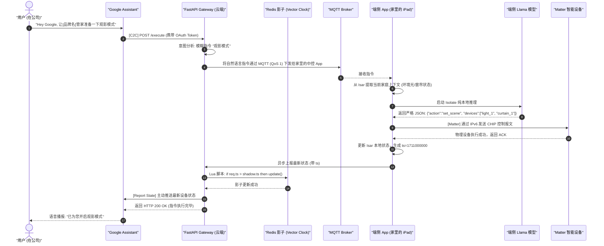

# 智能家居全链路架构深度拆解：端云协同、IoT 通信与生态集成

> **Document Status**: Architectural Blueprint | **Role**: Chief Architect / CTO / Product VP | **Date**: 2026-04-01

## 1. CTO 视角的系统性评审：第一性原理分析 (Systematic Review: First Principles)

作为技术总监/CTO，在审视这份横跨“端云协同”、“IoT 通信”和“全球生态集成”的全链路架构时，不能仅停留在技术组件的堆砌上。我们必须回到**第一性原理思维**，明确这个系统的**前提 (Premise)**、**约束 (Constraints)**、**边界 (Boundaries)** 和 **终局 (Endgame)**。只有这些宏观定义与产品/商业价值达成平衡，底层的技术拆解才有意义。

### 1.1 架构前提 (Premise)
- **商业前提**：纯云端 AI 的 API 账单会拖垮硬件利润率，且“全天候隐私上云”是阻碍高端用户买单的致命伤。
- **技术前提**：移动端/中控屏算力（NPU/Apple Silicon）已足以运行 2B 级别的量化模型（如 GGUF），但在处理域外长尾知识和多并发请求时依然孱弱。因此，**端侧主导 + 云端兜底**的混合算力架构是必然选择。
- **产品前提**：用户买的不是“能聊天的音箱”，而是“极速开灯”和“懂我习惯的管家”。稳定性和速度永远排在智能前面。

### 1.2 架构约束 (Constraints)
- **延迟红线**：局域网基础控制必须 < 200ms；涉及云端大模型的长尾复杂意图处理必须 < 800ms。超过这个时间，用户的体感就会从“智能”变成“智障”。
- **成本红线**：端侧必须拦截并消化 80% 以上的高频日常指令（如开关灯、调温），将每台设备的生命周期云端 API 成本压缩到纯云方案的 1/5 以下。
- **网络约束**：必须假设用户的家庭网络是脆弱的、间歇性断网的。架构必须支持“断网降级可用”。

### 1.3 架构边界 (Boundaries)
这是 CTO 必须死守的防线，防止系统过度耦合与越权：
- **数据隐私边界**：御三家（Apple/Google/Alexa）只能拿到设备的基础状态（开/关），**绝不允许**获取家庭关系图谱、用户作息习惯等核心行为日志。所有用于训练微调的日志必须在端侧脱敏（NER 剥离 PII）且经过用户显式授权 (Opt-in) 才能上云。
- **控制权边界**：云端大模型（vLLM/OpenAI）**没有直接下发物理控制指令的权限**。云端只负责解析意图并返回 JSON，最终的物理局域网控制协议（Matter CHIP 报文）必须由端侧 App (Executor) 甚至生物认证墙校验后发出。
- **状态真理边界**：面对 App、物理开关、Siri 等多端并发控制，**云端 Redis 设备影子只是缓存，端侧设备的真实物理反馈才是唯一真理**。必须依靠 Vector Clock (逻辑时钟) 解决因果一致性。

### 1.4 架构终局 (Endgame)
- **从“被动控制”走向“主动智能 (Zero-UI)”**：本架构的终局不是为了支持多少个 Matter 设备，而是通过端侧 24 小时的环境感知，结合数据飞轮（LLM-as-a-Judge 提取习惯），最终沉淀出“千人千面”的端侧专属行为模型，实现无需唤醒词的预判式服务。
- **SaaS 商业模式跨越**：依靠高隐私壁垒和专属数字生命体验，将公司从“一次性卖硬件”的厂商，转型为“提供长期家庭管家订阅服务 (SaaS)”的平台。

---

## 2. 领域一：端云协同计算架构拆解 (Edge-Cloud Synergy)

该领域解决的是“谁来听懂用户”以及“大脑在哪里”的问题。我们摒弃了纯云端大脑的思路，采用“分层算力路由”。

### 2.1 三层意图路由引擎 (3-Tier Intent Routing Engine)
在端侧 Flutter App 中，我们需要构建一个智能路由器，拦截并分发所有的自然语言输入。这既是架构分层，也是成本控制的护城河。

1. **Layer 1: 本地规则引擎 (Regex/FSM)**
   - **职责**：处理极高频、确定性的指令（如“开灯”、“关窗帘”）。
   - **技术栈**：Dart 编写的有限状态机。
   - **架构评审指标**：耗时 < 10ms，不唤醒任何大模型，拦截 30% 日常请求。
2. **Layer 2: 端侧大模型 (Edge AI - The Core)**
   - **职责**：处理涉及隐私上下文、复合意图、模糊指代的操作（如“我有点冷”、“关掉一楼除了走廊的所有灯”）。
   - **技术栈**：`llama.cpp` + FFI + Dart Isolate。注入动态 GBNF 语法树保证 100% 格式严谨的 JSON 输出。
   - **架构评审指标**：利用 NPU/Metal 硬件加速，推理耗时 200ms - 800ms。拦截 50% 模糊请求，**这是端侧体验与纯云端拉开代差的核心**。
3. **Layer 3: 云端大模型 (Cloud Fallback)**
   - **职责**：处理域外知识（“今天天气如何”）、复杂的日程规划、需要联网 API 的操作。
   - **技术栈**：FastAPI 网关 + vLLM/OpenAI API + Semantic Cache (防投毒缓存)。
   - **架构评审指标**：请求必须携带 `Command ID`，防止异步回调引发 UI 紊乱。

### 2.2 数据飞轮管道 (Data Flywheel Pipeline)
端云不仅是算力协同，更是数据协同。CTO 视角的飞轮不是收割用户数据，而是建立可信的数据流通管道：
- **端侧动作**：在本地 Isar 数据库中过滤掉 PII（个人敏感信息），并确保获得用户 `Opt-in` 授权后，将解析失败的 Bad Case 打包。
- **云端动作**：FastAPI 接收数据 -> 压入 RabbitMQ -> Celery Worker 调用 LLM-as-a-Judge 进行二次清洗 -> 生成 JSONL 用于后续 QLoRA 微调 -> OTA 分发新权重 (`.gguf`) 回端侧。

---

## 3. 领域二：IoT 物理通信架构拆解 (IoT Communication)

该领域解决的是“如何把 JSON 意图变成物理世界的电信号”，以及“如何保证状态一致性”。

### 3.1 南向控制：双轨制协议 (Southbound Control)
为了兼容历史遗留设备与未来生态，设备控制必须拆分为两条平行的物理通道，并在代码层进行**控制权仲裁**。

1. **主通道：Matter over Wi-Fi / Thread (局域网直控)**
   - **角色映射**：Flutter App 作为 `Matter Controller`，直接通过 IPv6 UDP 发送 CHIP 报文给灯泡/插座。
   - **CTO 评审决策**：局域网控制不仅是延迟优化的手段，更是“隐私闭环”的最坚实防线。此通道必须获得最高执行优先级。
2. **副通道：MQTT (云端代理)**
   - **使用场景**：当用户在公司（非局域网）试图控制家里的设备时，或者控制尚未支持 Matter 的老旧 Wi-Fi 设备。
   - **技术栈**：EMQX / AWS IoT Core，使用 QoS 1 保证指令必达。

### 3.2 状态同步与防乱序机制 (State Synchronization & Anti-Concurrency)
这是架构中最容易出 Bug（如“幽灵跳动”）的地方，必须用分布式系统设计的标准来防御：

1. **端侧实时订阅 (Local Subscribe)**
   - 抛弃低效的 HTTP 轮询，全面转向基于 Matter/MQTT 的事件驱动模型 (Event-Driven)。设备状态一变，立即推给端侧 Isar 数据库，确保端侧上下文时效性。
2. **云端影子与 Vector Clock (逻辑时钟)**
   - **CTO 重点审查**：绝不允许在弱网下因重发导致的旧数据覆盖新数据 (TOCTOU)。
   - **解决方案**：云端 Redis 影子引入 Vector Clock。端侧异步上报必须携带递增的 `ts`。云端 Redis 通过 **Lua 原子脚本** `Check-and-Set`：仅当 `请求.ts > 缓存.ts` 时更新，彻底杜绝状态倒流。

---

## 4. 领域三：全球第三方生态集成拆解 (Third-Party Ecosystem)

该领域解决的是“如何借力打力”，把 Apple/Google/Alexa 的流量转化为我们的用户，同时不泄露核心隐私数据。**在 CTO 视角下，这不仅是 API 对接，而是一场“流量与隐私控制权的零和博弈”。**

### 4.1 流量漏斗与接入模式拆解
我们采取“物理设备交出去，核心大脑留下来”的防守反击策略。

1. **Apple HomeKit (Matter 接入)**
   - **控制层**：直接通过 Matter 标准让设备被 Apple Home App 发现并控制。这是获取高净值用户的敲门砖。
   - **大脑层 (护城河)**：集成 `iOS App Intents`。当用户对 Siri 说复杂的“主动智能”指令时，Siri 会在后台唤醒我们的 Flutter Isolate 运行本地大模型，而不是把录音发给苹果云。**（CTO 评审点：需确保 FFI 调用 Llama.cpp 的冷启动内存占用 < 150MB，避免被 iOS 后台强杀）**
2. **Google Home (C2C 云云对接)**
   - **鉴权层**：实现 OAuth 2.0，重点落地 **AppFlip (App-to-App)** 一键授权，极大降低配网流失率。
   - **同步层 (Report State)**：当设备状态改变时，我们的 Redis 影子主动通过 HTTP/2 Server Push 或 gRPC 调用 Google HomeGraph API。**（CTO 评审点：主动推送失败必须有指数退避重试队列，严禁请求堆积拖垮主网关）**
3. **Amazon Alexa (FFS 与异步架构)**
   - **配网层**：打通 MES 产线，在出厂时将 MAC 烧录进 AWS IoT Core，实现 **FFS (Frustration-Free Setup)** 零接触配网。这是提升电商 ROI 的杀手锏。
   - **异步控制**：面对 Alexa 苛刻的 8 秒响应要求，引入异步机制。**（CTO 评审点：FastAPI 立即返回 HTTP 202，待设备真实执行后，由 Celery 触发 Amazon EventBridge 回调，彻底解耦耗时任务）**

---

## 5. 全链路业务时序图 (End-to-End Sequence Diagram)

为了让研发团队清晰理解这三大领域如何串联，以下是一个典型的**“非局域网环境下，通过 Google 语音助手触发复杂指令”**的全链路时序图。

---

## 6. 架构落地与 CTO 执行矩阵 (CTO Execution Matrix)

为了将上述架构转化为可执行的任务，并确保商业与产品的平衡，建议按以下矩阵进行研发组织，并设定严苛的门禁 (Stage Gate)：

| 领域架构 | 核心交付模块 | 技术栈要求 | CTO 关键验收指标 (KPI & Constraints) |
| :--- | :--- | :--- | :--- |
| **端云协同** | 三层路由引擎、Isolate 异步调度、本地 Isar RAG | Flutter, Dart FFI, C++, Llama.cpp | **体验红线**：UI 必须维持 60fps 不掉帧； **性能红线**：端侧复杂推理耗时 < 800ms，冷启动内存增量 < 150MB； **商业红线**：必须拦截 >50% 日常请求，云端 API 成本节省 80%。 |
| **IoT 通信** | Matter SDK 桥接、Redis Vector Clock 影子、MQTT 隧道 | C++, JNI/Obj-C++, Python (FastAPI), Redis Lua | **体验红线**：局域网控制延迟 < 200ms； **安全红线**：极弱网环境下 0 状态覆写 Bug (Vector Clock 100% 覆盖)； **合规红线**：影子数据必须去标识化。 |
| **生态集成** | C2C OAuth2.0 网关、AppFlip 拦截、Amazon FFS 产线预置 | Python (FastAPI), AWS Lambda, iOS App Intents | **商业红线**：跨生态配网跳出率 < 5% (降低客服客诉成本)； **生态红线**：Alexa 异步指令 100% 闭环无超时，避免被亚马逊降权； **护城河指标**：Siri/Alexa 触发端侧主动智能占比 > 20%。 |