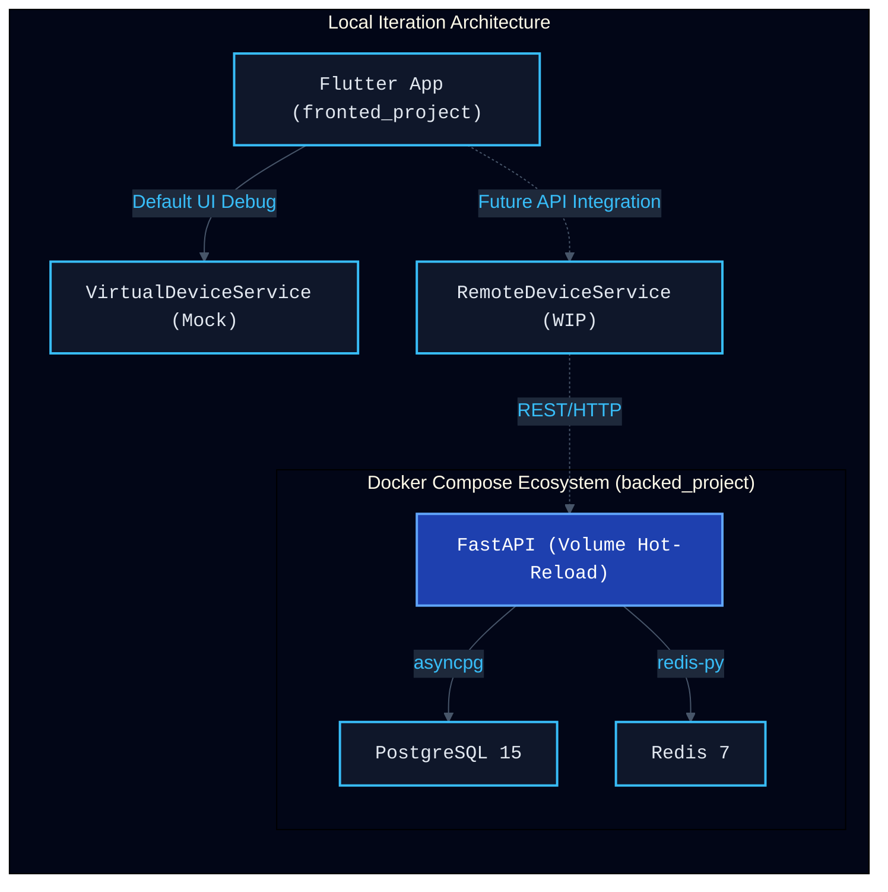

# 本地开发与运维迭代架构文档

> **文档状态**: 活跃 (Active)
> **目标**: 阐述项目本地开发、调试与运维架构的设计理念、边界约束以及交互流向，确保团队在“端云协同”的复杂架构下保持高效迭代。

---

## 1. 架构设计规范 (遵循第一性原理)

*   **前提 (Premise)**：系统为典型的端云协同架构（Flutter 端侧大模型 + FastAPI 云端兜底），涉及移动端、AI 算法侧与后端服务的联调。
*   **约束 (Constraints)**：本地开发环境需实现绝对的依赖隔离，防止宿主机被各种运行时（Python, C++, Flutter）污染；同时需要适配国内网络环境（如使用 DaoCloud 镜像加速）。
*   **边界 (Boundaries)**：本地迭代必须聚焦于核心业务逻辑（API、Database、Cache）。像基础设施监控与高并发网关（Prometheus、Nginx）目前被明确隔离在 `deploy/` 目录，以保持日常开发环境的轻量化。
*   **终局 (Endgame)**：实现“一键拉起、代码热更、端云解耦”的沉浸式本地开发体验。前端通过虚拟服务独立调试 UI，后端通过 Docker 挂载卷实现所见即所得。

---

## 2. 本地迭代架构与交互流向

以下是本地开发环境的核心组件依赖与交互链路。为了降低耦合，前端与后端在早期开发阶段可以完全独立运行。

### 2.1 后端容器化架构 (Backend Containerization)

后端的本地运行完全基于 Docker 体系，杜绝了“在我的电脑上能跑”的经典问题：

1.  **环境配置 (`.env`)**：项目基于 `app/core/config.py` 约定了环境变量。我们在 `backed_project/.env.example` 中提供了标准的本地开发配置，包含数据库、Redis 以及大模型 API 的鉴权信息。
2.  **热重载机制 (Hot Reload)**：`docker-compose.yml` 中配置了卷挂载 `- .:/app`，同时通过 `.dockerignore` 屏蔽了 `__pycache__` 和 `.venv`。配合 `uvicorn --reload`，开发者在宿主机 IDE 中修改 Python 代码后，容器内的服务将自动重启生效。
3.  **极速构建优化**：`Dockerfile` 中已替换了 Debian 的 apt 源以及 pip 源（阿里云镜像），并使用了高可用的 DaoCloud 基础镜像，极大提升了国内环境下的 `docker-compose build` 速度。

### 2.2 前端调试解耦设计 (Frontend Decoupling)

前端 Flutter 项目 (`fronted_project`) 采用了面向接口编程 (IoC) 的设计，极利于单端迭代：

*   **Mock 驱动开发**：在 `main.dart` 的入口处，通过 `DeviceManager(VirtualDeviceService())` 注入了虚拟设备服务。UI 开发者可以不依赖任何后端服务，直接在本地完成设备卡片、开关状态、动画效果的开发与测试。
*   **无缝端云联调**：当后端 API 接口（如 `/api/v1/devices`）开发就绪后，只需将 `DeviceManager` 的实现切换为已预留的 `RemoteDeviceService` 即可完成对接。

---

## 3. 运维与基础设施预留 (Infrastructure & DevOps)

对于重型基础设施，项目采取了“渐进式引入”的策略：

*   **隔离部署目录 (`deploy/`)**：`mosquitto` (MQTT Broker)、`nginx` (反向代理/负载均衡)、`prometheus` (时序监控) 的配置文件存放在了独立的 `deploy/` 目录。
*   **为何隔离？**：这些组件属于生产环境（或 Staging 环境）的必要基建，但在日常业务逻辑（CRUD、大模型提示词微调）开发中并不需要。将它们从后端的日常 `docker-compose.yml` 中剥离，可以显著降低本地电脑的内存压力和启动耗时。
*   **后续扩展建议**：如果未来需要本地调试 IoT 设备的物理连通性（MQTT 链路），建议在 `deploy/` 目录中新增一个 `docker-compose.infra.yml`，专门用于一键拉起这些重型中间件。

---

## 4. 开发者快速启动指南 (Quick Start)

### 后端启动
1. 确保已安装并启动 Docker Desktop。
2. 进入后端目录：`cd backed_project`
3. 执行一键拉起：`docker-compose up -d --build`
4. 访问 API 文档：`http://localhost:8000/docs`

### 前端启动
1. 确保已安装 Flutter SDK。
2. 进入前端目录：`cd fronted_project`
3. 运行项目：`flutter run` (默认使用 VirtualDeviceService)
