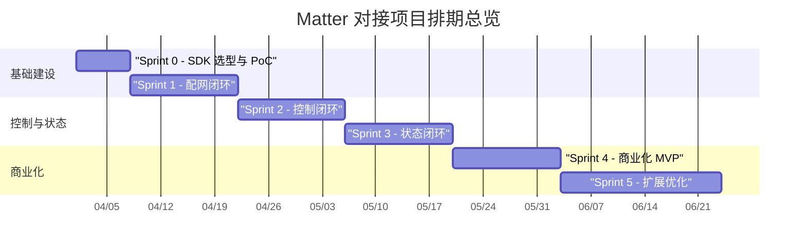

# 智能家居 Matter 对接项目排期与研发任务清单

> **文档状态**: Draft
> **视角**: 产品总监 / 项目负责人
> **目标**: 将 Matter 对接从“架构方案”推进为“可执行的商业化 MVP 计划”，明确阶段目标、跨职能分工、任务清单、验收标准与上线门禁。

---

## 1. 项目目标与业务边界

### 1.1 项目目标
Matter 对接的目标不是单纯补齐一个协议能力，而是完成产品能力的三次升级：

1. **生态升级**：从控制自有协议设备，升级为控制跨品牌 Matter 生态设备。
2. **体验升级**：从“AI 能理解意图”升级为“AI 能在局域网真实控制设备并获得状态反馈”。
3. **商业升级**：从卖单点设备/单点控制能力，升级为卖“家庭智能中枢”和后续服务订阅。

### 1.2 本期范围
本期只做 **Matter 商业化 MVP**，聚焦最小闭环，不追求一次性覆盖全部品类。

- **纳入范围**
  - Matter 设备扫码配网 / 配对码入网
  - 灯、插座、开关三类高频设备控制
  - 本地控制闭环与状态订阅
  - 设备状态同步到本地缓存和云端影子
  - 高危设备保护策略与验收标准
- **暂不纳入**
  - 全量 Cluster 覆盖
  - 全屋自动化编排平台
  - 多家庭多 Fabric 管理后台
  - 联邦学习与大规模设备运营平台

### 1.3 北极星指标

- 首次 Matter 配网成功率 ≥ 85%
- 首台设备接入时长 ≤ 3 分钟
- 局域网控制 P95 时延 ≤ 200ms
- 状态回写一致性 ≥ 99%
- 首次设备接入后 24 小时内 AI 控制转化率 ≥ 40%

---

## 2. 阶段规划与里程碑

### 2.1 版本策略
项目按 5 个阶段推进，建议采用 **双周 Sprint**，总周期 10~12 周。

| 阶段 | 时间盒 | 里程碑 | 核心目标 | Go/No-Go 标准 |
| :--- | :--- | :--- | :--- | :--- |
| **Sprint 0** | Week 0-1 | M0 - 技术验证 | 完成 SDK 选型、端侧桥接 PoC、样机验证 | 能发现 1 台标准 Matter 测试设备 |
| **Sprint 1** | Week 1-2 | M1 - 配网闭环 | 打通扫码配网、配对码、设备入库 | 至少 1 类设备配网成功 |
| **Sprint 2** | Week 3-4 | M2 - 控制闭环 | 打通开关/亮度/开关灯控制 | AI JSON 能映射到真实控制 |
| **Sprint 3** | Week 5-6 | M3 - 状态闭环 | 打通 Subscribe、本地缓存、云端影子 | 状态更新无明显乱序 |
| **Sprint 4** | Week 7-8 | M4 - 商业化 MVP | 完成 UX、异常兜底、QA 回归、安全门禁 | 可对外演示并小范围试点 |
| **Sprint 5** | Week 9-12 | M5 - 扩展优化 | Thread、更多 Cluster、Home Hub 预研 | 为下一阶段平台化做准备 |

### 2.2 排期总览

---

## 3. 跨职能资源编制

| 小组 | 人员建议 | 核心职责 | 关键交付物 |
| :--- | :--- | :--- | :--- |
| **产品与项目组** | 1x 产品总监, 1x PM | 范围控制、优先级、验收门禁、节奏推进 | PRD、里程碑、看板、验收报告 |
| **端侧应用组** | 1x Flutter, 1x iOS, 1x Android | 配网 UI、原生桥接、设备中心、错误处理 | 配网页、设备列表、桥接层 |
| **协议与设备组** | 1x IoT/嵌入式, 1x 客户端架构师 | Matter SDK、Cluster 映射、状态订阅、样机联调 | Controller/Commissioner 能力 |
| **云端平台组** | 1x 后端, 1x DevOps | 设备影子、遥测、监控、灰度与 OTA | Shadow API、监控指标、环境部署 |
| **AI 与数据组** | 1x AI 工程师 | Agent JSON 映射、上下文同步、异常归因 | 意图映射规则、误控分析 |
| **测试与质量组** | 1x QA, 1x 自动化测试 | 配网、控制、异常、兼容性、安全回归 | 测试用例、回归报告、上线门禁 |

---

## 4. WBS 与任务清单

## 4.1 Track A：产品与体验设计

### Epic A1：配网体验设计
- 定义扫码配网、输入配对码、失败重试、取消与恢复流程
- 设计“设备命名 + 房间归属 + 设备类型确认”引导
- 定义首次配网后的 AI 引导话术
- 输出配网失败原因文案字典

**验收标准**
- 首次使用者在无人工指导下可完成 1 台设备入网
- 所有错误态都有可理解文案与下一步引导

### Epic A2：设备中心与控制体验
- 设计 Matter 设备列表、在线态、离线态、房间分组
- 设计 AI 控制后设备状态回显
- 定义手动控制与 AI 控制的优先级提示
- 设计高危设备二次确认交互

**验收标准**
- 用户能区分“设备未入网”“局域网离线”“权限不足”三类状态
- AI 控制后能看到明确状态反馈

## 4.2 Track B：端侧原生与协议能力

### Epic B1：原生 SDK 与桥接层
- iOS 侧封装 Matter.framework 基础接口
- Android 侧封装 Matter SDK / play-services-home 接口
- 建立 Flutter MethodChannel 或 FFI 桥接层
- 定义统一的 Dart Domain Model：nodeId、endpointId、clusterId、fabricId

**验收标准**
- Flutter 可调用原生层发起配网与控制
- 桥接层具备日志、错误码、超时处理

### Epic B2：Commissioning 配网闭环
- 扫码二维码解析配网参数
- 支持手工输入配对码
- 设备加入 Fabric 并落本地数据库
- 失败后支持 retry / resume

**验收标准**
- 标准测试灯泡和插座配网成功
- 配网状态可被 UI 正确感知和展示

### Epic B3：Controller 与 Cluster 控制层
- 封装 OnOff Cluster
- 封装 LevelControl Cluster
- 建立 Agent JSON 到 Matter Command 的映射层
- 增加控制超时、失败回退和重试策略

**验收标准**
- “开灯/关灯/调亮度”三类指令可稳定执行
- AI 生成的结构化意图可直接映射为控制指令

### Epic B4：Subscribe 状态订阅
- 建立设备属性订阅
- 状态变化写入本地缓存
- 断网/重连后触发状态重同步
- 对接物理开关变更事件

**验收标准**
- 设备状态变化能在 UI 中实时回显
- 本地状态与真实状态的一致性 ≥ 99%

## 4.3 Track C：云端平台与可观测性

### Epic C1：设备影子与一致性
- 扩展现有设备影子模型以承接 Matter 设备语义
- 区分本地状态、云端影子状态、最后同步时间
- 建立乱序保护与冲突仲裁策略
- 预留 Home Hub 接入扩展点

**验收标准**
- 状态乱序不造成最终状态错误
- 云端可查询 Matter 设备最近有效状态

### Epic C2：遥测与运营看板
- 上报配网成功率、时延、失败码、设备品类分布
- 建立 Matter 专属质量看板
- 对接 AI 误控、状态冲突、超时失败指标
- 建立试点家庭分层观测机制

**验收标准**
- 产品、研发、测试可看到同一套核心指标
- 能对失败原因进行 Top N 归因

## 4.4 Track D：AI、场景与安全

### Epic D1：AI 控制映射与 Guardrails
- 建立 Matter 设备能力白名单
- 对高危设备增加二次确认策略
- 对 AI 生成结果做 Schema 校验与权限校验
- 建立误控样本回收机制

**验收标准**
- AI 不得生成未注册设备控制指令
- 高危设备控制必须经过额外安全门禁

### Epic D2：场景与主动智能接入
- 将 Matter 设备纳入现有场景引擎
- 支持基于状态变化触发自动化
- 将 Matter 设备数据纳入本地 RAG 上下文
- 为后续 Thread 传感器扩展预留字段

**验收标准**
- 至少 2 个典型家庭场景可演示
- Matter 设备可参与场景编排而非仅单点控制

## 4.5 Track E：测试、认证与发布

### Epic E1：测试矩阵与回归体系
- 建立设备兼容矩阵：灯、插座、开关至少各 2 个品牌
- 建立配网、控制、订阅、断网、重连测试用例
- 建立极端场景测试：弱网、后台恢复、局域网切换
- 建立安全测试：高危设备、越权控制、异常输入

**验收标准**
- P0/P1 用例全部通过
- 回归结果可追溯到设备型号和系统版本

### Epic E2：灰度与试点发布
- 明确内部试点家庭名单
- 定义试点期问题升级流程
- 建立灰度包、回滚与日志回收机制
- 输出 MVP 发布报告

**验收标准**
- 试点期内关键崩溃与误控问题可在 24 小时内定位
- 可执行回滚方案已演练通过

---

## 5. Sprint 级排期建议

### Sprint 0：SDK 选型与 PoC
- **产品**：确定 MVP 设备范围、目标家庭场景、成功标准
- **研发**：完成 iOS/Android 任一平台对单台测试设备的发现与控制
- **测试**：建立测试设备池与样机台账
- **验收**：一台 Matter 灯泡成功发现、配网、执行开关命令

### Sprint 1：配网闭环
- **产品**：完成配网页原型和文案
- **研发**：完成扫码、配对码、设备入库、设备命名
- **测试**：完成配网异常与弱网测试
- **验收**：至少两类设备完成首次配网闭环

### Sprint 2：控制闭环
- **产品**：完成设备中心与控制态设计
- **研发**：完成 OnOff/LevelControl 与 Agent JSON 映射
- **测试**：完成本地控制时延与稳定性验证
- **验收**：AI 指令驱动真实设备完成控制

### Sprint 3：状态闭环
- **产品**：定义状态一致性与冲突提示体验
- **研发**：完成 Subscribe、本地缓存、云端影子同步
- **测试**：验证物理按键变更、App 重启、断网恢复
- **验收**：状态闭环稳定，乱序可控

### Sprint 4：商业化 MVP
- **产品**：整理对外演示脚本与核心卖点
- **研发**：完成安全门禁、错误兜底、质量看板
- **测试**：完成试点回归与发布门禁
- **验收**：具备小规模试点条件

---

## 6. 关键依赖与风险管理

| 风险项 | 触发条件 | 影响 | 应对策略 | 责任方 |
| :--- | :--- | :--- | :--- | :--- |
| **原生 SDK 接入复杂** | iOS/Android API 差异过大 | 桥接延期 | Sprint 0 先做单平台 PoC，确认统一抽象层 | 客户端架构 |
| **设备兼容性碎片化** | 不同品牌 Cluster 支持不一致 | 演示效果不稳定 | MVP 先锁定少量标准设备池 | PM / QA |
| **AI 指令与协议映射失真** | JSON 能力与设备能力不一致 | 误控或失败 | 设备能力白名单 + Schema 校验 | AI / 客户端 |
| **状态一致性问题** | 弱网、物理按键、App 重启 | UI 与真实状态不一致 | Subscribe + 本地缓存 + 云端影子仲裁 | 协议 / 后端 |
| **高危设备风险** | 门锁、摄像头等被误控 | 安全事故 | 高危设备后置到下一阶段，或强制二次认证 | 产品 / 安全 |

---

## 7. 上线门禁与完成定义

### 7.1 MVP 上线门禁

- 配网成功率达到目标门槛
- 局域网控制时延达到目标门槛
- 设备状态同步一致性达到目标门槛
- 高危设备默认不开放或已加安全门禁
- 关键崩溃、误控、死循环问题归零
- 文档、测试报告、回滚方案齐备

### 7.2 Definition of Done

- 代码已合并主干
- 关键测试全部通过
- README / 架构文档 / 接口文档已同步
- 指标已接入监控看板
- 发布回滚路径经过验证

---

## 8. 管理建议

从产品总监视角，这个项目的 Matter 对接必须遵循三个原则：

1. **先闭环，再扩品类**：先把灯、插座、开关做透，再考虑门锁、空调和传感器。
2. **先本地控制，再主动智能**：先跑通配网、控制、状态，再叠加 AI 场景推荐。
3. **先可售卖，再大而全**：先做一个能对外演示、能进入试点家庭、能形成口碑的 MVP，而不是一开始追求“全协议覆盖”。 

一句话总结：Matter 对接是项目平台化的第一战，成败不在于接入多少设备，而在于是否把“配网、控制、状态、AI、质量、商业价值”做成一个真正可落地的闭环。
