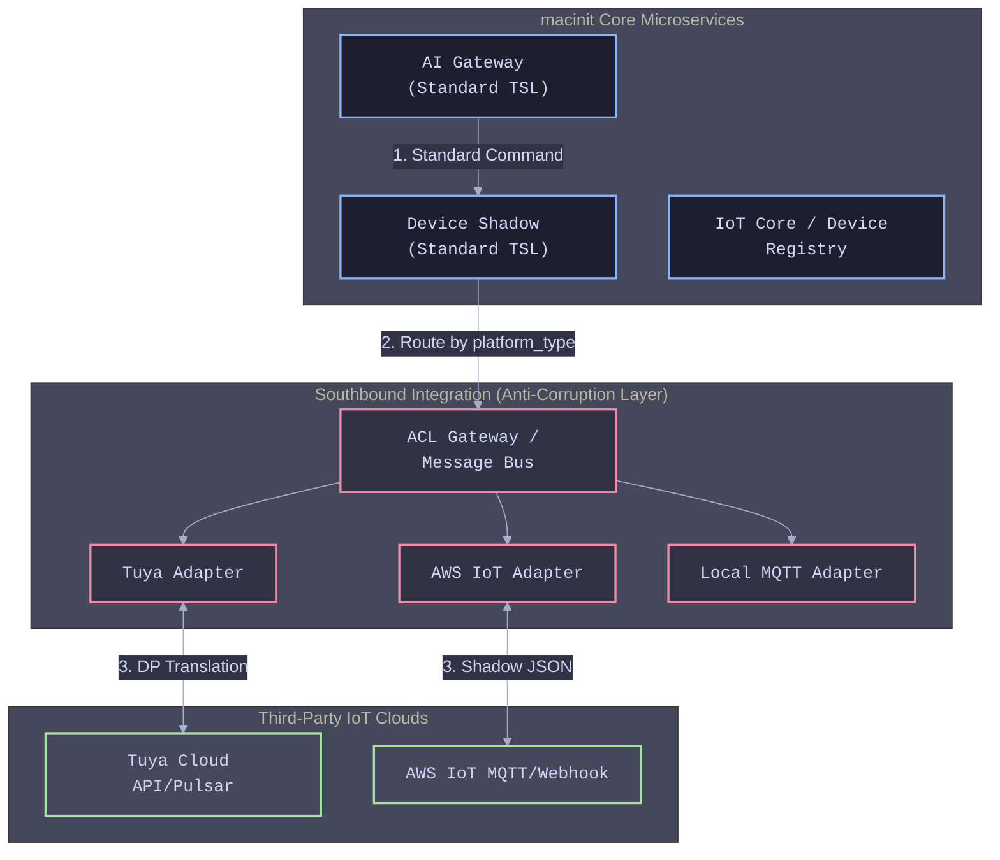

# macinit 多云 IoT 兼容架构设计

本文档详细描述了 `macinit` 项目后端在完成微服务改造后，如何通过引入防腐层（ACL）、统一物模型（TSL）和适配器模式，平滑接入第三方 IoT 平台（如涂鸦 Tuya、AWS IoT Core）。

---

## 1. 架构分层设计：引入南向集成层

为了保证核心业务（如 AI Gateway 语义理解、Device Shadow 高频竞态控制）不被第三方平台的特定概念（如涂鸦的 `dp_id`、AWS 的 `thingName`）污染，我们在现有微服务与第三方云之间，建立了**南向集成层 (Southbound Integration Layer)**。

## 2. 统一物模型 (Canonical TSL) 的建立

要兼容不同的平台，`macinit` 必须拥有自己的一套**标准物模型 (TSL)**。内部微服务只认这套标准，绝不处理外部厂商的专有格式。

* **标准化定义**：例如，所有的智能灯泡，在 `macinit` 内部的属性一律定义为 `{"power": "boolean", "brightness": "int(0-100)", "color": "hex"}`。
* **动态映射引擎 (Mapping Engine)**：在 `IoT Core` 中建立设备注册表，记录每个设备的 `platform_type`（如 tuya, aws）和映射模板。
  * **下行 (控制)**：AI Gateway 输出 `{"power": true}`。指令到达 `Tuya Adapter` 后，适配器查表发现涂鸦的开关对应的 DP ID 是 `1`，于是将其翻译为 `{"1": true}` 发送给涂鸦云。
  * **上行 (状态)**：AWS IoT 推送了 `{"state": {"reported": {"bright": 80}}}`。`AWS Adapter` 收到后，将其翻译为标准 TSL `{"brightness": 80}`，再投递给 `Device Shadow` 服务。

## 3. 核心架构模式的应用

在具体的代码落地时，我们运用了以下设计模式：

* **防腐层 (Anti-Corruption Layer, ACL)**：作为一个独立的模块或服务网关存在。所有进出第三方平台的流量必须经过此层。核心服务只与防腐层交互，防腐层对外屏蔽不同云厂商的 API 差异。
* **适配器模式 (Adapter Pattern)**：在代码层面，定义一个抽象基类 `IPlatformAdapter`，包含 `connect()`, `send_command()`, `subscribe_state()` 等标准方法。然后实现 `TuyaAdapter` 和 `AwsAdapter`。无论接多少个平台，对上层 `Device Shadow` 来说，调用的接口永远是一致的。
* **策略模式 (Strategy Pattern)**：当需要下发指令时，根据数据库中设备所属的平台类型，动态实例化并调用对应的 Adapter。

## 4. 异构协议与影子同步 (Shadow Sync) 机制

接入第三方云后，系统面临“双重影子”的挑战（本地存了一份影子，涂鸦/AWS 云端也有一份）。我们需要一套严密的同步机制：

* **上行链路（被动监听 + 主动兜底）**：
  * **被动监听**：`Tuya Adapter` 订阅涂鸦的 Pulsar 消息队列，`Aws Adapter` 接收 AWS IoT Rule 触发的 Webhook。收到状态变更后，立即转换为标准 TSL 并更新本地 `Device Shadow`。
  * **主动兜底**：为了防止消息丢失，运行一个定时任务 (Cron Job)，定期调用第三方云的 Open API 拉取全量状态，与本地影子进行 Diff 比对并修复。
* **下行链路（异步解耦）**：
  * `Device Shadow` 更新了“期望状态 (Desired)”后，将指令推入内部消息队列（如 Redis Pub/Sub 或 RabbitMQ）。对应的 Adapter 消费该消息并调用第三方云的 HTTP API 或 MQTT 执行下发。
* **冲突处理 (Vector Clock 保留)**：继续沿用我们之前修复的 Lua 脚本 Vector Clock 机制。如果第三方平台推送的事件时间戳落后于本地影子的最新时间，则视为网络乱序报文，直接丢弃，防止状态回滚。

## 总结

通过在微服务架构下引入防腐层和统一物模型，`macinit` 从一个强耦合的单体系统，蜕变为一个**可插拔、多云兼容的 IoT 中枢大脑**。AI 只需要专心处理自然语言到标准 TSL 的转换，剩下的脏活累活全部交给底层的适配器去处理。