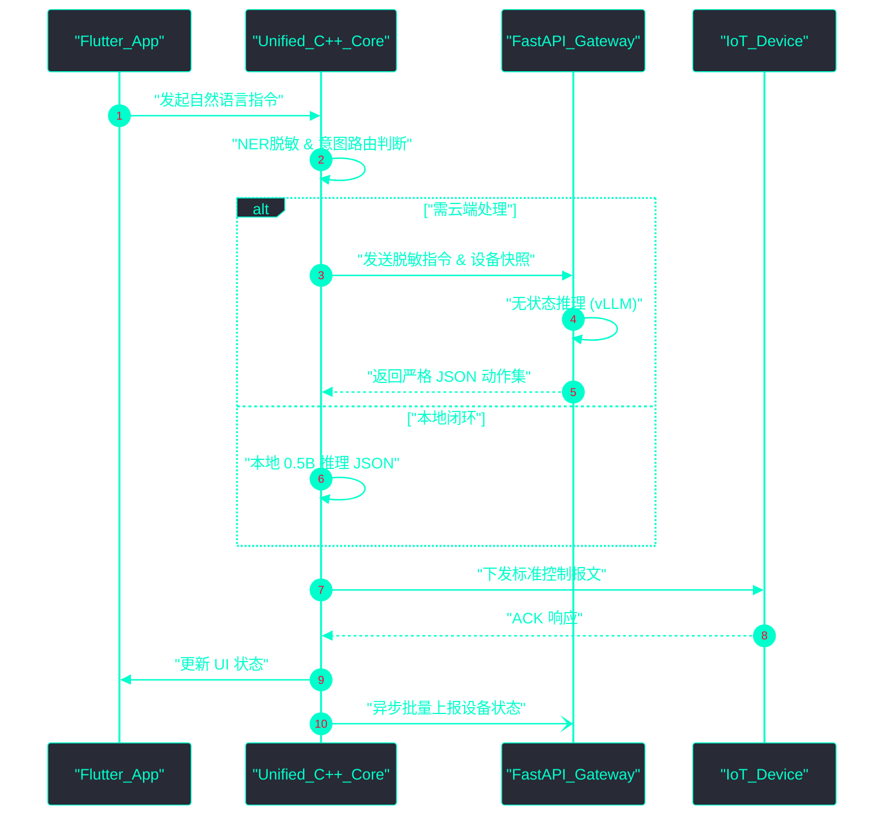

# 智能家居端云系统复杂度优化架构方案 (System Complexity Optimization)

> **文档状态**: 架构优化方案 (Draft)
> **目标读者**: 全体研发团队
> **背景**: 随着端云协同、多模态大模型及物联网设备的接入，当前系统面临严重的“架构熵增”与复杂度失控。本文档旨在从第一性原理出发，系统性地对现有复杂度进行降维和优化。

---

## 1. 架构的第一性原理分析

### 1.1 前提 (Premise)
*   **系统熵增必然性**：由于长期的业务迭代，我们在端侧（Flutter/C++）和云端（FastAPI/Celery）堆砌了过多零散的微服务与同步/异步状态机，导致通信成本与维护成本激增。
*   **可用性优先**：无论如何精简，端侧在断网条件下的基本控制能力必须得到保障，云端必须作为补充而非单点依赖。
*   **极简即稳定**：更少的流转节点意味着更低的故障率和更短的延迟（End-to-End Latency）。

### 1.2 约束 (Constraints)
*   **重构成本约束**：优化必须是渐进式的（Evolutionary），不能推翻现有底座（如 FastAPI, Isar DB, 0.5B 本地模型），需以“接口兼容”为基础。
*   **性能约束**：精简流程后，云端推理与端侧执行的总耗时必须严格控制在 800ms 内。
*   **合规约束**：优化后的数据链路不得破坏现有的 Opt-in 授权与 NER 脱敏墙。

### 1.3 边界 (Boundaries)
*   **剥离非核心中间件**：去除不必要的 MQ（消息队列）多级转发，合并为单一的高性能事件总线。
*   **统一网关层**：将分散的鉴权、限流、日志网关统一为单一的高性能 APISIX 或自研网关。
*   **拒绝过度设计**：不再为低频场景设计复杂的补偿重试机制，而是统一采用最终一致性（Eventual Consistency）的简单拉取（Pull）模型。

### 1.4 终局 (Endgame)
*   **极致轻量化的端云单工架构**：端侧成为绝对的“控制单点（Single Source of Truth）”，云端退化为纯粹的“无状态算力补充（Stateless Compute Node）”。
*   **代码与配置同源**：通过声明式配置管理设备与模型联动，消除大量胶水代码（Glue Code）。
*   **自愈能力**：系统具备极强的自我恢复能力，通过状态机的自动收敛解决并发冲突。

---

## 2. 核心视图与可视化说明

### 2.1 业务流程图 (Business Process Flow)
优化后的指令流转业务流程，砍掉了多余的中间状态判断，直接在端侧路由。

```mermaid
%%{init: {'theme': 'base', 'themeVariables': {'primaryColor': '#1e1e2e', 'primaryTextColor': '#00ffcc', 'primaryBorderColor': '#00ffcc', 'lineColor': '#00ffcc', 'secondaryColor': '#282a36', 'tertiaryColor': '#44475a', 'clusterBkg': '#282a36', 'clusterBorder': '#00ffcc'}}}%%
graph TD
classDef default fill:#1e1e2e,stroke:#00ffcc,stroke-width:2px,color:#00ffcc,font-family:monospace;
classDef highlight fill:#ff007f,stroke:#ff007f,color:#fff;

"Start"([ "用户语音/文本" ]) --> "Local_Router"{"端侧统一路由"}
"Local_Router" -->|"匹配本地意图"| "Local_Infer"["本地 0.5B 推理"]
"Local_Router" -->|"复杂/长尾意图"| "Cloud_API"["云端统一网关"]

"Local_Infer" --> "Executor"["设备执行器"]
"Cloud_API" --> "Cloud_Infer"["云端 vLLM 推理"]
"Cloud_Infer" --> "Executor"

"Executor" --> "Update_DB"[ "更新本地 Isar" ]
"Update_DB" -.->|"异步同步"| "Cloud_Shadow"[ "云端 Redis 影子" ]
```
**说明**：将以前的层层校验合并为“端侧统一路由”，仅通过一套规则判定是否需要上云。

### 2.2 产品架构图 (Product Architecture)
展示优化后的组件划分，强调模块的合并与冗余服务的剥离。

```mermaid
%%{init: {'theme': 'base', 'themeVariables': {'primaryColor': '#1e1e2e', 'primaryTextColor': '#00ffcc', 'primaryBorderColor': '#00ffcc', 'lineColor': '#00ffcc', 'secondaryColor': '#282a36', 'tertiaryColor': '#44475a', 'clusterBkg': '#282a36', 'clusterBorder': '#00ffcc'}}}%%
flowchart TB
classDef default fill:#1e1e2e,stroke:#00ffcc,stroke-width:2px,color:#00ffcc,font-family:monospace;
classDef edge fill:#2b2d42,stroke:#ffb86c,stroke-width:2px,color:#ffb86c,font-family:monospace;

subgraph "Edge_Environment" [ "端侧极简环境 (Edge)" ]
    direction TB
    "UI_Layer"["Flutter UI层"]
    "Unified_Core"["C++ 统一核心库 (推理+路由)"]:::edge
    "Local_DB"[("Isar 本地库")]
end

subgraph "Cloud_Environment" [ "云端无状态环境 (Cloud)" ]
    direction TB
    "FastAPI_Gateway"["FastAPI 无状态网关"]
    "Model_Pool"["vLLM 模型池"]
    "Data_Flywheel"["数据飞轮 (异步任务)"]
end

"UI_Layer" --> "Unified_Core"
"Unified_Core" <--> "Local_DB"
"Unified_Core" <--> "FastAPI_Gateway"
"FastAPI_Gateway" --> "Model_Pool"
"FastAPI_Gateway" -.-> "Data_Flywheel"
```
**说明**：将原有的 `Isolate` 引擎、复杂网络请求模块统一整合入 `C++ 统一核心库`，Flutter 仅负责 UI 展示。云端去掉复杂的 Celery 调度，改用轻量级后台任务处理飞轮数据。

### 2.3 数据流向图 (Data Flow)
强调优化后的闭环数据流向，减少网络 IO 次数。

```mermaid
%%{init: {'theme': 'base', 'themeVariables': {'primaryColor': '#1e1e2e', 'primaryTextColor': '#00ffcc', 'primaryBorderColor': '#00ffcc', 'lineColor': '#00ffcc', 'secondaryColor': '#282a36', 'tertiaryColor': '#44475a', 'clusterBkg': '#282a36', 'clusterBorder': '#00ffcc'}}}%%
flowchart LR
classDef default fill:#1e1e2e,stroke:#00ffcc,stroke-width:2px,color:#00ffcc,font-family:monospace;

"User"([ "用户" ]) -->| "指令" | "Edge_Core"[ "端侧统一核心" ]
"Edge_Core" -->| "R/W" | "Local_State"[ "本地状态 (Isar)" ]
"Edge_Core" -->| "脱敏长尾数据" | "Cloud_Gateway"[ "云端网关" ]
"Cloud_Gateway" -->| "结构化 JSON" | "Edge_Core"
"Edge_Core" -->| "控制指令" | "IoT_Devices"[ "智能设备" ]

"Local_State" -.->| "状态增量(Batch)" | "Cloud_Sync"[ "云端状态同步" ]
```
**说明**：数据读写高度集中在本地，上云的数据被严格精简。状态同步从实时转为批量 (Batch)，极大降低云端并发压力。

### 2.4 核心交互时序图 (Core Interaction Sequence Diagram)
展示一次复杂的云端兜底指令是如何在优化后的架构中极速完成的。


**说明**：时序图展示了合并请求的优势，核心逻辑下沉到 C++ 层避免了 Flutter Isolate 间的频繁通信开销，云端仅作为“纯函数”被调用，提升了交互的鲁棒性。

---

## 3. 具体执行清单 (Action Items)

为了实现上述架构复杂度的降低，我们制定了以下执行步骤：

1. **统一端侧逻辑库**：将散落在 Dart 中的业务逻辑下沉至 `unified_core` (C++)，暴露统一的 FFI 接口。
2. **削减云端中间件**：废弃现有的 Celery 队列，采用 FastAPI 内置的 `BackgroundTasks` 处理数据飞轮任务，降低运维复杂度。
3. **批量状态同步**：优化设备状态上报机制，从单次触发改为合并批处理 (Debounce & Batch)。
4. **清理冗余 API**：合并现有的零散 CRUD 接口，提供统一的 GraphQL 或基于 JSON-RPC 的精简接口，降低客户端对接成本。
