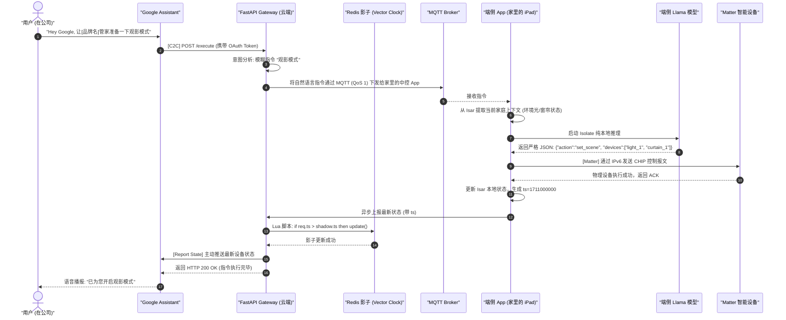

# 智能家居全链路架构深度拆解：端云协同、IoT 通信与生态集成

> **Document Status**: Architectural Blueprint | **Role**: Chief Architect | **Date**: 2026-04-01

## 1. 架构第一性原理 (Architectural First Principles)

作为架构师，在拆解本智能家居系统时，我们必须明确核心的技术冲突与破局点。本系统有三个核心领域（Domain）：**端云协同计算**、**IoT 物理控制通信**、以及**全球生态集成**。
这三者的架构设计必须遵循以下“第一性原理”：
1. **控制指令必须本地闭环 (Local-First Determinism)**：哪怕云端宕机，用户必须能在 200ms 内开灯。
2. **状态真理之源防乱序 (Single Source of Truth & Causality)**：由于多生态接入，物理开关、App、Siri 的状态必须保证因果一致性。
3. **复杂意图的算力路由 (Compute Routing)**：端侧只算“能算的”，长尾、模糊意图必须平滑上云。

本方案将这三大领域进行物理与逻辑层面的深度拆解。

---

## 2. 领域一：端云协同计算架构拆解 (Edge-Cloud Synergy)

该领域解决的是“谁来听懂用户”以及“大脑在哪里”的问题。我们摒弃了纯云端大脑的思路，采用“分层算力路由”。

### 2.1 三层意图路由引擎 (3-Tier Intent Routing Engine)
在端侧 Flutter App 中，我们需要构建一个智能路由器，拦截并分发所有的自然语言输入。

1. **Layer 1: 本地规则引擎 (Regex/FSM)**
   - **指责**：处理极高频、确定性的指令（如“开灯”、“关窗帘”）。
   - **技术栈**：Dart 编写的有限状态机。
   - **性能指标**：耗时 < 10ms，不唤醒任何大模型。
2. **Layer 2: 端侧大模型 (Edge AI - The Core)**
   - **指责**：处理涉及隐私上下文、复合意图、模糊指代的操作（如“我有点冷”、“关掉一楼除了走廊的所有灯”）。
   - **技术栈**：`llama.cpp` + FFI + Dart Isolate。注入动态 GBNF 语法树保证 100% 格式严谨的 JSON 输出。
   - **性能指标**：利用 NPU/Metal 硬件加速，推理耗时 200ms - 800ms。完全断网可用。
3. **Layer 3: 云端大模型 (Cloud Fallback)**
   - **指责**：处理域外知识（“今天天气如何”）、复杂的日程规划、需要联网 API 的操作。
   - **技术栈**：FastAPI 网关 + vLLM/OpenAI API + Semantic Cache (防投毒缓存)。

### 2.2 数据飞轮管道 (Data Flywheel Pipeline)
端云不仅是算力协同，更是数据协同。
- **端侧动作**：在本地 Isar 数据库中过滤掉 PII（个人敏感信息）后，将解析失败的 Bad Case 打包。
- **云端动作**：FastAPI 接收数据 -> 压入 RabbitMQ -> Celery Worker 调用 LLM-as-a-Judge 进行二次清洗 -> 生成 JSONL 用于后续 QLoRA 微调 -> OTA 分发新权重 (`.gguf`) 回端侧。

---

## 3. 领域二：IoT 物理通信架构拆解 (IoT Communication)

该领域解决的是“如何把 JSON 意图变成物理世界的电信号”，以及“如何保证状态一致性”。

### 3.1 南向控制：双轨制协议 (Southbound Control)
为了兼容历史遗留设备与未来生态，设备控制必须拆分为两条平行的物理通道：

1. **主通道：Matter over Wi-Fi / Thread (局域网直控)**
   - **角色映射**：Flutter App 作为 `Matter Controller`，直接通过 IPv6 UDP 发送 CHIP 报文给灯泡/插座。
   - **优势**：0 云端延迟，完全断网可用。
2. **副通道：MQTT (云端代理)**
   - **使用场景**：当用户在公司（非局域网）试图控制家里的设备时，或者控制尚未支持 Matter 的老旧 Wi-Fi 设备。
   - **技术栈**：EMQX / AWS IoT Core，使用 QoS 1 保证指令必达。

### 3.2 状态同步与防乱序机制 (State Synchronization & Anti-Concurrency)
这是架构中最容易出 Bug（如“幽灵跳动”）的地方。

1. **端侧实时订阅 (Local Subscribe)**
   - 抛弃轮询，通过 Matter 协议的 `Subscribe` 机制，设备状态一变，立即推给端侧 Isar 数据库，延迟 < 50ms。
2. **云端影子与 Vector Clock (逻辑时钟)**
   - 当端侧更新 Isar 后，异步向云端 Redis 发送状态增量，**必须携带设备本地的时间戳或版本号 (last_update_ts)**。
   - 云端 Redis 必须使用 **Lua 脚本** 执行原子级的 `Check-and-Set` 操作：只有当上报的 `ts` 大于 Redis 影子中的 `ts` 时才更新，彻底解决因网络抖动导致的旧状态覆写新状态（TOCTOU 漏洞）。

---

## 4. 领域三：全球第三方生态集成拆解 (Third-Party Ecosystem)

该领域解决的是“如何借力打力”，把 Apple/Google/Alexa 的流量转化为我们的用户，同时不泄露核心隐私数据。

### 4.1 流量漏斗与接入模式拆解
我们采取“物理设备交出去，核心大脑留下来”的防守反击策略。

1. **Apple HomeKit (Matter 接入)**
   - **控制层**：直接通过 Matter 标准让设备被 Apple Home App 发现并控制。
   - **大脑层 (护城河)**：集成 `iOS App Intents`。当用户对 Siri 说复杂的“主动智能”指令时，Siri 会在后台唤醒我们的 Flutter Isolate 运行本地大模型，而不是把录音发给苹果云。
2. **Google Home (C2C 云云对接)**
   - **鉴权层**：实现 OAuth 2.0，重点落地 **AppFlip (App-to-App)** 一键授权，极大降低配网流失率。
   - **同步层 (Report State)**：当设备状态改变时，我们的 Redis 影子主动通过 HTTP/2 Server Push 或 gRPC 调用 Google HomeGraph API，防止 Google 的定时 `QUERY` 打爆我们的网关。
3. **Amazon Alexa (FFS 与异步架构)**
   - **配网层**：打通 MES 产线，在出厂时将 MAC 烧录进 AWS IoT Core，实现 **FFS (Frustration-Free Setup)** 零接触配网。
   - **异步控制**：面对 Alexa 苛刻的 8 秒响应要求，若设备处于休眠，FastAPI 立即返回 HTTP 202 (DeferredResponse)，等设备苏醒执行后，再通过 **Amazon EventBridge** 异步回调给 Alexa。

---

## 5. 全链路业务时序图 (End-to-End Sequence Diagram)

为了让研发团队清晰理解这三大领域如何串联，以下是一个典型的**“非局域网环境下，通过 Google 语音助手触发复杂指令”**的全链路时序图。

---

## 6. 架构落地与团队执行矩阵 (Execution Matrix)

为了将上述架构转化为可执行的任务，建议按以下矩阵进行研发组织：

| 领域架构 | 核心交付模块 | 技术栈要求 | 关键验收指标 (KPI) |
| :--- | :--- | :--- | :--- |
| **端云协同** | 三层路由引擎、Isolate 异步调度、本地 Isar RAG | Flutter, Dart FFI, C++, Llama.cpp | UI 不掉帧 (60fps)；端侧推理耗时 < 800ms；JSON 格式成功率 100% |
| **IoT 通信** | Matter SDK 桥接、Redis Vector Clock 影子、MQTT 隧道 | C++, JNI/Obj-C++, Python (FastAPI), Redis Lua | 局域网控制延迟 < 200ms；极弱网环境下 0 状态覆写 Bug |
| **生态集成** | C2C OAuth2.0 网关、AppFlip 拦截、Amazon FFS 预置 | Python (FastAPI), AWS Lambda, iOS App Intents | 跨生态配网跳出率 < 5%；长尾异步指令 100% 闭环无超时 |