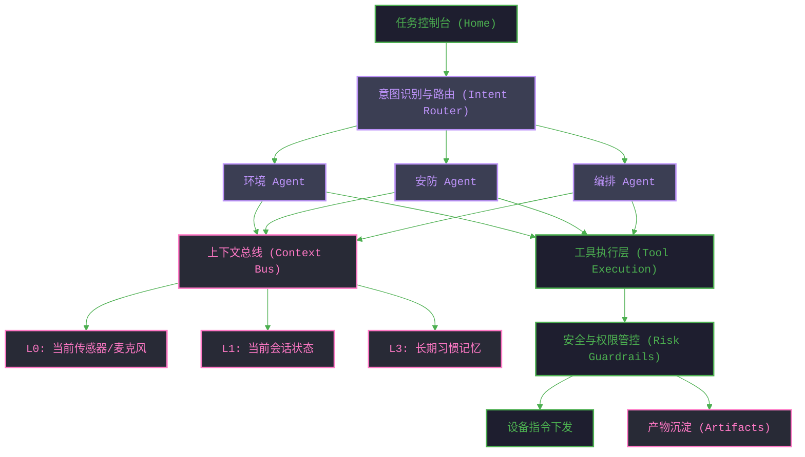
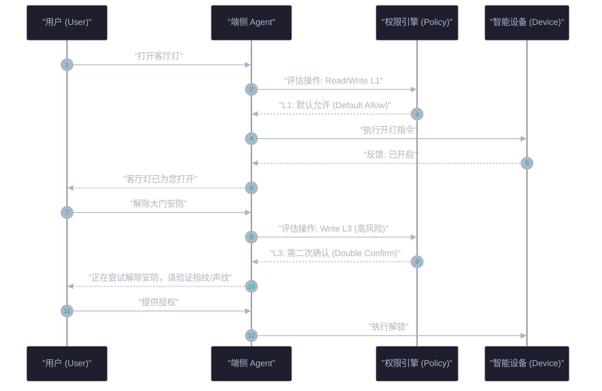

# AI 交互改造需求文档：端侧智能家居系统

## 0. 架构设计前提与定义

*   **前提 (Premise)**：从“功能/页面树”向“意图-上下文-执行-反馈”的任务系统演进，全面拥抱 AI Agent 时代的信息架构 (IA)。
*   **约束 (Constraints)**：
    *   端侧资源受限：RAM峰值≤1.5GB。
    *   性能要求：TTFT≤300ms，端到端延迟≤800ms，吞吐量≥15 Tokens/s。
    *   技术栈约束：Flutter/Dart，需规避懒加载造成的 UI 卡顿。
*   **边界 (Boundaries)**：专注端侧 AI 拦截（拦截率≥80%），只有高阶复杂逻辑或需要云端大模型支持的任务才 fallback 到云端，保证 100% GBNF 绝对命中防幻觉。
*   **终局 (Endgame)**：构建“0页面切换、100%意图驱动”的自然语言操作系统式智能家居控制台，实现首日 AI 交互转化率的最大化。

## 1. 一级意图地图 (Intent Map)

原有的“设备控制面板”重构为 5 个核心意图：
1.  **环境调节 (Environment Control)**：“太热了”、“我想睡觉了”。
2.  **安防监控 (Security Monitoring)**：“门口是谁”、“帮我锁门”。
3.  **自动化编排 (Routine Automation)**：“以后我出门就关灯”、“定时帮我拉窗帘”。
4.  **设备排障 (Device Troubleshooting)**：“空调怎么不制冷”、“网络是不是断了”。
5.  **资讯与陪伴 (Information & Companion)**：“今天天气怎么样”、“给我放点音乐”。

## 2. 核心架构重构蓝图 (IA Top Structure)



## 3. Flutter 前端界面改造需求

### 3.1 首页：从“设备列表”到“任务控制台”
*   不再优先展示设备状态宫格。
*   顶部核心为 **多模态输入区**（语音/文本/摄像头环境识别）。
*   中间展示 **进行中的任务 (Active Workflows)**（例如：“正在为您调节睡眠模式...”）与 **待审批通知**（例如：“发现异常闯入，是否报警？”）。
*   底部展示 **沉淀产物 (Artifacts)**（如新生成的“自动化规则”、“家庭能耗周报”）。

**【界面线框图：首页控制台】**
```text
+---------------------------------------------------+
| [ 🎙️ 语音 ]  [ ⌨️ 文本输入... ]  [ 📷 环境识别 ] |
| "有什么我可以帮您的？"                            |
+---------------------------------------------------+
| 【进行中的任务】                                  |
|  > 正在为您调节睡眠模式...                 [停止] |
+---------------------------------------------------+
| 【待审批通知】                                    |
|  ! 发现异常闯入，是否报警？                       |
|    [是，立即报警]  [忽略]                         |
+---------------------------------------------------+
| 【最近产物】                                      |
|  📄 自动化规则：下雨自动关窗                      |
|  📊 家庭能耗周报 (生成于昨天)                     |
+---------------------------------------------------+
```

### 3.2 导航与搜索：从“找页面”到“找下一步”
*   **状态导航**：将底部 Tab 改为：任务流、自动化库、家庭记忆、安全审计。
*   **动作搜索**：搜索结果不仅返回设备，必须返回 **可执行的动作** 或 **工作流**（例如搜“空调”，返回“开启制冷”、“排查故障工作流”）。

**【界面线框图：搜索与全局导航】**
```text
+---------------------------------------------------+
| 🔍 搜索: 空调|                                    |
|---------------------------------------------------|
| 推荐动作:                                         |
|  [▶] 开启客厅空调制冷                             |
|  [▶] 运行 "排查故障" 工作流                       |
| ------------------------------------------------- |
| 相关设备:                                         |
|  - 客厅空调 (当前离线)                            |
+---------------------------------------------------+
|                                                   |
|             [ 状态导航栏 (Bottom Tab) ]           |
|  任务流  |  自动化库  |  家庭记忆  |  安全审计  |
+---------------------------------------------------+
```

### 3.3 过程可视化 (Execution UI)
*   必须暴露 Agent 执行过程，将黑盒变白盒：
    *   显示“当前目标”、“正在调用的工具”、“权限请求状态”。
    *   通过 Step Timeline 和 Status Chips 让用户随时可以打断 (Stop) 或接管 (Take over)。

**【界面线框图：过程可视化与接管态】**
```text
+---------------------------------------------------+
| 🎯 当前目标: "解除大门安防"                       |
+---------------------------------------------------+
| 过程追踪 (Step Timeline):                         |
|  [√] 识别意图: 安防控制                           |
|  [√] 调用工具: 门锁控制API                        |
|  [!] 权限请求: 触发 L3 级安全策略 (需二次确认)    |
|      "正在尝试解除安防，请验证指纹/声纹"          |
+---------------------------------------------------+
|              [ 验证授权 ]  [ 停止/取消 ]          |
+---------------------------------------------------+
```

## 4. 性能与底层架构约束

### 4.1 Dart 全局懒加载优化 (Critical)
*   **痛点**：原有 Flutter/Dart 架构中，`AgentManager` 等重负载任务依赖全局变量懒加载，导致首次唤醒 AI 时出现严重卡顿。
*   **改造要求**：
    *   在 `main()` 函数或 Root Widget 的 `initState` 中，显式调用 `AgentManager.preload()`。
    *   预先加载端侧大模型与 Prompt 模板，确保用户导航到 AI 交互界面时，模型已驻留内存。

### 4.2 端侧 AI 指标对齐
*   **推理性能**：优化模型加载与推理链路，确保 TTFT (Time To First Token) ≤ 300ms，端到端响应 ≤ 800ms。
*   **资源限制**：通过内存管理机制，保证峰值 RAM 消耗不超过 1.5GB。
*   **内容控制**：接入 GBNF (Grammar-Based Neural Format) 约束输出，实现 100% 绝对命中，彻底消除硬件控制指令幻觉。

## 5. 权限与风险架构 (Risk Guardrails)



*   **L1 默认允许**：读取温度、开/关普通照明、调节音量。
*   **L2 一次确认**：创建新自动化规则、调整全屋模式。
*   **L3 二次确认（高风险）**：门锁操作、安防监控摄像头授权。
*   **数据隐私**：保证 100% 数据纯净度去 PII，敏感数据不上传云端，端侧拦截率≥80%。

## 6. 核心评估指标体系 (IA Metrics Tree)

将传统 DAU/停留时长替换为 AI Agent 专有指标：
*   **模型验收 (KPIs)**：FSR≥99.5%, IEM≥95%, OOD-R≥98%, DCR≥99%。
*   **IA 架构指标**：首次意图路径命中率、工具调用成功率、上下文补充率。
*   **用户干预指标**：高风险动作拦截率、授权中断率、用户接管率 (Take-over rate)。

---
*文档生成于 AI Agent 重构阶段，用于指导后续开发与测试验收。*