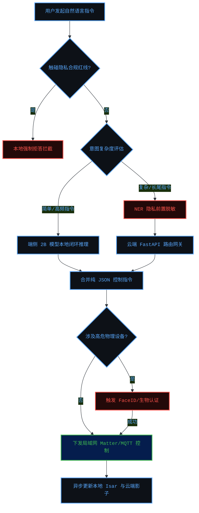
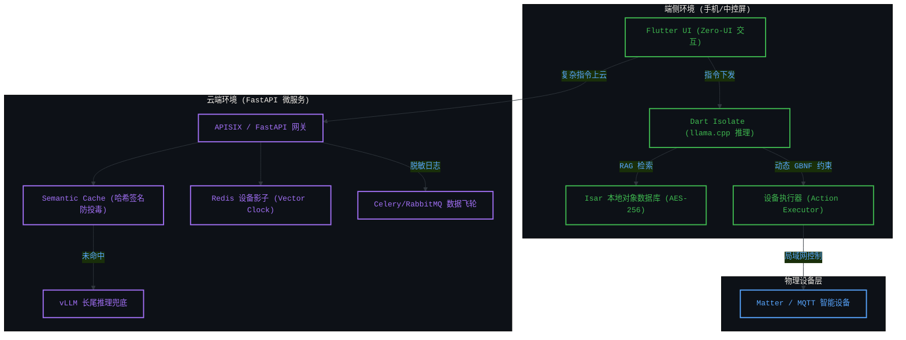
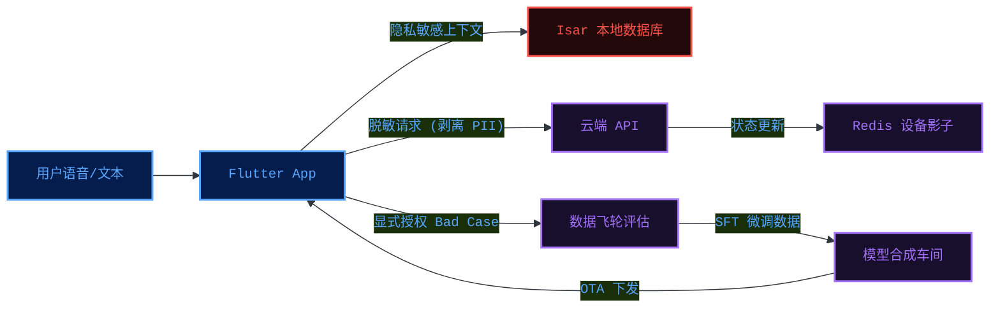
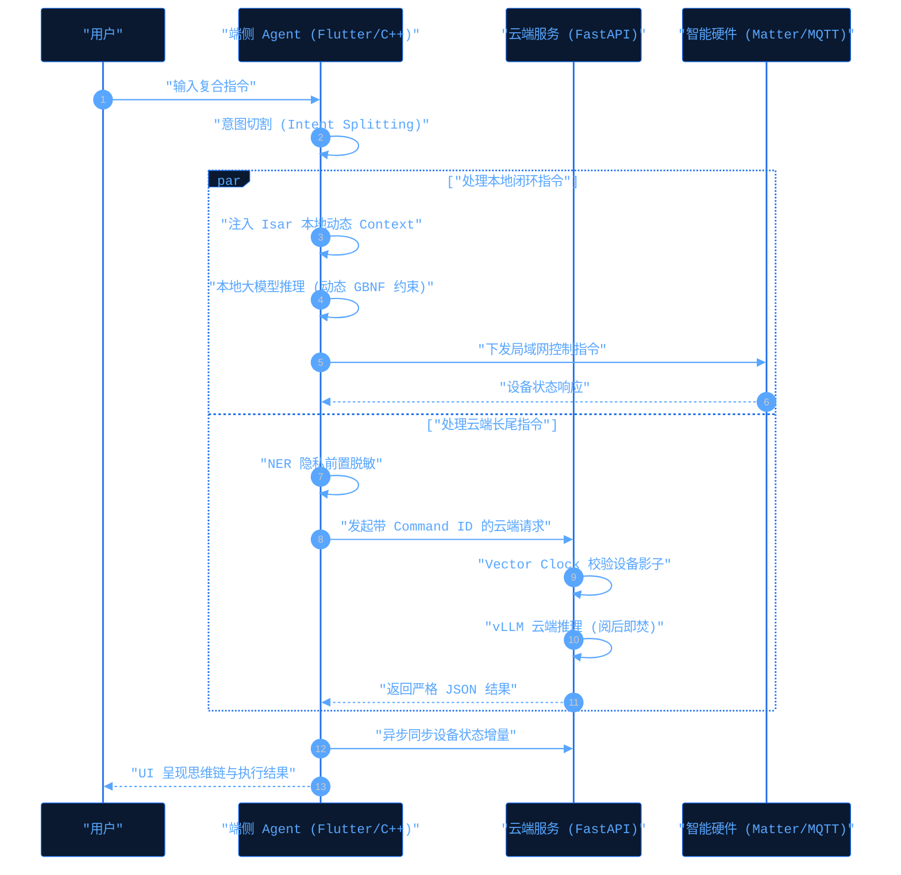

# 智能管家端侧 AI Agent 产品需求与架构设计文档 (PRD & Architecture)

## 1. 架构前提 (Premise)
*   **隐私信任重塑**：智能家居用户对隐私的关注度日益提升，家是最私密的空间。纯云端处理家庭敏感数据（对话、安防、作息）面临合规与信任危机，必须通过本地闭环处理打消高净值用户的顾虑。
*   **成本与响应倒逼**：智能家居中 >80% 的高频指令为简单控制（如“开灯”）。全部上云不仅导致海量 API Token 账单拖垮企业利润率，还会引发不可接受的网络延迟。
*   **算力平权化**：当前移动端设备的算力（如 Apple M系列芯片、高通 NPU 等）已足以支撑 2B 级别本地大模型的流畅运行，使得“端侧大模型 + Agent”架构在消费级硬件上成为现实。

## 2. 架构约束 (Constraints)
*   **设备资源与性能约束**：端侧模型推理必须在后台独立线程（如 Dart Isolate）中运行，绝不能阻塞主线程，保证 Flutter UI 维持 60fps 丝滑体验。内存与功耗需严格控制。
*   **隐私合规红线约束**：极度隐私数据必须在本地（基于 Isar AES-256）闭环处理。所有必须上云的长尾/复杂指令，在离开设备前必须强制通过 NER (命名实体识别) 引擎进行脱敏和个人标识符（PII）剥离，云端确保内存阅后即焚。
*   **确定性与可靠性约束**：大模型控制物理世界硬件时“零容忍幻觉”。端侧推理必须利用动态 GBNF (GGML BNF) 语法树，从 C++ 底层采样概率掐断非法字符，实现 100% 的 JSON 解析成功率。
*   **弱网可用性约束**：系统必须具备 Local-First 特性，在弱网或断网环境下依然能完成基础设备控制。

## 3. 架构边界 (Boundaries)
*   **包含在内的核心系统**：
    *   **端侧智能环境**：基于 Flutter 的 Zero-UI 跨平台应用、基于 llama.cpp FFI 绑定的端侧推理引擎、基于 Isar 的本地对象数据库与 RAG 检索、设备控制执行器 (Action Executor)。
    *   **云端协同底座**：基于 FastAPI 的高并发 AI 路由网关、基于 Redis Lua 原子脚本防并发覆写的设备影子、Semantic Cache 语义防投毒缓存。
    *   **数据飞轮与基建**：基于 Celery + RabbitMQ 的 LLM-as-a-Judge 脱敏日志异步清洗队列、支持增量更新的 OTA 模型分发系统。
*   **不包含在内的边界外系统**：
    *   **云端大模型预训练底座**：项目不涉足千亿级通用大模型的从零预训练，长尾复杂指令依赖外部成熟开源模型（如 vLLM 部署或商业 API）作为兜底。
    *   **底层固件与硬件制造**：不涉及智能设备的底层硬件电路设计与芯片固件研发，通过标准 Matter/MQTT 协议与设备进行通信交互。

## 4. 架构终局 (Endgame)
*   **交互范式转移**：彻底跨越“被动控制”（一问一答、命令执行），迈向“主动智能”。系统通过本地传感器、生物节律在后台持续构建动态家庭上下文，预判用户意图，实现自然如呼吸的 Zero-UI（无感交互）体验。
*   **私域数字生命进化**：利用合规的数据飞轮（端侧脱敏上传 Bad Cases -> 云端自动提炼微调数据 -> OTA 下发模型），AI 将随着用户的起居习惯不断自我进化，成为最懂用户的专属数字管家。
*   **商业模式跃迁**：打破外资品牌的高端垄断，凭借“隐私即服务”构建护城河，成功将用户从“购买一次性硬件”转化为“持续订阅长尾服务 (SaaS)”。

---

## 5. 核心图表与详细说明

### 5.1 业务流程图 (Business Flow)
> **详细说明**：该流程展示了用户发起指令后的全链路流转。系统首先评估是否触碰隐私红线，并根据意图复杂度进行端云路由。高频简单指令在端侧 2B 模型本地闭环处理；复杂长尾指令经过 NER 脱敏后上云，经 FastAPI 网关处理后返回。最后进行格式校验，下发控制硬件，并异步更新本地数据与云端设备影子。

### 5.2 产品架构图 (Product Architecture)
> **详细说明**：架构被严谨地划分为三层：**端侧环境**（负责 Zero-UI 交互、Isolate 异步推理、基于 Isar 的本地隐私 RAG 和动作执行）、**云端环境**（由 FastAPI 微服务集群组成，包含防投毒 Cache、Redis 设备影子与数据飞轮队列）、**物理设备层**（通过 Matter/MQTT 协议受控的 IoT 设备终端）。

### 5.3 数据流向图 (Data Flow)
> **详细说明**：核心数据被严格隔离在三个域内：**本地极密数据**（永远不出设备，存在 Isar 中）；**云端控制数据**（上云前剥离 PII，以匿名态更新 Redis 设备影子）；**飞轮演进数据**（用户显式 Opt-in 授权后，提取失败日志上报给云端大模型裁判 LLM-as-a-Judge，提炼微调数据后 OTA 下发端侧）。

### 5.4 核心交互时序图 (Core Interaction Sequence)
> **详细说明**：展示了系统如何处理复杂的并发控制。用户输入复合指令后，系统在端侧进行意图切割 (Intent Splitting)。本地可闭环的指令由端侧模型并发执行并驱动硬件；长尾指令则并发上云，云端通过 Vector Clock 与分布式锁机制防止指令竞态和状态脏读，最终在 UI 侧合并反馈给用户。

