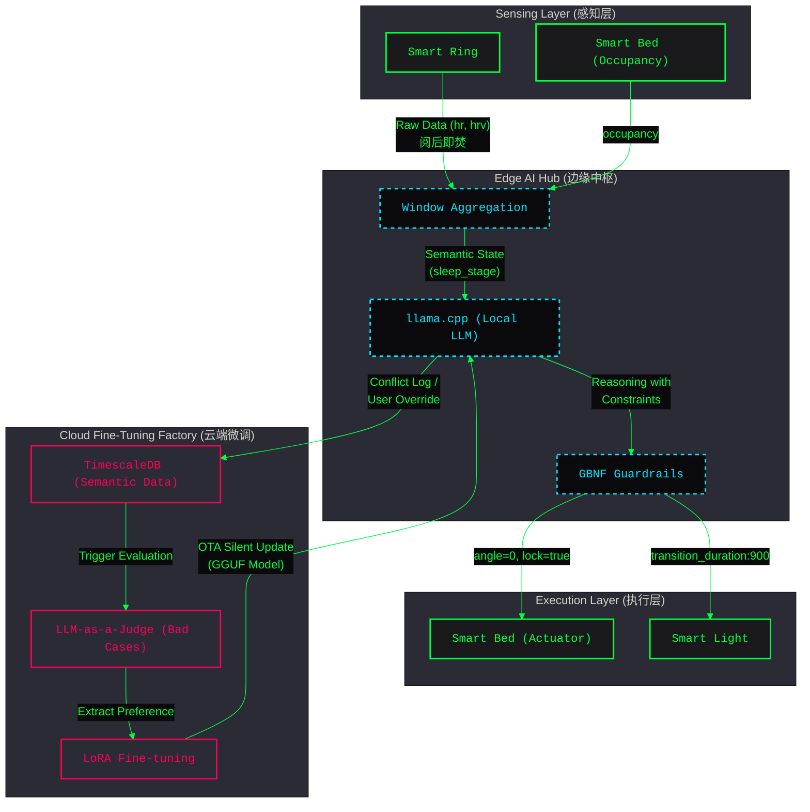
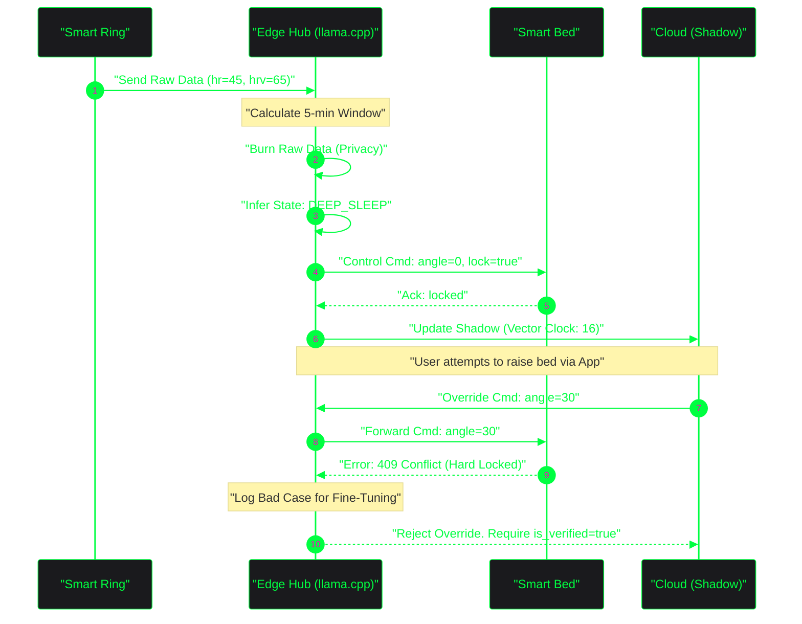

# 27. Luma AI 下一阶段核心逻辑深度设计：数据搜集、微调与设备联动

**文档状态**: Active
**项目**: Luma AI 无感智能空间联动系统
**作者**: 产品负责人 (Product Owner)
**背景**: 随着 Sprint 5 商业级演示 UI 与数据打通完成，下一阶段（Phase 2/3）的核心目标将转向更深度的设备数据搜集、端侧 AI 自动化微调以及多模态互联互通逻辑设计。本文档系统性梳理这几个核心设备在真实用户场景中的地盘逻辑与环境约束。

---

## 1. 架构定义 (Architecture Definitions)

根据架构设计第一性原理，首先明确本阶段的前提、约束、边界与终局。

*   **前提 (Premise)**: 
    *   用户卧室已部署 Luma AI 智能中枢 (Edge Hub)，并包含核心硬件：智能戒指 (感知源)、智能床 (执行终端)、智能灯光/电视 (环境终端)。
    *   设备底层已打通 Vector Clock 乐观锁与 Redis Lua 影子同步。
*   **约束 (Constraints)**: 
    *   **数据隐私护栏**: 智能戒指的原始高频生理数据 (Raw Data) 必须在边缘侧进行窗口计算并**阅后即焚**，绝不上云。
    *   **硬件安全锁**: 深睡期间智能床强制锁定角度 (angle=0)，任何试图变更姿态的操作必须通过二次鉴权 (is_verified)。
    *   **性能指标**: 工程推理满足 TTFT≤300ms, 端到端≤800ms, RAM峰值≤1.5GB；必须 100% 使用 GBNF 绝对命中防幻觉。
*   **边界 (Boundaries)**: 
    *   云端仅接收高阶语义数据 (Semantic Data) 与脱敏后的冲突日志用于微调，不进行实时设备状态仲裁。
    *   设备状态最终一致性由云端影子 (Device Shadow) + last_update_ts 保障。
*   **终局 (Endgame)**: 
    *   实现完全无感交互 (Zero-UI) 体验，通过 "数据采集 -> 冲突捕获 -> LLM-as-a-Judge 评估 -> 云端微调 -> 端侧下发 GGUF 模型" 的完整数据飞轮，实现**千人千面的睡眠大模型专属订阅**。

---

## 2. 设备核心地盘逻辑与数据搜集

在无感智能中，各设备的职责边界极其明确，严格遵循“感知-决策-执行”的流转体系。

### 2.1 智能戒指 (感知核心)
*   **数据搜集**: 高频监测心率 (hr)、心率变异性 (hrv)、体动幅度 (movement)、血氧 (spo2) 和皮肤温度偏差。
*   **核心逻辑**:
    *   **单向数据流**: 设备 -> 边缘中枢 (Edge Hub)。
    *   **数据脱敏与聚合**: 戒指自身或 Edge Hub 在 5 分钟滑动窗口内计算出 `sleep_stage` (如 AWAKE, LIGHT_SLEEP, DEEP_SLEEP)。
    *   **隐私约束**: 原始数据只存留于本地 RAM，计算出高阶状态后立即丢弃（阅后即焚）。仅向云端暴露 `computed_state` 作为事件触发器。

### 2.2 智能床 (执行与防护终端)
*   **数据搜集**: 监测是否在床 (occupancy)、鼾声分贝 (snoringLevel) 等环境级数据。
*   **核心逻辑**:
    *   **双向数据流**: 接受控制指令并上报当前状态 (angle, vibration, support_level, temp_mode)。
    *   **深睡硬锁 (Deep Sleep Hard Lock)**: 戒指判断进入 `DEEP_SLEEP` 后，床体强制平躺 (0°)，并进入强支撑模式。在此状态下，屏蔽常规的姿态调整指令。若遇突发情况需调整，必须提供 `is_verified=true` 二次鉴权凭证，防大模型幻觉与误触。
    *   **并发控制**: 使用 Vector Clock 解决多端并发控制问题。

### 2.3 智能灯光/环境 (氛围执行端)
*   **核心逻辑**: 
    *   **日出唤醒 (Sunrise)**: 强制下发 `transition_duration: 900` (15分钟渐变)。灯光不能瞬间点亮，必须匹配人体褪黑素的缓慢消退节律。
    *   **联动灯控**: 助眠阶段暖橘色呼吸灯同步戒指心率；深睡阶段强制全黑息屏。

---

## 3. 数据流向与产品架构图

本章节展示端侧数据采集、本地决策与云端微调的数据闭环。

---

## 4. 核心交互场景与环境约束

为了保证产品落地的严谨性，以下对 3 个核心业务场景的时序与约束进行定义。

### 4.1 场景一：入睡准备与助眠 (Wind Down)
*   **触发环境**: 夜间 21:00-23:00，戒指检测到 `movement` 降低，`hr` 趋于平稳，判定为入睡准备阶段。
*   **联动交互**: 
    *   床体：开启背部缓抬 15° (零重力姿态)，温度调节至助眠 32°C。
    *   灯光：色温切换至 2000K 暖橘色，亮度 20%，随心率频率呼吸律动。
*   **异常约束**: 如果用户此时离开床 (`occupancy=false`)，系统暂停助眠流程，灯光切至起夜微光模式。

### 4.2 场景二：深睡沉浸与安全锁定 (Deep Sleep Immersion)
*   **触发环境**: 戒指聚合判断 `sleep_stage = DEEP_SLEEP` 持续超过 5 分钟。
*   **联动交互**:
    *   床体：平躺复位 (angle=0)，关闭震动，启动**深睡硬锁**。
    *   灯光/电视：强制断电息屏，切断氛围同步。
*   **异常约束 (AI 幻觉隔离)**: 通过端侧 GBNF 语法强制拦截，杜绝大模型在用户深睡期间生成“将床升起”、“开启强光”的 Json 指令。任何深睡期的物理调节请求必须带有 `is_verified` 参数 (例如用户醒来后在 App 上输入二次确认)。

### 4.3 场景三：无感唤醒 (Sunrise Wake-up)
*   **触发环境**: 距离预设闹钟前 30 分钟，戒指监测到进入 `LIGHT_SLEEP` 或 `AWAKE`。
*   **联动交互**:
    *   灯光：执行 `transition_duration: 900` 的日出渐变 (由 0% 升至 70%)。
    *   床体：头部微抬 10° 辅助呼吸，配合舒缓脉冲震动。
*   **微调飞轮触发 (冲突捕获)**: 如果系统提前 30 分钟唤醒，但用户觉得太早，手动关闭闹钟并继续躺平，此次行为被记为**冲突负样本 (Bad Case)**，上报云端进入 LoRA 微调工厂，以便下次该用户的唤醒模型更为保守。

---

## 5. 核心交互时序图 (深睡状态流转与锁定)

## 6. 后续迭代排期 (Next Steps)
1. **数据打通测试**: 基于 Sprint 5 成果，验证戒指与床在局域网内的高并发 Vector Clock 冲突。
2. **微调链路基建**: 在 `timescaleDB` 中建立针对用户主动 Override (干预) 操作的埋点宽表，搭建 LLM-as-a-Judge 自动评测流水线。
3. **模型下发基建**: 完善 GGUF 模型通过 MQTT / HTTPS 静默下发到本地边缘中枢的 OTA 能力。
