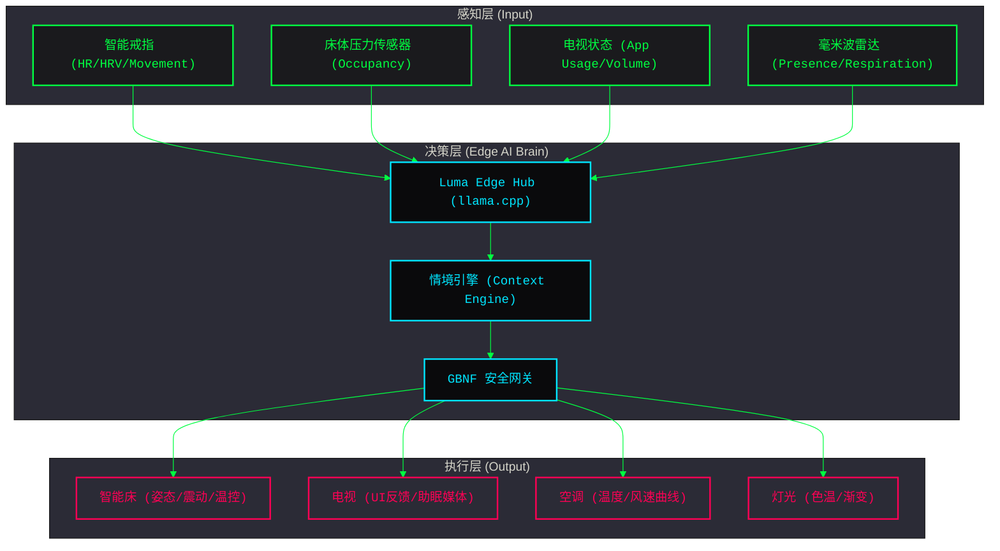

# 28. Luma AI 多模态无感联动方案：戒指、电视、智能床与环境设备的深度集成

**文档状态**: Draft / Discussion
**项目**: Luma AI 无感智能空间联动系统
**领域专家**: Aiden (Luma AI Architecture Lead)
**日期**: 2026-04-06

---

## 1. 核心设计哲学 (Design Philosophy)

Luma AI 的多设备联动不应是简单的 "If-This-Then-That" (IFTTT)，而应演进为基于 **生理感知 (Physiological Sensing)** 的 **情境感知计算 (Context-Aware Computing)**。

*   **感知核心 (Sensing Hub)**: 智能戒指提供高频、私密的生理基准（心率、HRV、血氧）。
*   **反馈媒介 (Feedback Hub)**: 电视作为空间内最大的视觉终端，承担健康可视化与心理调节任务。
*   **执行终端 (Actuator Hub)**: 智能床作为物理接触最广的设备，通过姿态调节实现干预。
*   **环境补齐 (Environment Hub)**: 灯光、空调、窗帘等设备作为辅助，补全舒适度曲线。

---

## 2. 深度联动架构设计 (Deep Linkage Architecture)

### 2.1 架构层次图


---

## 3. 核心联动场景深度解析 (Core Linkage Scenarios)

### 3.1 场景 A：从娱乐到深度助眠 (Leisure to Deep Sleep)
*   **逻辑**: 用户在床上看电视，系统通过戒指检测到 `HR` 持续下降且 `Movement` 极低。
*   **自动演进**:
    1.  **引导期**: 电视 UI 右下角静默弹出 "Vital Ring" 呼吸光环，其频率随用户心率律动，引导用户进行深呼吸。
    2.  **过渡期**: 电视画面自动切换至 "Sleep Shader" (极简流体背景)，音量线性衰减；智能床自动升起 15° (零重力模式) 以释放脊柱压力。
    3.  **锁定层**: 当戒指判定 `DEEP_SLEEP` 状态时，电视强制关闭电源，床体极缓平躺复位并触发**深睡硬锁**。

### 3.2 场景 B：健康干预与防鼾 (Health Intervention)
*   **逻辑**: 床体传感器检测到高分贝鼾声，同时戒指监测到 `SpO2` (血氧) 出现波动下降。
*   **联动闭环**:
    1.  **物理调整**: 智能床头部区域极缓抬升 10-15°，增加气道通气量，过程不惊醒用户。
    2.  **环境协同**: 空调调低 1°C 并开启新风模式，提高室内含氧量。
    3.  **反馈记录**: 次日早晨，电视健康面板展示此次干预的曲线对比图，告知用户干预效果。

### 3.3 场景 C：无感日出唤醒 (Seamless Sunrise)
*   **逻辑**: 距离闹钟 20 分钟，戒指监测到用户处于 `LIGHT_SLEEP` (浅睡) 窗口期。
*   **联动闭环**:
    1.  **视觉唤醒**: 电视背光 (Ambilight) 模拟日出，执行 15 分钟渐变；电视屏幕显示晨间问候。
    2.  **触觉唤醒**: 智能床执行极轻微的脉冲震动，并缓慢将背部抬升 5°。
    3.  **后续联动**: 当戒指检测到 `AWAKE` 状态后，窗帘自动拉开，电视播报今日天气与行程。

---

## 4. 技术实现关键点 (Technical Implementation)

### 4.1 向量时钟 (Vector Clock) 解决多端并发
由于电视控制、戒指自动触发、用户手动调节可能同时发生，系统必须采用向量时钟机制，确保所有状态变更在分布式环境下具有一致的因果序。

### 4.2 阅后即焚 (Ephemeral Privacy)
戒指的原始生理波形（如 PPG）绝不上云，仅在边缘侧计算出高阶语义（如 `sleep_stage: DEEP`）。计算完成后，内存数据立即擦除，保障用户最高隐私权。

### 4.3 GBNF 语法树 (防幻觉指令)
Edge AI 在生成联动指令时，必须通过 GBNF (Guidance-Based Next-token Formatting) 校验。例如：
```gbnf
# 强制规定深睡期间禁止开启电视和大幅度升床
root ::= sleep_safe_cmd
sleep_safe_cmd ::= "{\"action\": \"set_angle\", \"value\": 0, \"lock\": true}" | "{\"action\": \"turn_off_tv\"}"
```

---

## 5. 讨论总结与下一步建议 (Summary & Recommendations)

1.  **UI/UX 统一**: 建议将电视作为 Luma AI 的 "Dashboard"，所有设备的联动状态（如：床正在锁定、戒指正在同步）应通过非侵入式的 UI 组件告知用户。
2.  **数据飞轮**: 记录用户手动 Override (覆盖) AI 决定的行为，作为 LoRA 微调的负样本，实现千人千面的个性化联动策略。
3.  **硬件冗余**: 建议引入毫米波雷达作为戒指的补充，在用户未佩戴戒指时，仍能提供基础的呼吸率与在床检测。

---
*文档由 Aiden 生成，旨在为 Luma AI 的多模态联动提供顶层设计参考。*
