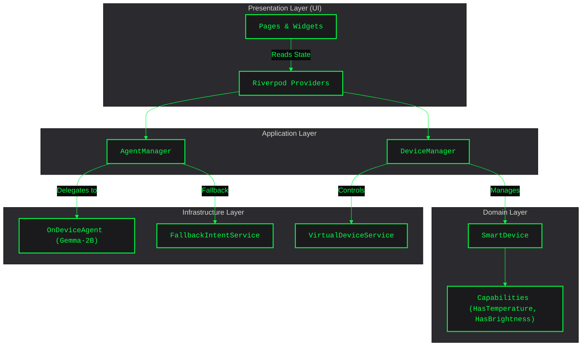
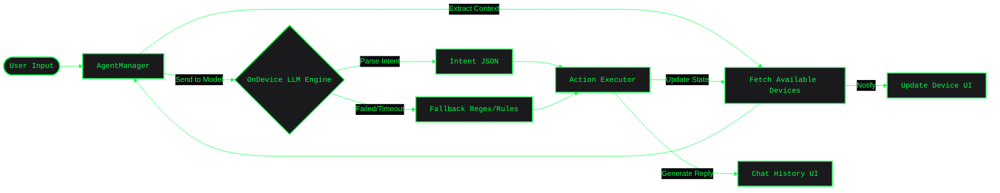
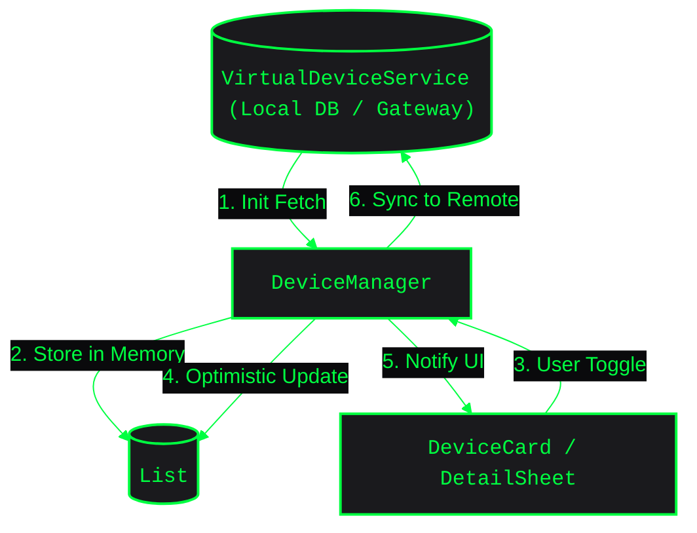
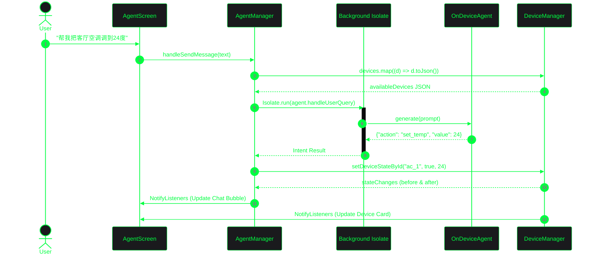

# Smart Home AI Agent (Flutter)

这是一款集成了 **本地端侧大模型 (On-Device AI)** 的智能家居控制终端。
无需依赖云端服务器即可在本地离线理解自然语言指令，并控制虚拟（或真实）的智能家居设备。

## 架构设计文档

### 前提 (Premise)
- **离线优先**：由于家庭环境网络不稳定或出于隐私考虑，智能家居的语音控制核心链路（意图理解与指令生成）必须能够在移动端或中控屏上本地完成。
- **端侧 AI 演进**：轻量级大语言模型（如 Gemma 2B/Qwen 1.5B）已具备足够的常识与意图推理能力，支持在移动端进行量化推理。

### 约束 (Constraints)
- **算力与内存限制**：移动设备内存有限，端侧大模型运行不应超过 2GB RAM 占用。
- **UI 流畅度**：大模型推理是 CPU 密集型任务，严禁阻塞主线程（Main Isolate），必须保证 Flutter 渲染的 60FPS 帧率。
- **平台兼容**：核心架构必须同时兼容 iOS 和 Android，端侧推理库（`on_device_agent`）需通过 FFI 或 Platform Channels 桥接 C++ (llama.cpp) 底层。

### 边界 (Boundaries)
- **职责划分**：本项目（客户端）仅负责 UI 渲染、全局状态管理、端侧 AI 推理及设备指令生成。
- **外部依赖**：真正的硬件控制通信（如 Zigbee/蓝牙/MQTT 协议转换）由 `VirtualDeviceService` 模拟，未来将接入真实的物联网网关，客户端不直接处理底层硬件协议。

### 终局 (Endgame)
- 构建一个**完全离线、高度隐私保护、具有极强扩展性**的智能家居控制中枢。
- 架构上彻底遵循领域驱动设计（DDD），使新设备类型的接入成本趋近于零（Capability 机制），且能够随时热插拔替换更先进的端侧大模型。

---

### 产品架构图



### 核心业务流程图



### 设备状态数据流向图



### 端侧推理核心交互时序图



---

## 核心特性
- **完全离线 AI**：借助 `on_device_agent` 在本地加载并运行 Gemma 2B 等轻量级大模型。
- **现代化架构**：使用 `flutter_riverpod` 管理状态，遵循清晰的领域驱动设计（Domain-Driven Design），业务、表现与领域逻辑解耦。
- **扩展性极强**：采用 `Capability` 接口设计模式（如 `HasTemperature`, `HasBrightness`），杜绝向下转型，轻松接入任何新设备。
- **高性能**：模型加载等重度操作移入 `Isolate`，保证主线程（UI）丝滑流畅，支持 60FPS+ 动画。

## 环境要求
- Flutter 3.22+
- Dart 3.4+

## 本地运行指南

1. **获取代码并安装依赖**
   ```bash
   flutter pub get
   ```

2. **下载端侧模型文件**
   端侧 AI 需要本地模型权重文件的支持。请下载 [Gemma-2b-it-q4_k_m.gguf](https://huggingface.co/google/gemma-2b-it-GGUF)（或其他受支持的 GGUF 模型）。
   将下载好的模型文件放置到项目的 `assets/models/` 目录下，并重命名为 `gemma-2b-q4.bin`。
   
   *注意：如果资产目录不存在，请自行创建 `mkdir -p assets/models`。*

3. **运行应用**
   ```bash
   flutter run
   ```

## 目录说明
- `lib/domain/` 或 `lib/models/`: 设备领域模型（`SmartDevice`, `DeviceType` 及各项能力 `Mixin`）。
- `lib/application/`: 业务逻辑控制层，包括 `DeviceManager`、`AgentManager` 及 Riverpod `Providers`。
- `lib/presentation/`: UI 表现层，按 `pages/` 和 `widgets/` 切分。
- `lib/features/agent/`: AI 对话及意图回退处理服务。
- `lib/services/`: 与设备网关通信的基础服务（当前为 `VirtualDeviceService`）。

## 测试
本项目包含核心 Manager 的单元测试。可以通过以下命令运行：
```bash
flutter test
```
