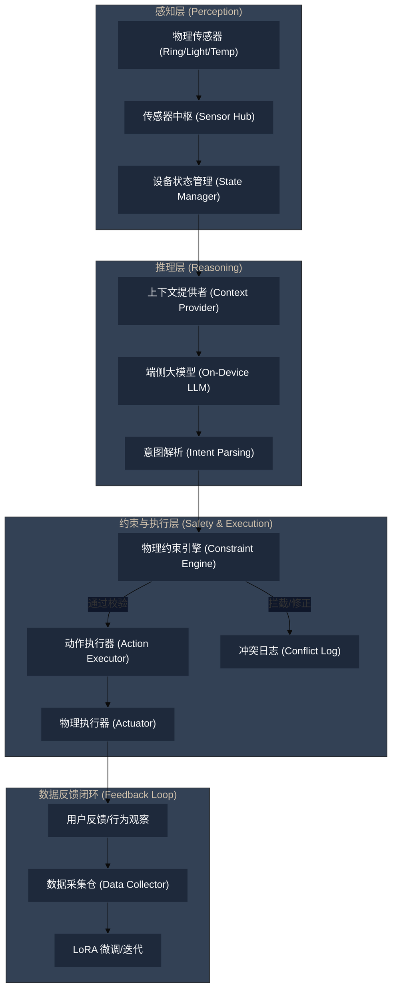

# 🏠 智能家居端侧 AI：工程化落地实践指南 (Data, Lifecycle & Constraints)

> **"Intelligence is not just about making a decision; it's about making a safe and consistent one in the physical world."**
> 本文档旨在解决 `model_forge` 项目中缺失的数据采集闭环、传感器全生命周期管理及物理约束逻辑，提升 AI Agent 的工程落地能力。

---

## 一、 核心架构：从物理感知到智能决策的端到端链路

为了实现无感智能，系统必须从“被动响应指令”转变为“主动感知并决策”。

### 1. 完整数据流向 (The Actual Process)

---

## 二、 数据采集策略：构建真实世界的数据飞轮

合成数据（Synthetic Data）只能解决“起步”问题，真实的工程落地必须依赖**环境反馈数据**。

### 1. 采集维度
*   **传感器原始数据 (Raw Data)**：高频采样（如心率、环境亮度），在端侧进行特征提取（Feature Extraction）后上传“语义数据”（如：用户进入深睡）。
*   **决策冲突日志 (Conflict Logs)**：大模型建议的操作被“物理约束引擎”拦截或被用户手动撤销的情况。
*   **状态转移序列 (State Transitions)**：记录“状态A -> 动作B -> 状态C”的序列，用于训练强化学习（RL）或更精准的 SFT。

### 2. 反馈机制 (The Flywheel)
1.  **主动采纳**：用户未干预，视为正样本。
2.  **静默拒绝**：大模型输出了意图，但约束引擎因安全原因拦截，记录为“护栏样本”。
3.  **用户修正 (Manual Override)**：
    *   **硬性修正**：Agent 执行操作后 5 分钟内，用户通过物理开关反向操作。系统应进入 **2 小时“人工优先”观察期**，暂停该区域自动调度。
    *   **意图偏差**：用户微调了 Agent 的动作（如灯光太亮，用户调暗）。这被标记为“偏好漂移”，触发微调任务。

---

## 三、 用户逻辑与多用户冲突处理 (User Logic & Multi-user)

智能家居不只是为一个“平均人”设计的，必须处理空间内多个真实个体的冲突。

### 1. 优先级准则 (Priority Hierarchy)
在 Zero-UI 决策中，优先级遵循：**安全 (Safety) > 睡眠 (Sleep) > 专注 (Focus) > 舒适 (Comfort)**。
*   *示例*：若 A 在书房深度专注工作，B 进入拿东西，灯光应保持 A 的专注模式，不应为 B 切换为全局照明。

### 2. 多用户冲突解决 (Conflict Resolution)
*   **空间占位权重**：基于位置传感器（如 mmWave 雷达）判定“主导用户”。
*   **偏好中值与分域控制**：
    *   **空调/环境**：若 A 偏好 24℃，B 偏好 26℃，系统取中值 25℃，并利用导风板“避人吹”减少体感差异。
    *   **照明/声场**：利用定向音箱或局部照明（Zone Lighting）实现“一屋两制”。

---

## 四、 传感器全生命周期管理 (Sensor Lifecycle)

传感器不是永远可靠的。工程化落地必须考虑其“生老病死”。

| 阶段 | 核心任务 | 技术要点 |
| :--- | :--- | :--- |
| **1. 注册 (Registration)** | 设备配网与能力发现 | 使用 Matter/IoT 协议声明传感器精度、采样率、单位。 |
| **2. 校准 (Calibration)** | 消除系统误差 | 初始启动时或定期（如每3个月）要求用户协助进行零位校准。 |
| **3. 活跃监控 (Monitoring)** | 健康度与心跳检测 | **Heartbeat**: 超过 5 分钟未上报数据标记为 `OFFLINE`。**Anomaly Detection**: 瞬时数值跳变（如室温从 25°C 突跳到 80°C）标记为 `FAULTY`，触发 Agent 告警。 |
| **4. 漂移处理 (Drift Handling)** | 长期运行误差补偿 | 通过与云端或其他冗余传感器对比，自动修正读数偏差。 |
| **5. 报废 (Decommissioning)** | 数据合规销毁 | 物理设备移除后，彻底清除本地相关的行为日志和习惯缓存。 |

---

## 四、 物理约束引擎 (Physical Constraint Engine)

大模型擅长推理，但不了解物理世界的极限。必须在 `ActionExecutor` 之前增加一层硬约束。

### 1. 约束分类
*   **安全硬约束 (Safety Constraints)**：
    *   *示例*：电暖器开启时间严禁超过 8 小时。
    *   *逻辑*：`if (action == 'turn_on' && device == 'heater' && duration > MAX) reject();`
*   **物理环境约束 (Environmental & Physics)**：
    *   **露点保护**：空调制冷开启时，加湿器严禁以最高功率运行（防止墙面结露）。
    *   **静音锚定**：深睡期 (DEEP_SLEEP) 锁定净化器/新风系统的最高噪音分贝，忽略瞬时空气质量跳变。
*   **资源与功耗约束 (Resource Limits)**：
    *   **电力负载**：电热水器、电烘干机、电动车充电桩严禁在峰值功率下同时运行，由 Agent 自动调度排序。
*   **隐私与权限约束 (Privacy & Auth)**：
    *   *示例*：深睡期严禁开启卧室摄像头，除非二次生物识别鉴权。

---

## 六、 场景化深度设计：Zero-UI 的具体表达

通过具体场景，将上述逻辑串联起来。

### 1. 深夜起夜：静谧路径导引
*   **感知层**：戒指监测到 Movement + 床侧毫米波雷达感应到下床动作。
*   **决策层**：判断“非清醒但离床”。
*   **约束层**：检查伴侣是否在深睡。若在，禁止主灯。
*   **执行层**：仅点亮洗手间路径的**地脚灯** (3000K, 5% 亮度)，并联动马桶静音冲水。

### 2. 分区唤醒：光律动分域
*   **感知层**：早起者闹钟前 15 分钟。
*   **决策层**：启动“模拟日出”。
*   **冲突处理**：仅开启早起者一侧的床头灯，且该侧窗帘仅开启 20% 缝隙。晚起者一侧保持全黑与静音状态。

---

## 七、 工程落地路线图 (Action Plan)

1.  **[ ] 升级 SensorHub**：实现传感器状态机，支持 `OFFLINE` 和 `FAULTY` 状态的动态感知。
2.  **[ ] 重构 ActionExecutor**：引入 `ConstraintManager` 拦截器，在下发指令前读取设备边界配置。
3.  **[ ] 建立本地数据湖**：在 `Isar` 中新增 `ConflictLog` 表，专门记录“Agent 决策 vs 物理约束”的偏差。
4.  **[ ] 自动化 SFT 闭环**：编写脚本从 `ConflictLog` 提取数据，自动转换为微调数据集格式。

---
*Created by Gemini-3-Flash-Preview in Trae IDE*
